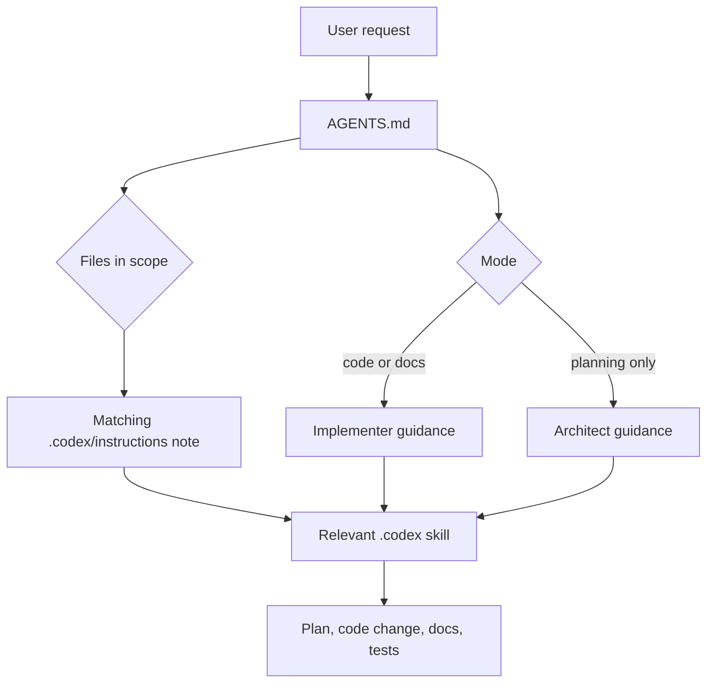

# Codex Migration

This repo keeps the original GitHub Copilot customization under `.github/` and mirrors it for Codex under `.codex/`.

## Migrated Layout

| GitHub source | Codex mirror | Purpose |
| --- | --- | --- |
| `.github/copilot-instructions.md` | `AGENTS.md` | Repo-level Codex instructions |
| `.github/agents/` | `.codex/agents/` | ContextOS implementer and architect persona docs |
| `.github/instructions/` | `.codex/instructions/` | File-scoped guidance formerly driven by `applyTo` globs |
| `.github/skills/` | `.codex/skills/` | Reusable skill playbooks, assets, references, and scripts |

## How Codex Should Use It

Codex reads `AGENTS.md` as the primary repo guide. When a task needs a specialized playbook, load the matching file from `.codex/skills/<skill>/SKILL.md`.



## Maintenance Rule

When updating `.github` customization, update the matching `.codex` mirror in the same change. When updating Codex-only behavior, update `AGENTS.md` and this document if routing or folder structure changes.

## Validation

After changing skills or routing, run the migrated authoring checks from `.codex/skills/contextos-authoring/scripts/`:

```bash
.codex/skills/contextos-authoring/scripts/score-skills.sh
.codex/skills/contextos-authoring/scripts/score-skill-routing.sh
.codex/skills/contextos-authoring/scripts/check-mermaid-policy.sh
.codex/skills/contextos-authoring/scripts/score-readme-coverage.sh
.codex/skills/contextos-authoring/scripts/score-readme-quality.sh
.codex/skills/contextos-authoring/scripts/check-readme-sync-on-change.sh
```
