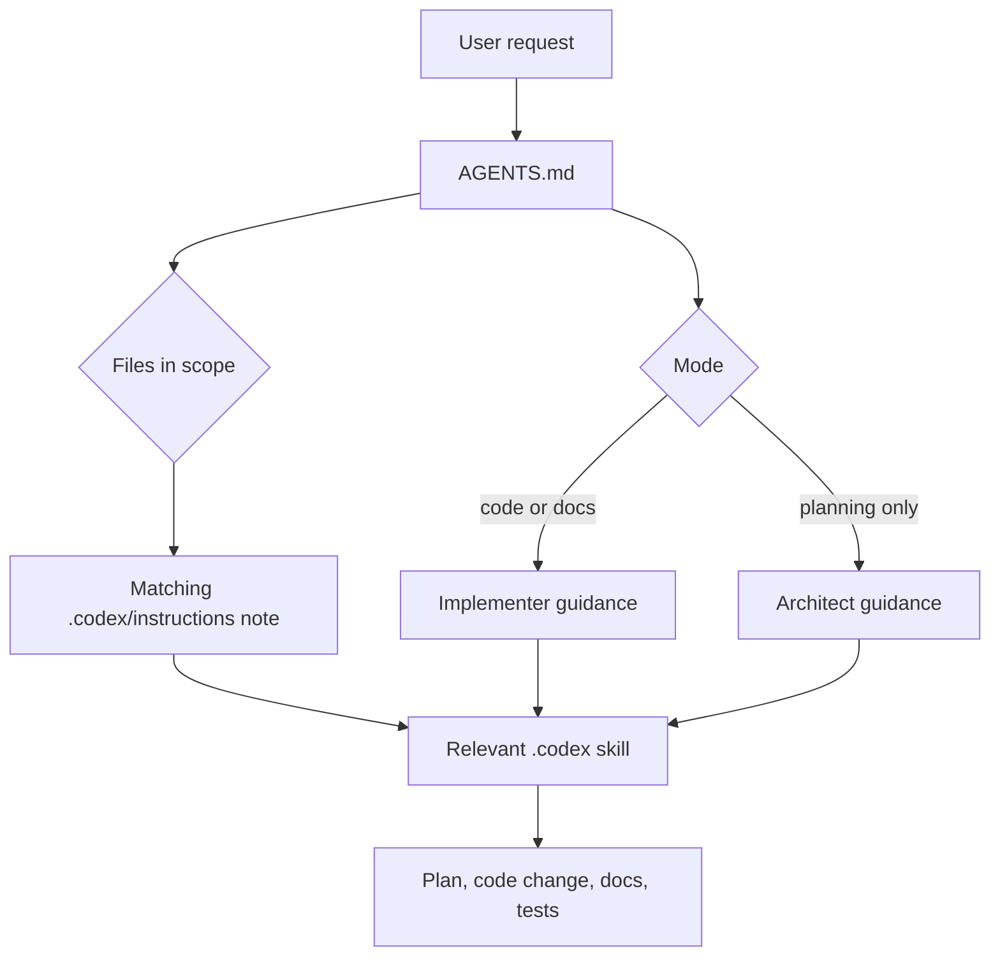

# Codex Migration

This repo keeps the original GitHub Copilot customization under `.github/` and mirrors it for Codex under `.codex/`.

## Migrated Layout

| GitHub source | Codex mirror | Purpose |
| --- | --- | --- |
| `.github/copilot-instructions.md` | `AGENTS.md` | Repo-level Codex instructions |
| `.github/agents/` | `.codex/agents/` | ContextOS implementer and architect persona docs |
| `.github/instructions/` | `.codex/instructions/` | File-scoped guidance formerly driven by `applyTo` globs |
| `.github/skills/` | `.codex/skills/` | Reusable skill playbooks, assets, references, and scripts |

## How Codex Should Use It

Codex reads `AGENTS.md` as the primary repo guide. When a task needs a specialized playbook, load the matching file from `.codex/skills/<skill>/SKILL.md`.

Frontend Svelte UI work is routed through `contextos-frontend-design` so layout, spacing, button, graph, source setup, and chat changes follow the current app pattern.



## Maintenance Rule

When updating `.github` customization, update the matching `.codex` mirror in the same change. When updating Codex-only behavior, update `AGENTS.md` and this document if routing or folder structure changes.

README coverage excludes `.codex/skills` because skill internals use `SKILL.md`, `assets/`, and `references/` instead of per-folder README files. Keep the exclusion mirrored in `.github/skills/contextos-authoring/references/readme-coverage-exclusions.txt`.

## Skills

| Skill | Primary Trigger |
| --- | --- |
| `contextos-api-handler` | API handlers, source connector routes, status, ingest, and stream endpoints |
| `contextos-authoring` | New or changed skills, instruction files, agents, or routing maps |
| `contextos-frontend-design` | Svelte UI design, spacing, buttons, panels, graph/source/chat visuals |
| `contextos-frontend-connector` | New Svelte connector components and connector registration |
| `contextos-harness-engineering` | Fixtures, scenarios, goldens, benchmarks, and regression gates |
| `contextos-identity-resolution-benchmark` | Identity merge rules, thresholds, aliases, and matching metrics |
| `contextos-issue-workflow` | GitHub parent-child issue groups and labels |
| `contextos-misalignment-report` | Cross-layer mismatch reports with evidence, confidence, impact, and recommended action |
| `contextos-pipeline-stage-delivery` | Pipeline stage behavior, contracts, events, and traceability |
| `frontend-jest-swc-patterns` | Frontend `*.test.ts`, `$lib` mocks, fetch mocks, and setter lifecycle tests |
| `go-best-practices` | Go implementation, review, and refactor quality |
| `go-test-patterns` | Go `_test.go` files and test style review |

## Mermaid Explanation Policy

Explanations of architecture, workflows, pipeline stages, skill routing, state transitions, or multi-step behavior should include a small Mermaid diagram. This mirrors the repo-wide response policy in `AGENTS.md`.

## Validation

After changing skills or routing, run the migrated authoring checks from `.codex/skills/contextos-authoring/scripts/`:

```bash
.codex/skills/contextos-authoring/scripts/score-skills.sh
.codex/skills/contextos-authoring/scripts/score-skill-routing.sh
.codex/skills/contextos-authoring/scripts/check-mermaid-policy.sh
.codex/skills/contextos-authoring/scripts/score-readme-coverage.sh
.codex/skills/contextos-authoring/scripts/score-readme-quality.sh
.codex/skills/contextos-authoring/scripts/check-readme-sync-on-change.sh
```
