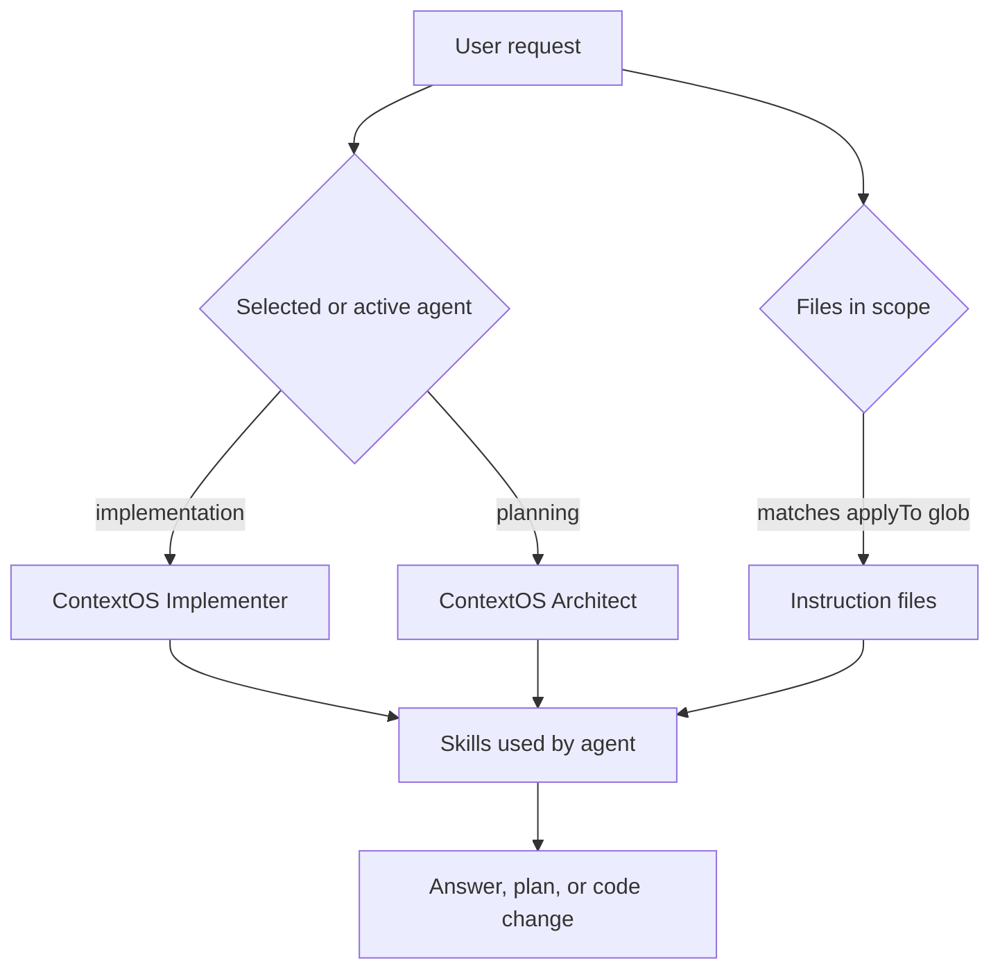

# ContextOS Agents

Agents are selectable working modes. They do not automatically trigger instruction files by themselves. The active agent sets the role, tool permissions, procedure, and skill wiring; instruction files are added separately when their `applyTo` glob matches the files being edited or reviewed.

## How Agents And Instructions Combine

## Available Agents

| Agent                 | File                             | Trigger                                                                                  | Does It Edit? |
| --------------------- | -------------------------------- | ---------------------------------------------------------------------------------------- | ------------- |
| ContextOS Implementer | `contextos-implementer.agent.md` | Use for implementation, tests, frontend design, connectors, handlers, harnesses, and customization edits. | Yes           |
| ContextOS Architect   | `contextos-architect.agent.md`   | Use for architecture planning, phase breakdown, dependency mapping, and risk review.     | No            |

## Clarification Rule

If the user request is unclear, the agent should restate the interpreted prompt in one short sentence and ask the smallest clarifying question before editing files or producing a plan. If the intent is clear enough to act safely, the agent proceeds without asking.

## Agent Selection Rule

- Use ContextOS Implementer when the task asks to change files, run tests, add docs, create skills, or fix behavior.
- The implementer is wired to `contextos-frontend-design` for Svelte UI layout, spacing, buttons, graph/source/chat visuals, and current frontend component patterns.
- Use ContextOS Architect when the task asks for planning, sequencing, system design, tradeoffs, or issue breakdown without edits.

## README Alignment

Update this README when adding, renaming, retiring, or materially changing an agent. Also update `.github/README.md` so the top-level customization map stays aligned.
