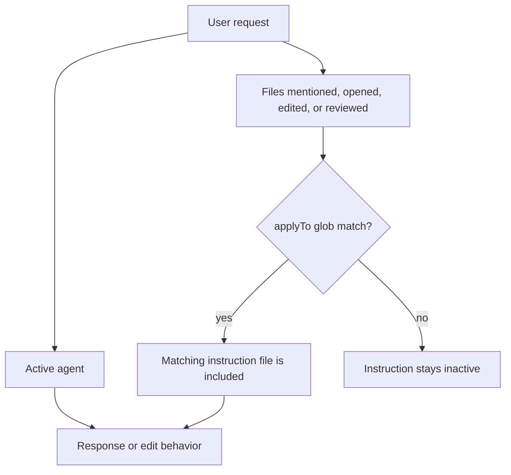

# ContextOS Instructions

Instructions are automatic file-scoped rules. They trigger when the files being edited or reviewed match the instruction file's `applyTo` glob. Agents do not trigger instructions directly; agents and instructions are combined by the workspace context.

## Trigger Flow

## Current Instructions

| Instruction                        | `applyTo`                                         | When It Triggers                                 | Paired Skill                            |
| ---------------------------------- | ------------------------------------------------- | ------------------------------------------------ | --------------------------------------- |
| `api-handlers.instructions.md`     | `apps/api/**/*.go`                                | API handlers, request types, and response types. | `contextos-api-handler`                 |
| `connectors.instructions.md`       | `internal/source/**/*.go`                         | Source connector implementations.                | `contextos-api-handler`                 |
| `customization.instructions.md`    | `.github/{agents,instructions,skills}/**/*.md`    | Agents, instruction files, and skill markdown.   | `contextos-authoring`                   |
| `frontend-tests.instructions.md`   | `apps/frontend/src/**/*.test.ts`                  | Frontend Jest/SWC TypeScript tests.              | `frontend-jest-swc-patterns`            |
| `go-pipeline.instructions.md`      | `{domain,internal,tests}/**/*.go`                 | Go domain, internal pipeline, and Go test files. | `go-best-practices`, `go-test-patterns` |
| `reasoning-output.instructions.md` | `internal/{reasoning,presentation,graph}/**/*.go` | Reasoning, presentation, and graph outputs.      | `contextos-misalignment-report`         |

## Clarification Rule

When a matching instruction applies but the user intent is ambiguous, restate the interpreted prompt in one short sentence and ask the minimum clarifying question before editing. Do not guess across incompatible interpretations.

## How To Add An Instruction

1. Use `contextos-authoring`.
2. Keep the `applyTo` glob as narrow as possible.
3. Put deep procedure detail in a skill, not in the instruction file.
4. Update this README and `.github/README.md`.
5. Run the authoring benchmark scripts.

## README Alignment

Update this README when adding, renaming, retiring, or changing the trigger scope of an instruction.
