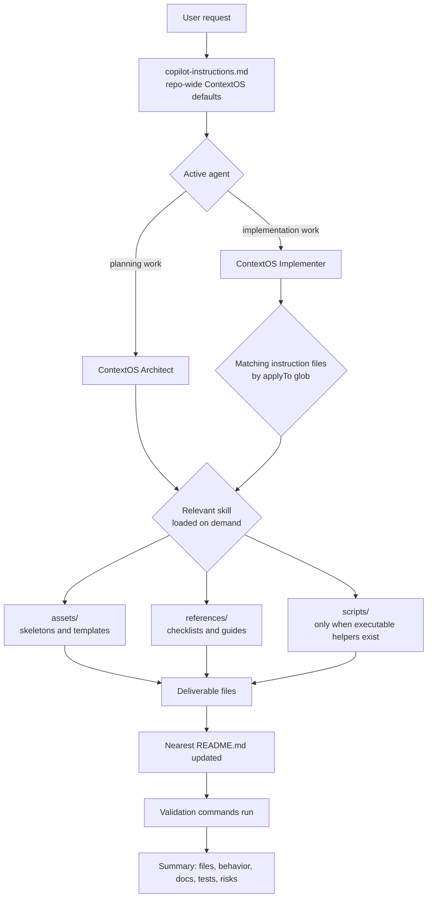
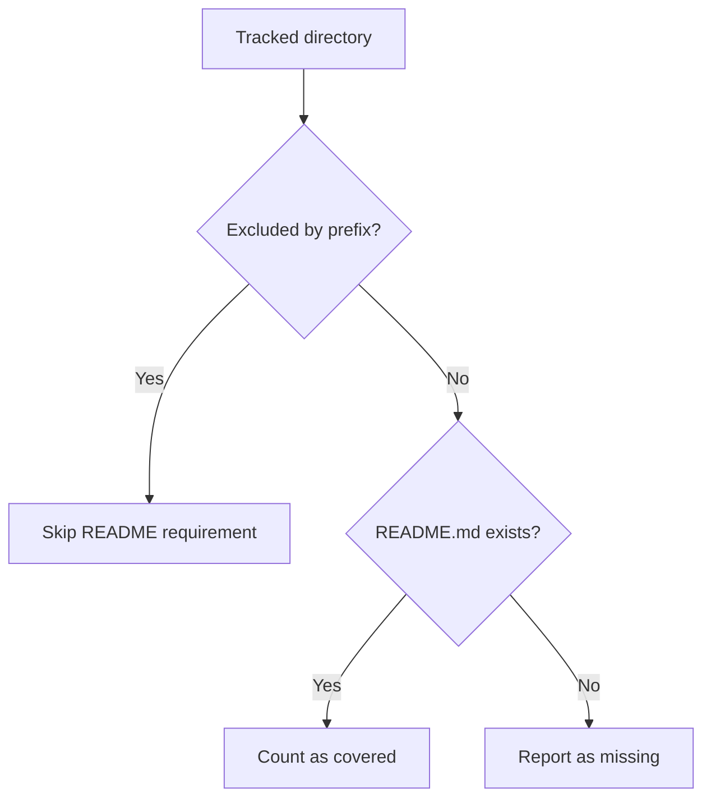
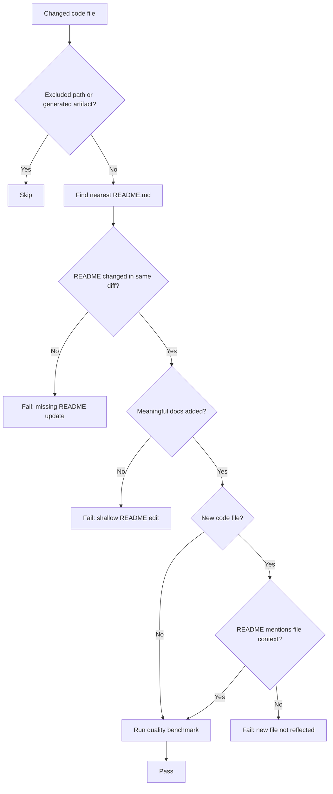

# ContextOS Agent, Instruction, and Skill Map

This folder contains the local customization layer for Copilot inside ContextOS. Use this README as the routing map: agents decide the operating mode, instructions apply automatically to matching files, and skills provide deeper task playbooks with assets and checklists.

## How The Pieces Fit



## Folder Roles

| Path                      | Role                                                                     | When It Matters                                                   |
| ------------------------- | ------------------------------------------------------------------------ | ----------------------------------------------------------------- |
| `copilot-instructions.md` | Repo-wide product direction, architecture boundaries, and quality bar    | Always active for work in this repo                               |
| `agents/`                 | Named working modes with tool permissions and required skill wiring      | Choose implementation vs architecture behavior                    |
| `instructions/`           | Short automatic rules matched by `applyTo` globs                         | Editing files that match a specific area                          |
| `skills/`                 | Detailed task playbooks with skeletons, references, and optional scripts | Specialized implementation, testing, authoring, or workflow tasks |

See `agents/README.md` for agent selection and `instructions/README.md` for `applyTo` trigger behavior.

## Agents

| Agent                   | Use For                                                                                 | Main Skill Families                                                                                                                                                       |
| ----------------------- | --------------------------------------------------------------------------------------- | ------------------------------------------------------------------------------------------------------------------------------------------------------------------------- |
| `ContextOS Implementer` | Production-minded code, tests, connectors, handlers, harnesses, and customization edits | Go quality, Go tests, pipeline stages, identity benchmarks, misalignment reports, API handlers, frontend design, frontend connectors, frontend tests, harnesses, authoring, issue workflow |
| `ContextOS Architect`   | Phase planning, domain boundaries, dependency mapping, and delivery risk review         | Pipeline delivery, identity benchmarks, misalignment reports, harness engineering, API/frontend connector patterns, frontend tests, authoring, issue workflow             |

## Instructions

| Instruction                        | Applies To                                        | Paired Skill                            |
| ---------------------------------- | ------------------------------------------------- | --------------------------------------- |
| `api-handlers.instructions.md`     | `apps/api/**/*.go`                                | `contextos-api-handler`                 |
| `connectors.instructions.md`       | `internal/source/**/*.go`                         | `contextos-api-handler`                 |
| `customization.instructions.md`    | `.github/{agents,instructions,skills}/**/*.md`    | `contextos-authoring`                   |
| `frontend-design.instructions.md`  | `apps/frontend/src/**/*.svelte`                   | `contextos-frontend-design`             |
| `frontend-tests.instructions.md`   | `apps/frontend/src/**/*.test.ts`                  | `frontend-jest-swc-patterns`            |
| `go-pipeline.instructions.md`      | `{domain,internal,tests}/**/*.go`                 | `go-best-practices`, `go-test-patterns` |
| `reasoning-output.instructions.md` | `internal/{reasoning,presentation,graph}/**/*.go` | `contextos-misalignment-report`         |

## Skills

| Skill                                     | Primary Trigger                                                                 | Assets                                  | References                          | Scripts               |
| ----------------------------------------- | ------------------------------------------------------------------------------- | --------------------------------------- | ----------------------------------- | --------------------- |
| `contextos-api-handler`                   | New API handler, source connector route, `/status`, `/ingest`, `/ingest/stream` | Handler skeleton                        | Handler checklist                   | None                  |
| `contextos-authoring`                     | New or changed skill, instruction, or agent                                     | Agent, instruction, and skill skeletons | Authoring checklist                 | Skill score helper    |
| `contextos-frontend-design`               | Svelte UI design, layout, spacing, buttons, panels, graph/source/chat visuals   | Frontend style skeleton                  | Frontend design checklist           | None                  |
| `contextos-frontend-connector`            | New Svelte connector component or `+page.svelte` registration                   | Connector skeleton                      | Connector checklist                 | None                  |
| `contextos-harness-engineering`           | Fixtures, scenarios, goldens, benchmarks, or regression gates                   | Scenario template                       | Harness checklist                   | None                  |
| `contextos-identity-resolution-benchmark` | Alias matching, merge thresholds, precision/recall evaluation                   | Benchmark dataset template              | Evaluation matrix and conflict tree | Benchmark runner      |
| `contextos-issue-workflow`                | Parent-child GitHub issue groups                                                | Parent and child issue templates        | Label and group guide               | Issue creation helper |
| `contextos-misalignment-report`           | Cross-layer mismatch reports with evidence and confidence                       | Report template                         | Severity guide                      | None                  |
| `contextos-pipeline-stage-delivery`       | Stage behavior, contracts, events, and traceability                             | Stage test template                     | Stage checklist                     | None                  |
| `frontend-jest-swc-patterns`              | Frontend `*.test.ts`, `$lib` mocks, fetch mocks, setter lifecycle tests         | Test skeleton                           | Test checklist                      | Jest runner helper    |
| `go-best-practices`                       | Go implementation, review, and refactor quality                                 | Go best-practices notes                 | External Go references              | None                  |
| `go-test-patterns`                        | Go `_test.go` files and test style review                                       | Test skeleton                           | Test checklist                      | None                  |

## README Alignment Rule

Whenever a change creates or modifies behavior, structure, commands, routes, components, tests, harnesses, or customization routing, update the closest relevant `README.md` in the same change.

Examples:

| Change                                            | README To Check                                                                                                 |
| ------------------------------------------------- | --------------------------------------------------------------------------------------------------------------- |
| New API route or handler package                  | `apps/api/README.md` and the nearest handler/source README                                                      |
| New source connector                              | `internal/source/README.md` and connector package README                                                        |
| New frontend component or shared frontend utility | `apps/frontend/src/lib/README.md` and the relevant component folder README                                      |
| New frontend test pattern or command              | `apps/frontend/README.md`, `apps/frontend/src/lib/README.md`, and this README if customization behavior changes |
| New harness, fixture, scenario, or golden         | `tests/harness/README.md` or the package-local harness README                                                   |
| New skill, instruction, or agent                  | This README and the relevant skill checklist or agent section                                                   |

## Mermaid Explanation Policy

Explanations of architecture, workflows, pipeline stages, skill routing, state transitions, or multi-step behavior should include a small Mermaid diagram. This is a repo-wide response policy in `copilot-instructions.md`, so keep it aligned when changing prompts, agents, or instructions.

## Clarification Policy

If a request is ambiguous, restate the interpreted prompt in one short sentence and ask the smallest clarifying question before editing files. If the request is clear enough to act safely, proceed without asking.

## Audit Notes

- `scripts/` is used only when the skill has a real executable helper. Do not add empty script folders or placeholder files.
- Instruction files should stay short. Put detailed procedures in skills, then link to skeletons and checklists.
- Agent files should wire skills once with concise fallback rules. Avoid copying full skill procedures into agents.
- Skill reference tables should be updated whenever a skill is added, renamed, or retired.

## Skill Quality Benchmark

Run the local benchmarks after changing any skill or customization routing:

```bash
.github/skills/contextos-authoring/scripts/score-skills.sh
.github/skills/contextos-authoring/scripts/score-skill-routing.sh
.github/skills/contextos-authoring/scripts/check-mermaid-policy.sh
.github/skills/contextos-authoring/scripts/score-readme-coverage.sh
.github/skills/contextos-authoring/scripts/score-readme-quality.sh
.github/skills/contextos-authoring/scripts/check-readme-sync-on-change.sh
```

These checks cover structural skill health, prompt-to-skill routing scenarios, Mermaid explanation policy, folder README coverage, folder README quality, and change-level README sync. The pass bar is 90/100 for every skill, 100/100 for every routing scenario, 100/100 for the Mermaid policy check, 100/100 README coverage, 100/100 for every required README quality score, and a passing change-sync check.

## README Coverage Scope

README coverage is intentionally focused on product-facing folders. The benchmark excludes internal customization meta-folders and test data subfolders configured in `.github/skills/contextos-authoring/references/readme-coverage-exclusions.txt`.



Current policy excludes:

- `.github` (customization internals)
- `.codex/skills` (Codex skill internals use `SKILL.md`, `assets/`, and `references/` instead of per-folder README files)
- `tests/harness/fixtures` (fixture payloads)
- `tests/harness/golden` (golden artifacts)
- `tests/harness/scenarios` (scenario definitions)

README quality is scored against real folder context. High-level folders such as `apps`, `internal`, `domain`, `docs`, and `storage` must include Mermaid and describe the child areas they actually contain. Leaf package folders are checked for references to their real files, handlers, components, or connectors instead of being forced into the same section layout as root docs. Operational folders are checked for commands, workflow notes, or maintenance guidance when the code in that folder implies runnable or maintained behavior.

## README Debt Guard

The change-sync benchmark prevents AI documentation debt by making README updates part of the same diff as code changes. It checks the nearest applicable README instead of forcing every folder into one shape.



Use the guard locally without arguments to check the working tree:

```bash
.github/skills/contextos-authoring/scripts/check-readme-sync-on-change.sh
```

CI passes the pull request base and head SHA range so committed changes are checked the same way.

## CI Enforcement

These same six checks run automatically on every pull request through [`.github/workflows/authoring-benchmarks.yml`](.github/workflows/authoring-benchmarks.yml). You can also run the workflow manually with `workflow_dispatch` from the Actions tab.
