# Contributing to ContextOS

Thanks for taking a look at ContextOS. Issues, ideas, and pull requests are welcome.

## Repository Rules

- This is a maintainer-led repository.
- Only the owner/maintainer can merge into protected branches.
- Public visitors can fork the repository and open pull requests.
- Contributors should not expect direct push access.

## Pull Request Workflow

1. Fork the repository.
2. Create a focused branch for your change.
3. Keep the change scoped to one behavior, bug, or documentation improvement.
4. Add or update tests when behavior changes.
5. Open a pull request with a short explanation of what changed and how it was verified.

## Development Checks

For Go changes:

```bash
go test ./...
go vet ./...
```

For frontend changes:

```bash
cd apps/frontend
bun run test
bun run check
```

For local startup:

```bash
./scripts/setup-local.sh
./scripts/start-infra.sh
./scripts/start-local.sh
```

`start-infra.sh` starts PostgreSQL/pgvector and NATS. `start-local.sh` starts the API, worker, and frontend.

## Architecture Expectations

ContextOS follows this pipeline:

```mermaid
flowchart LR
  Source[source] --> Ingestion[ingestion]
  Ingestion --> Normalization[normalization]
  Normalization --> Classification[classification]
  Classification --> Extraction[extraction]
  Extraction --> Identity[identity]
  Identity --> Relationship[relationship]
  Relationship --> Graph[graph]
  Graph --> Reasoning[reasoning]
  Reasoning --> Execution[execution]
  Execution --> Presentation[presentation]
```



Keep stable contracts in `domain/` and implementation details in `internal/`. Findings and reasoning outputs should keep evidence and confidence traceable back to source artifacts.

## Maintainer Review

The maintainer may ask for changes before merging. A pull request can also be closed if it expands scope too much, weakens provenance, removes deterministic behavior without a clear reason, or changes architecture boundaries without discussion.
