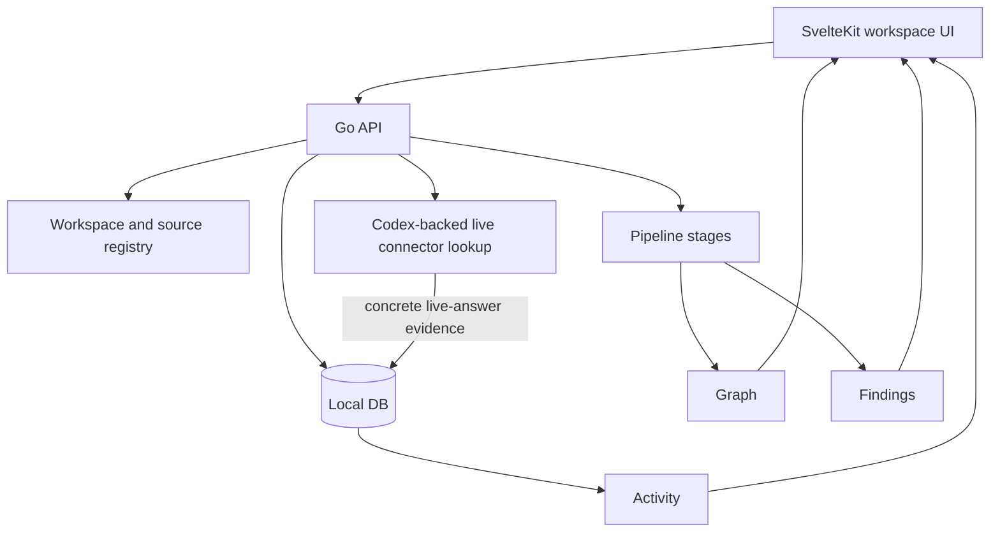
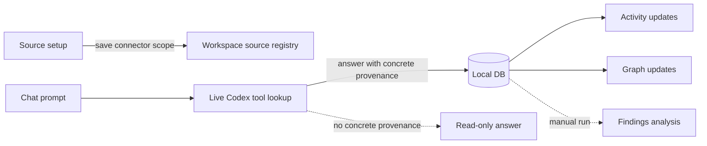

# ContextOS

Local-first workspace intelligence for detecting delivery context drift across engineering and business sources.

ContextOS connects live tool context, local files, persisted evidence artifacts, graph output, and mismatch findings into one local workflow. The first product success metric is still simple:

```text
Detect real cross-layer context misalignment automatically.
```

## What It Does

- Saves external source references for GitHub, Jira/Rovo, Slack, Google Drive, Notion, and SharePoint so chat can query them live through Codex.
- Uploads and ingests local files and folders into ContextOS storage.
- Persists concrete live-answer evidence into the Local DB when chat asks about a specific source.
- Uses the Local DB for Activity, graph, findings, verification, and fallback.
- Runs deterministic pipeline stages for normalization, classification, extraction, identity, relationship, graph, reasoning, execution, and presentation.

## Current Product Shape



External connectors connect first; they do not bulk-ingest automatically. Filesystem is different: browser-selected files, folders, and server-visible paths are ingested locally.

Chat has two visible phases:

| Phase | Behavior |
| --- | --- |
| Live Codex | Concrete external sources are queried first through the relevant Codex plugin. |
| Local DB | Persisted evidence is used for fallback, verification, Activity, graph, and findings. |

Examples of concrete live sources include `BKGDEV-8466`, a Jira browse URL, `owner/repo`, a Slack channel, or a document URL. Broad scopes such as just `jira` or `github` stay read-only.

## How ContextOS Works Now



- Source setup saves connector scope so chat knows which live tool to use.
- Chat queries live tools first for plugin-backed sources, and meaningful prompts without an explicit connector fan out across connected live scopes.
- Concrete live answers save into the Local DB when the answer exposes specific provenance such as document URLs, Jira keys, Slack references, GitHub URLs, Notion URLs, or SharePoint/OneDrive URLs.
- Activity updates automatically after concrete live evidence is saved.
- Graph updates automatically from the saved live answer evidence.
- Optional graph verification can compare saved Local DB evidence across sources when `CONTEXTOS_GRAPH_VERIFIER=codex` is set.
- Findings are manual analysis outputs and update only when analysis/findings is run.
- Broad connector lookups remain read-only unless concrete sources are detected in the live answer.

## Known Gaps

- Broad prompts can still be read-only if no concrete provenance appears in the answer.
- Multi-source saves depend on visible answer provenance.
- Connector permissions such as Rovo 403 still limit live reads.
- Graph quality depends on extraction from saved answer text unless optional graph verification is enabled.

## Quick Start

```bash
./scripts/setup-local.sh
./scripts/start-local.sh
```

Open:

- frontend: http://localhost:5173
- API health: http://localhost:8080/health
- Swagger: http://localhost:8080/swagger/
- Rendered docs HTML: `apps/api/docs/api.html`

Useful checks:

```bash
go test ./...
go vet ./...
cd apps/frontend && npm run test && npm run check
```

`bun` is supported by the scripts when installed; `npm` works with the checked-in frontend scripts in this workspace.

## Important Paths

| Path | Purpose |
| --- | --- |
| `apps/api/` | Go API, route wiring, handlers, generated OpenAPI docs. |
| `apps/frontend/` | SvelteKit product UI. |
| `domain/` | Stable contracts and shared domain types. |
| `internal/` | Pipeline stages, source connectors, chat service, stores, and orchestration. |
| `migrations/` | PostgreSQL schema migrations. |
| `prompts/findings.md` | Active findings prompt. |
| `storage/` | Local raw, parsed, snapshot, and embedding artifacts. |
| `docs/` | Architecture, readiness gates, and connector notes. |
| `.codex/` | Codex agents, instructions, and skills for repository work. |

## Documentation

- [Architecture](docs/ARCHITECTURE.md): pipeline stages, package boundaries, and data flow.
- [Production Readiness](docs/PRODUCTION_READINESS.md): current readiness gates and remaining gaps.
- [MCP Connectors](docs/mcp-connectors.md): connector behavior and integration notes.
- [API](apps/api/README.md): routes, OpenAPI generation, and backend workflow.
- [Frontend](apps/frontend/README.md): workspace UI behavior, source setup, and type generation.

## Development Rules

- Keep domain contracts in `domain/`; implementations belong in `internal/`.
- Preserve the stage flow: source -> ingestion -> normalization -> classification -> extraction -> identity -> relationship -> graph -> reasoning -> execution -> presentation.
- Keep external source setup as connect/save unless it is filesystem upload or explicit ingest.
- Keep concrete live-answer evidence traceable back to connector, source URI, and persisted artifact IDs.
- Add focused tests for behavior changes.
