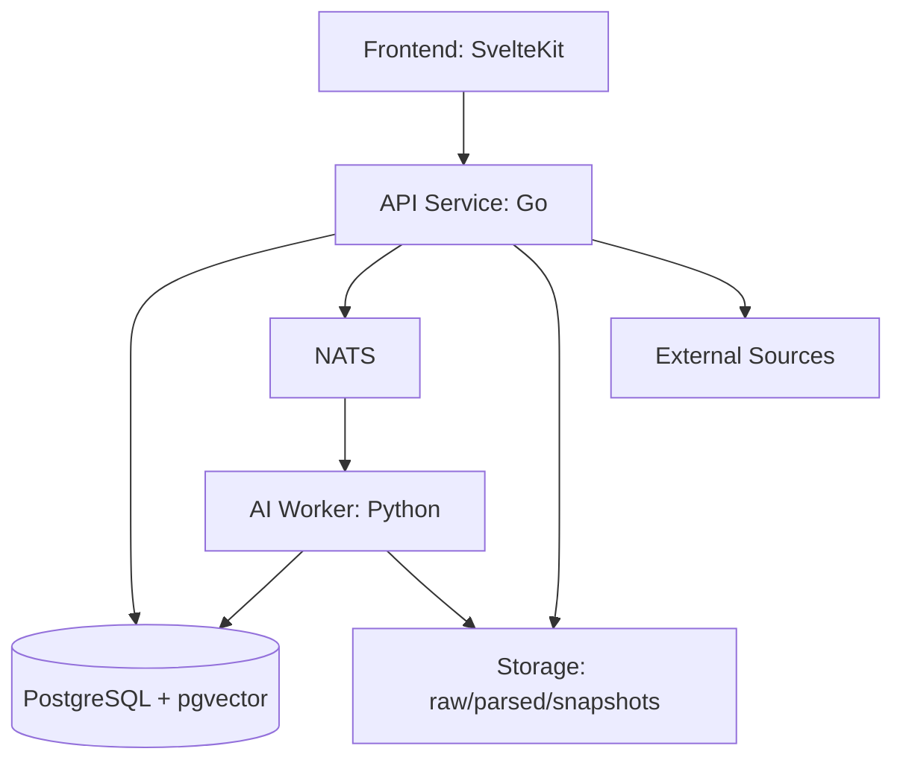

# ContextOS

Local-first AI operating system for delivery intelligence and organizational context synchronization.

ContextOS continuously converts fragmented delivery signals across engineering and business tools into a structured, queryable, and explainable understanding of how work is actually being delivered.

## Why ContextOS Exists

Most organizations do not fail because information is missing. They fail because understanding is fragmented.

Typical failure patterns:

- frontend and backend implement different business assumptions
- PMO status does not match engineering reality
- Jira, Slack, GitHub, docs, and spreadsheets disagree on scope and intent
- key concepts are renamed across teams and languages
- repeated clarification work consumes delivery time

ContextOS addresses this by synchronizing meaning, not just storing data.

## Product Thesis

The hardest part of delivery intelligence is not generation. It is identity resolution under ambiguity.

The same concept often appears in many forms:

```text
refund_status
refundState
refund flag
返金状態
```

ContextOS resolves these into shared business entities, links them to implementation artifacts, and surfaces misalignment before it becomes delay or defect.

## What ContextOS Is

- organizational memory layer
- delivery intelligence engine
- context synchronization platform
- business logic understanding system

ContextOS is not a generic chatbot, coding assistant, or issue tracker replacement.

## System Architecture

### Layered Processing Pipeline

```mermaid
flowchart LR
  subgraph S[Source Connectors]
    S1[GitHub]
    S2[Slack]
    S3[Jira]
    S4[OpenAPI]
    S5[Excel]
    S6[Filesystem]
  end

  subgraph P[Context Processing]
    P1[Ingestion]
    P2[Normalization]
    P3[Classification]
    P4[Extraction]
    P5[Identity Resolution]
    P6[Relationship]
    P7[Context Graph]
    P8[Reasoning]
  end

  subgraph O[Intelligence Outputs]
    O1[Delivery Misalignment Reports]
    O2[Business Logic Maps]
    O3[Dependency Risk Views]
    O4[PMO Summaries]
    O5[Actionable Recommendations]
  end

  S --> P
  P --> O
```



### Runtime Component Architecture



### Domain Responsibilities

Current domain modules map to pipeline stages in [internal](internal):

- source: connector abstraction and source-specific adapters
- ingestion: raw event/document intake and metadata capture
- normalization: canonical schema and text normalization
- classification: content typing and signal routing
- extraction: entity, intent, and rule extraction
- identity: canonical identity resolution and alias merging
- relationship: cross-entity linkage and edge scoring
- graph: graph materialization and traversal views
- reasoning: detection logic and explanation assembly
- execution: orchestration of asynchronous intelligence tasks
- presentation: shaping outputs for API and UI consumption

## Data Contracts and Storage Model

Data is persisted across processing maturity levels:

- raw: immutable source payloads
- parsed: normalized and extracted structured records
- snapshots: reproducible point-in-time context states
- embeddings: vectorized semantic representations

Domain contracts and primitives live in [domain/contracts](domain/contracts), [domain/entities](domain/entities), [domain/events](domain/events), [domain/pipelines](domain/pipelines), and [domain/types](domain/types).

## Tech Stack

- frontend: SvelteKit
- backend APIs and core orchestration: Go
- AI/LLM task workers: Python
- database and vector storage: PostgreSQL + pgvector
- async messaging: NATS
- search: PostgreSQL full text (OpenSearch optional later)
- AI execution strategy: provider-agnostic, hidden internal execution interfaces

## Beyond MVP: Detailed Delivery Plan

This project is intentionally not limited to a demo MVP. The plan below targets production-grade organizational intelligence.

### Phase 0: Platform Foundation

Goals:

- define canonical domain contracts and event envelopes
- establish ingestion idempotency and replay safety
- set up local-first developer workflow and baseline observability

Exit criteria:

- connectors can ingest repeatably without duplication
- each pipeline stage has traceable input/output identifiers
- baseline metrics exist for throughput, latency, and failure rate

### Phase 1: Source Reliability and Parsing Quality

Goals:

- production-ready connectors for GitHub, Slack, Jira, OpenAPI, and Excel
- robust parsing for code, tickets, discussions, and specs
- snapshot versioning for reproducible analysis

Exit criteria:

- end-to-end sync runs across all core connectors
- parse coverage and error rates are measurable and within target
- snapshots can reconstruct a prior context state deterministically

### Phase 2: Identity Resolution Engine

Goals:

- alias dictionary + embedding-assisted identity candidate generation
- confidence scoring, merge rules, and conflict handling
- multilingual and naming-convention-aware matching

Exit criteria:

- canonical entity linking reaches agreed precision/recall targets
- conflicts are surfaced with explainable reasons
- manual correction loop exists and updates future resolution behavior

### Phase 3: Relationship Graph and Dependency Intelligence

Goals:

- model cross-artifact relationships (feature, API, owner, risk, timeline)
- detect dependency chains and ownership bottlenecks
- support graph queries for impact analysis

Exit criteria:

- graph supports critical queries for planning and incident triage
- dependency risk scoring is available through API outputs
- relationship provenance is visible for auditability

### Phase 4: Reasoning and Misalignment Detection

Goals:

- detect FE/BE contract drift, PMO vs implementation drift, and requirement gaps
- generate explainable findings with evidence links
- prioritize risks by likely delivery impact

Exit criteria:

- findings include confidence, impact, and evidence references
- false-positive rate is tracked and controlled
- recommendation quality is validated with team feedback

### Phase 5: Operational Intelligence Productization

Goals:

- delivery intelligence dashboards and periodic summaries
- role-specific views (engineering, PMO, leadership)
- notification and workflow hooks for actionability

Exit criteria:

- users can move from insight to action in one workflow
- recurring reports are stable and trusted by delivery stakeholders
- usage and outcome metrics show measurable planning improvement

### Phase 6: Scale, Governance, and Ecosystem

Goals:

- tenancy, access control, retention, and compliance controls
- plugin-based connector and rule ecosystem
- continuous evaluation framework for model behavior and regressions

Exit criteria:

- governance controls satisfy organizational security requirements
- extension points are documented and stable
- evaluation suite blocks regressions before release

## Success Metrics

ContextOS should be judged by delivery outcomes, not model novelty.

- reduction in FE/BE mismatch incidents
- reduction in repeated clarification cycles
- improved predictability of delivery milestones
- faster impact analysis during requirement changes
- higher confidence in cross-team status accuracy

## Current Repository Structure

- apps: deployable surfaces (api, frontend, ai-worker)
- internal: domain implementations and orchestration logic
- shared: cross-domain contracts, entities, events, and pipeline types
- storage: local-first data layers by processing stage
- tests: pipeline-level validation and integration checks
- docs: architecture and connector specifications

## Near-Term Build Priorities

1. finalize canonical contracts in shared and internal boundaries
2. implement connector reliability guarantees (idempotency + replay)
3. establish measurable identity-resolution benchmarks
4. ship first misalignment reports with explainable evidence
5. add role-specific presentation outputs for PMO and engineering

## Design Principles

- local-first by default
- modular domain boundaries
- observable and explainable intelligence
- deterministic pipelines where possible
- provider-agnostic AI execution layer
- replaceable connectors and reasoning strategies

## Long-Term Outcome

Build persistent organizational intelligence that survives personnel change, tool churn, and naming drift while continuously improving delivery alignment across business and engineering.
