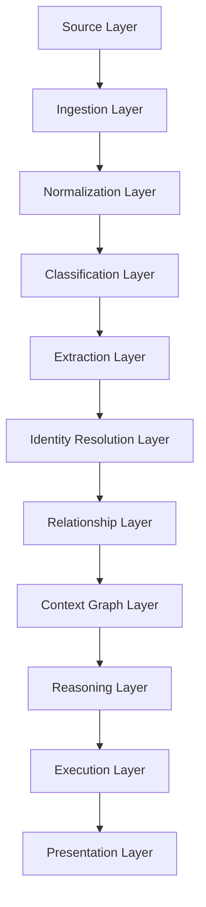

# ContextOS

> Local-first AI Delivery Intelligence Operating System

ContextOS is a modular context synchronization platform designed to solve one of the biggest problems in software delivery:

Fragmented organizational understanding.

Instead of focusing only on code generation, ContextOS continuously ingests engineering communication, extracts structured project knowledge, resolves contextual identity, builds relationship graphs, and detects delivery misalignment across PMO, frontend, backend, QA, and business stakeholders.

The system operates locally-first and uses hidden AI execution (Codex CLI / future providers) internally while exposing only structured intelligence outputs to users.

---

# Core Vision

ContextOS acts as:

- Organizational Memory Layer
- Delivery Intelligence Engine
- Context Synchronization Layer
- Business Logic Understanding Engine

The platform continuously transforms:

```text
Slack + Jira + GitHub + OpenAPI + Excel + Docs
```

into:

```text
Structured Organizational Understanding
```

---

# Main Problem

Modern delivery organizations suffer from:

* FE / BE business logic mismatch
* PMO visibility gaps
* fragmented documentation
* duplicated clarification work
* hidden implementation assumptions
* disconnected naming conventions
* inconsistent API understanding

Current tools store information.

They do NOT synchronize understanding.

---

# Key Insight

The hardest problem is NOT AI generation.

The hardest problem is:

```text
Context Identity Resolution
```

Example:

```text
refund_status
refundState
返金状態
refund flag
```

may all refer to the SAME business concept.

ContextOS resolves these fragmented references into unified organizational understanding.

---

# Core Domains

ContextOS is designed using LEGO-style modular domains.

## Domains

* Source Domain
* Ingestion Domain
* Normalization Domain
* Classification Domain
* Extraction Domain
* Identity Resolution Domain
* Relationship Domain
* Context Graph Domain
* Reasoning Domain
* Execution Domain
* Presentation Domain

Each domain is:

* isolated
* composable
* replaceable
* extensible

---

# Architecture



---

# Tech Stack

## Frontend

* SvelteKit

## Backend

* Go

## AI Workers

* Python

## Database

* PostgreSQL
* pgvector

## Queue

* NATS

## Search

* PostgreSQL Full Text
* OpenSearch later

## AI Execution

* Hidden Codex CLI
* Future provider agnostic

---

# Core MVP

## Inputs

* Git repositories
* Slack exports
* Jira exports
* OpenAPI specs
* Excel mappings

## Outputs

* FE / BE mismatch reports
* business logic extraction
* PMO summaries
* dependency understanding
* implementation risks

---

# Philosophy

ContextOS is NOT:

* another chatbot
* another coding assistant
* another Jira replacement

ContextOS IS:

* an AI operating system for organizational understanding
* a synchronization engine for delivery teams
* a context intelligence platform

---

# Long-Term Goal

Build persistent organizational intelligence:

* historical memory
* business logic continuity
* delivery reasoning
* dependency understanding
* relationship intelligence
* implementation synchronization
