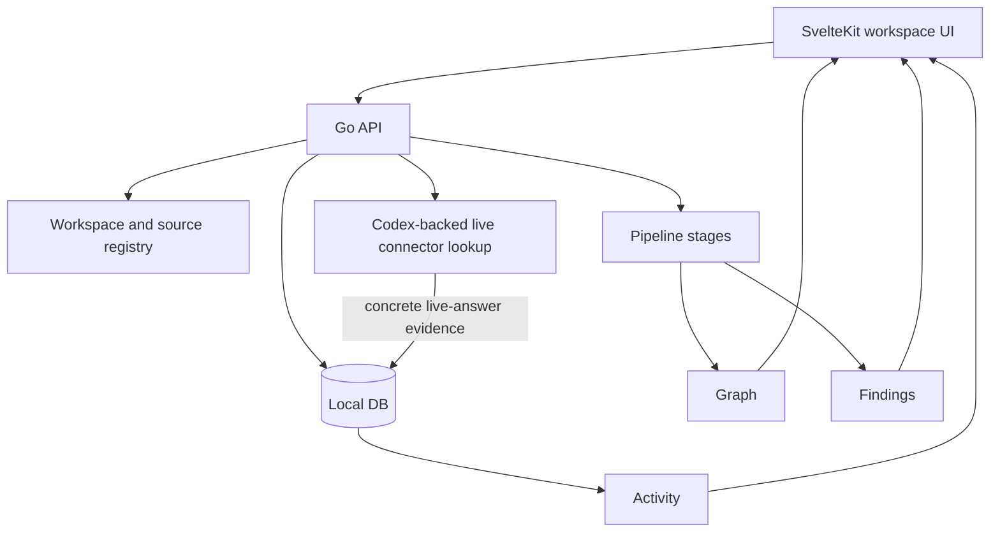
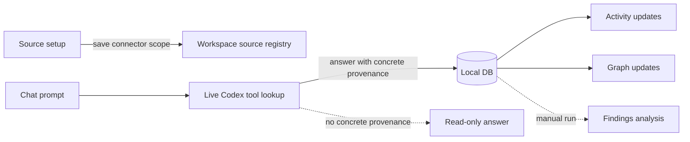

# ContextOS

[中文 README](README.zh-CN.md) | [Contributing](CONTRIBUTING.md) | [License](LICENSE)

Local-first workspace intelligence for detecting delivery context drift across engineering and business sources.

ContextOS connects live tool context, local files, persisted evidence artifacts, graph output, and mismatch findings into one local workflow. The first product success metric is simple:

```text
Detect real cross-layer context misalignment automatically.
```

## What It Does

- Saves source references for GitHub, Jira/Rovo, Slack, Google Drive, Notion, and SharePoint so chat can query them live through Codex.
- Uploads and ingests local files and folders into ContextOS storage.
- Persists concrete live-answer evidence into the Local DB when chat answers from a specific source.
- Uses the Local DB for Activity, graph, findings, verification, and fallback.
- Runs deterministic pipeline stages for normalization, classification, extraction, identity, relationship, graph, reasoning, execution, and presentation.
- Keeps provenance attached so findings can trace back to real source artifacts.

## Tech Stack

| Area | Stack |
| --- | --- |
| Backend API | Go 1.24, net/http, generated Swagger/OpenAPI docs |
| Frontend | SvelteKit, Svelte 5, TypeScript, Vite |
| Frontend tests | Jest, SWC, svelte-check |
| Local database | PostgreSQL with pgvector |
| Queue/runtime infra | NATS with JetStream |
| AI worker | Python, uv |
| Live source access | Codex CLI plugins for GitHub, Atlassian Rovo/Jira, Slack, Google Drive, Notion, and SharePoint |
| Local orchestration | Bash scripts, Docker Compose |

## Architecture

ContextOS is organized around a layered pipeline:

```mermaid
flowchart LR
  Source[source] --> Ingestion[ingestion]
  Ingestion --> Normalization[normalization]
  Normalization --> Classification[classification]
  Classification --> Extraction[extraction]
  Extraction --> Identity[identity]
  Identity --> Relationship[relationship]
  Relationship --> Graph[graph]
  Graph --> Reasoning[reasoning]
  Reasoning --> Execution[execution]
  Execution --> Presentation[presentation]
```



Current product shape:



External connectors connect first; they do not bulk-ingest automatically. Filesystem is different: browser-selected files, folders, and server-visible paths are ingested locally.

## How ContextOS Works Now



Chat has two visible phases:

| Phase | Behavior |
| --- | --- |
| Live Codex | Concrete external sources are queried first through the relevant Codex plugin. |
| Local DB | Persisted evidence is used for fallback, verification, Activity, graph, and findings. |

Examples of concrete live sources include `BKGDEV-8466`, a Jira browse URL, `owner/repo`, a Slack channel, or a document URL. Broad scopes such as just `jira` or `github` stay read-only.

## Quick Start

The local setup script currently targets Linux:

```bash
./scripts/setup-local.sh
./scripts/start-local.sh
```

Open:

- Frontend: http://localhost:5173
- API health: http://localhost:8080/health
- Swagger: http://localhost:8080/swagger/
- Rendered docs HTML: `apps/api/docs/api.html`

Useful checks:

```bash
go test ./...
go vet ./...
cd apps/frontend && bun run test && bun run check
```

`bun` is supported by the scripts when installed; `npm` works with the checked-in frontend scripts in this workspace.

## Docker Compose

```bash
docker compose up --build
```

The compose stack starts PostgreSQL with pgvector, NATS, the Go API, the Python worker, and the SvelteKit frontend.

## Important Paths

| Path | Purpose |
| --- | --- |
| `apps/api/` | Go API, route wiring, handlers, generated OpenAPI docs. |
| `apps/frontend/` | SvelteKit product UI. |
| `apps/ai-worker/` | Python worker service. |
| `domain/` | Stable contracts and shared domain types. |
| `internal/` | Pipeline stages, source connectors, chat service, stores, and orchestration. |
| `migrations/` | PostgreSQL schema migrations. |
| `prompts/findings.md` | Active findings prompt. |
| `storage/` | Local raw, parsed, snapshot, and embedding artifacts. |
| `docs/` | Architecture, readiness gates, and connector notes. |
| `.codex/` | Codex agents, instructions, and skills for repository work. |

## Documentation

- [Architecture](docs/ARCHITECTURE.md): pipeline stages, package boundaries, and data flow.
- [Production Readiness](docs/PRODUCTION_READINESS.md): current readiness gates and remaining gaps.
- [MCP Connectors](docs/mcp-connectors.md): connector behavior and integration notes.
- [API](apps/api/README.md): routes, OpenAPI generation, and backend workflow.
- [Frontend](apps/frontend/README.md): workspace UI behavior, source setup, and type generation.

## Development Rules

- Keep domain contracts in `domain/`; implementations belong in `internal/`.
- Preserve the stage flow: source -> ingestion -> normalization -> classification -> extraction -> identity -> relationship -> graph -> reasoning -> execution -> presentation.
- Keep external source setup as connect/save unless it is filesystem upload or explicit ingest.
- Keep concrete live-answer evidence traceable back to connector, source URI, and persisted artifact IDs.
- Add focused tests for behavior changes.

## Contributing

Issues and pull requests are welcome. This is a maintainer-led repository: only the owner/maintainer can merge into protected branches. See [CONTRIBUTING.md](CONTRIBUTING.md) for the workflow.

## Known Gaps

- Broad prompts can still be read-only if no concrete provenance appears in the answer.
- Multi-source saves depend on visible answer provenance.
- Connector permissions such as Rovo 403 still limit live reads.
- Graph quality depends on extraction from saved answer text unless optional graph verification is enabled.

## License

ContextOS is released under the [MIT License](LICENSE).
