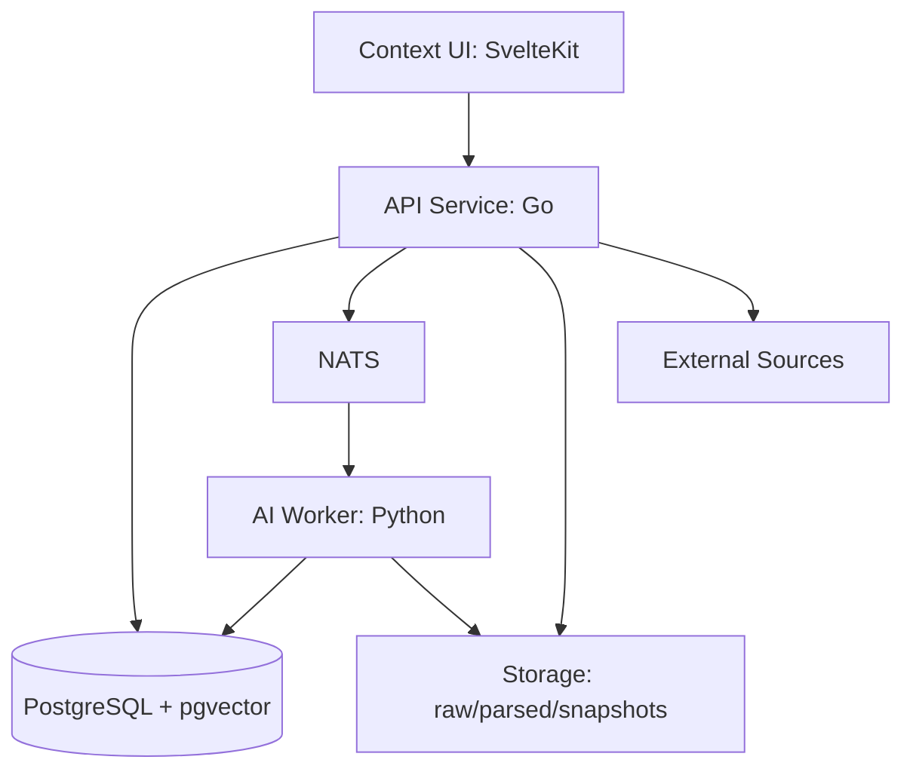

# ContextOS

Local-first AI operating system for delivery intelligence and organizational context synchronization.

ContextOS continuously converts fragmented delivery signals across engineering and business tools into a structured, queryable, and explainable understanding of how work is actually being delivered.

## Why ContextOS Exists

Most organizations do not fail because information is missing. They fail because understanding is fragmented.

Typical failure patterns:

- presentation and service layers implement different business assumptions
- PMO status does not match engineering reality
- Jira, Slack, GitHub, docs, and spreadsheets disagree on scope and intent
- key concepts are renamed across teams and languages
- repeated clarification work consumes delivery time

ContextOS addresses this by synchronizing meaning, not just storing data.

## Product Thesis

The hardest part of delivery intelligence is not generation. It is identity resolution under ambiguity.

The same concept often appears in many forms:

```text
refund_status
refundState
refund flag
返金状態
```

ContextOS resolves these into shared business entities, links them to implementation artifacts, and surfaces misalignment before it becomes delay or defect.

## What ContextOS Is

- organizational memory layer
- delivery intelligence engine
- context synchronization platform
- business logic understanding system

ContextOS is not a generic chatbot, coding assistant, or issue tracker replacement.

## System Architecture

The pipeline processes source events through eleven deterministic stages from ingestion to presentation. For domain diagrams, stage contracts, dependency rules, and per-stage implementation guides, see [docs/ARCHITECTURE.md](docs/ARCHITECTURE.md).

### Runtime Component Architecture



## Storage Model

Data is persisted across processing maturity levels:

- raw: immutable source payloads
- parsed: normalized and extracted structured records
- snapshots: reproducible point-in-time context states
- embeddings: vectorized semantic representations

Domain contracts and package structure are documented in [docs/ARCHITECTURE.md](docs/ARCHITECTURE.md).

## Tech Stack

- context UI: SvelteKit
- APIs and core orchestration: Go
- AI/LLM task workers: Python
- database and vector storage: PostgreSQL + pgvector
- async messaging: NATS
- search: PostgreSQL full text (OpenSearch optional later)
- AI execution strategy: provider-agnostic, hidden internal execution interfaces

## Getting Started (Local)

### 1) Set up prerequisites

```bash
./scripts/setup-local.sh
```

Installs Go, Bun, Python 3.12, `uv`, Codex CLI, and the GitHub, Atlassian Rovo, and Slack Codex plugins on Linux. Run once on a fresh machine.

### 2) Validate the repository

```bash
go mod tidy
go test ./...
```

### 3) Start all services

```bash
./scripts/start-all.sh
```

Starts the API, context UI dev server, and AI worker together. Press `Ctrl+C` to stop all processes. If `uv` is not found, the AI worker is skipped automatically.

Local connector UI is served from `apps/frontend` and includes GitHub, Jira, Slack, Google Drive, Notion, SharePoint, filesystem, and Codex CLI status/login flows. Filesystem ingestion covers browser-uploaded files/folders, server-visible local paths, spreadsheets, and OpenAPI spec files.

## Current Production Status

This repository is moving toward a production-ready local-first product, but it is not production-ready yet. The working pieces are strong enough for local development, connector experiments, deterministic pipeline tests, and early workspace-scoped querying. The unfinished pieces are mainly around production hardening: real-world connector replay guarantees, graph persistence depth, evaluation fixtures, security controls, and release operations.

### Working Today

| Area | Status |
| --- | --- |
| Local API service | Go API starts on `:8080`, exposes health, connector, workspace, artifact, chat, graph, and presentation endpoints. |
| Local frontend | SvelteKit product workspace exists with workspace selection, DB-backed source setup, chat/search flow, findings view, and connector debug routes. |
| Workspace model | Workspaces are keyed by local folder path and persisted through PostgreSQL when the database is available. |
| Database migrations | PostgreSQL migrations create workspaces, ingest events, entities, relationships, mismatches, connector sync state, and audit log tables. |
| Source connectors | GitHub, Jira, Slack, Google Drive, Notion, SharePoint/OneDrive, filesystem, and Codex status/login endpoints are scaffolded and tested at handler/package level. |
| Filesystem ingestion | Local paths, browser uploads, recursive folders, text/code/config files, CSV/XLSX, DOCX, PPTX, PDF best-effort text, and OpenAPI JSON/YAML metadata are supported. |
| Artifact query | `/artifacts` queries locally persisted ingest events by workspace, connector, source URI, date range, text, and limit. It only sees data that has gone through a persistence path such as `/presentation/findings`, not plain `/ingest` responses. |
| Local chat query | `/chat/query` answers deterministic source questions from local artifacts only. |
| Pipeline stages | Normalization, classification, extraction, identity, relationship, graph, reasoning, presentation, and execution packages exist with unit tests. |
| Graph snapshots | In-memory graph can save and load deterministic local JSON snapshots. |
| Reasoning output | Deterministic mismatch rules emit findings with confidence, evidence, impact, severity, affected roles, and recommended action. |
| Backend tests | `go test ./...` passes in this workspace. |

### Not Working Yet

| Area | Gap To Close |
| --- | --- |
| Production connector reliability | Cloud connectors need broader real-account validation, retry/backoff coverage, cursor replay tests, rate-limit behavior checks, and duplicate prevention under repeated sync. |
| End-to-end production sync | Background sync exists, but full multi-connector lifecycle testing with real credentials, failures, restarts, and replays is still needed. |
| Connector debug-to-DB flow | The main `Install Knowledge` flow now uses the DB-backed findings pipeline, but older connector debug pages still call `/api/<connector>/ingest` or `/api/<connector>/ingest/stream`; those routes return events but do not persist them to PostgreSQL. See [Frontend Ingest And Database Audit](docs/FRONTEND_INGEST_DB_AUDIT.md). |
| Durable raw and parsed storage discipline | Raw, parsed, snapshot, and embedding storage exists, but retention policy, cleanup, schema versioning, and reproducible replay workflows need hardening. |
| Identity resolution quality | Current identity matching is deterministic and tested, but production needs alias dictionaries, semantic candidate review, conflict workflows, precision/recall targets, and human correction loops. |
| Relationship intelligence | Relationship extraction still needs richer typed edges, source-span evidence, confidence scoring, and graph constraints beyond basic deterministic linking. |
| Reasoning quality | Current rules are explainable, but production needs realistic evaluation fixtures, false-positive tracking, PMO-vs-engineering drift rules, and recommendation quality checks. |
| Execution backend | Execution boundary exists, but generated/assistive analysis still needs a production local executor path with persisted prompts, output provenance, errors, and timeouts. |
| Frontend production build verification | Frontend Jest tests and Svelte type checks pass with the Node/npm tooling in this workspace, but a production build gate and browser smoke test still need to be added. |
| Auth and secrets | Local connector secrets work through environment/request/OAuth paths, but production needs secret handling rules, token isolation, audit review, and least-privilege setup docs. |
| Observability | Some trace/status metadata exists, but production needs structured logs, metrics, trace IDs across every stage, operator-visible failures, and alert thresholds. |
| Release packaging | Docker files and compose exist, but production needs repeatable release builds, environment validation, migrations strategy, backup/restore, and smoke tests. |

## Phase-By-Phase Production Plan

Use these phases as the build order. Do not treat later AI or dashboard work as production until the earlier replay, storage, and evaluation gates are satisfied.

### Phase 0: Baseline Local Product

Goal: make the current local developer product reliable enough that every new change can be verified.

Working:

- Go API routes, domain packages, migrations, and backend tests.
- SvelteKit product workspace and connector screens.
- Local filesystem response-only ingest, persisted findings analysis, and artifact/chat workflows once data is in PostgreSQL.

Not done:

- Frontend production build and browser smoke-test verification.
- Connector debug pages must be rewired to persist ingested events before marking a connector ready.
- One-command environment validation that confirms Go, Bun, Python/uv, Docker, Postgres, and Codex readiness.
- Clear smoke-test script for API, frontend, database, and one sample ingest.

Production exit criteria:

- Calling source setup from the frontend increases `/workspace/status.event_count` and makes `/artifacts` return the ingested item.
- `go test ./...`, frontend tests, frontend type check, and API smoke tests pass from a fresh setup.
- `scripts/start-all.sh` gives a clear success/failure summary.
- README setup steps match reality on a clean machine.

### Phase 1: Replay-Safe Source Ingestion

Goal: every source can be ingested repeatedly without duplicate or unstable records.

Working:

- Connector endpoints and source packages exist.
- Filesystem has the strongest current extraction and metadata coverage.
- Database tables support ingest events and connector sync state.

Not done:

- Real credential test matrix for GitHub, Jira, Slack, Google Drive, Notion, and SharePoint.
- Cursor and modified-time replay tests for every connector.
- Consistent retry, cancellation, timeout, and partial-failure behavior.

Production exit criteria:

- Re-running the same sync produces stable event IDs and no duplicate facts.
- Every connector records source URI, object ID, content hash or cursor, status, last error, and event count.
- Failed syncs can resume without corrupting workspace state.

### Phase 2: Durable Storage And Reproducible Pipeline

Goal: make every pipeline result traceable back to raw input and reproducible from local storage.

Working:

- PostgreSQL schema covers core entities, relationships, mismatches, sync state, and audit log.
- Local storage folders exist for raw, parsed, snapshots, and embeddings.
- Graph snapshots can be saved and loaded deterministically.

Not done:

- Strict raw-to-parsed-to-graph replay command.
- Retention and cleanup policy.
- Audit log writes for all important stage transitions.
- Snapshot/version compatibility checks beyond current graph JSON behavior.

Production exit criteria:

- A workspace can be rebuilt from persisted source events and raw/parsed artifacts.
- Migrations are idempotent and tested against empty and existing databases.
- Backup/restore instructions are documented and verified.

### Phase 3: Identity Resolution Quality

Goal: resolve the same concept across source systems with explainable confidence.

Working:

- Identity package exists with deterministic matching tests.
- Entity persistence supports aliases, confidence, match layer, conflict reason, and human-review fields.

Not done:

- Alias dictionary workflow.
- Human correction flow.
- Multilingual and naming-convention benchmarks at production scale.
- Precision/recall targets for canonical entity linking.

Production exit criteria:

- Entity merges include confidence, evidence, and reason.
- Ambiguous matches are marked for review instead of silently merged.
- Regression fixtures prevent identity quality from drifting.

### Phase 4: Relationship Graph And Impact Analysis

Goal: build a useful context graph for impact, ownership, and dependency questions.

Working:

- Graph package stores entities, relationships, history, snapshots, neighbors, and impact traversal.
- Relationship package emits typed relationships with tests.
- `/graph` endpoint can expose persisted entities when the database is available.

Not done:

- Rich typed relationship vocabulary across requirements, APIs, DB fields, owners, services, risks, and timelines.
- Relationship source-span evidence.
- Graph query coverage for real planning and incident workflows.

Production exit criteria:

- Users can ask what is affected by a requirement/API/service change and get traceable answers.
- Relationships have stable IDs, confidence, evidence, and source provenance.
- Graph snapshots are part of regression tests.

### Phase 5: Reasoning And Misalignment Detection

Goal: deliver the first production success metric: detect real cross-layer context misalignment automatically.

Working:

- Deterministic reasoning rules detect keyword signals, requirement gaps, API/DB contract drift, and dependency risks.
- Findings include confidence, impact, evidence, severity, affected roles, and recommended action.
- Presentation outputs expose findings for UI consumption.

Not done:

- Realistic cross-layer evaluation dataset.
- False-positive tracking.
- PMO status vs implementation drift detection.
- Recommendation quality review.

Production exit criteria:

- A realistic fixture set proves expected findings and blocks regressions.
- False positives are tracked and kept below an agreed threshold.
- Findings always cite source evidence and never depend only on generated text.

### Phase 6: Product Workflow And Operator Experience

Goal: make the product usable repeatedly by a real operator, not just a developer.

Working:

- Main frontend product window supports workspace selection, source setup, chat, and truth panel workflows.
- Connector debug and findings pages exist for deeper inspection.

Not done:

- Production-grade empty, loading, error, and recovery states across every flow.
- Clear source health, last sync, and next action guidance.
- Role-specific reports that users can trust without reading raw logs.

Production exit criteria:

- A user can add a workspace, connect sources, sync, ask questions, inspect evidence, and recover from connector errors without touching code.
- Every important answer links back to local artifacts or findings.
- UI build, type check, and test suite pass in CI.

### Phase 7: Security, Operations, And Release

Goal: make the local-first product safe to install, run, update, and recover.

Working:

- Docker files, compose file, setup scripts, and local service scripts exist.
- API starts even if the database is temporarily unavailable, with DB-backed endpoints disabled.

Not done:

- Secret storage policy and token rotation guidance.
- Structured logs and metrics.
- Release artifacts and versioned upgrade path.
- Backup/restore and disaster recovery drill.
- CI gate that runs backend, frontend, migration, and smoke tests.

Production exit criteria:

- Fresh install, upgrade, backup, restore, and uninstall are documented and tested.
- Logs expose failures without leaking secrets.
- CI blocks broken migrations, broken API contracts, failing tests, and broken frontend builds.

## Production Delivery Plan

The plan below targets production-grade organizational intelligence with local-first operation, replay-safe ingestion, durable graph memory, and explainable misalignment findings.

### Phase 0: Platform Foundation

Goals:

- define canonical domain contracts and event envelopes
- establish ingestion idempotency and replay safety
- set up local-first developer workflow and baseline observability

Exit criteria:

- connectors can ingest repeatably without duplication
- each pipeline stage has traceable input/output identifiers
- baseline metrics exist for throughput, latency, and failure rate

### Phase 1: Source Reliability and Parsing Quality

Goals:

- production-ready connectors for GitHub, Slack, Jira, Google Drive, Notion, SharePoint, and filesystem
- robust parsing for code, tickets, discussions, OpenAPI specs, spreadsheets, and documents
- snapshot versioning for reproducible analysis

Exit criteria:

- end-to-end sync runs across all core connectors and supported filesystem formats
- parse coverage and error rates are measurable and within target
- snapshots can reconstruct a prior context state deterministically

### Phase 2: Identity Resolution Engine

Goals:

- alias dictionary + embedding-assisted identity candidate generation
- confidence scoring, merge rules, and conflict handling
- multilingual and naming-convention-aware matching

Exit criteria:

- canonical entity linking reaches agreed precision/recall targets
- conflicts are surfaced with explainable reasons
- manual correction loop exists and updates future resolution behavior

### Phase 3: Relationship Graph and Dependency Intelligence

Goals:

- model cross-artifact relationships (feature, API, owner, risk, timeline)
- detect dependency chains and ownership bottlenecks
- support graph queries for impact analysis

Exit criteria:

- graph supports critical queries for planning and incident triage
- dependency risk scoring is available through API outputs
- relationship provenance is visible for auditability

### Phase 4: Reasoning and Misalignment Detection

Goals:

- detect cross-layer context drift, PMO vs implementation drift, and requirement gaps
- generate explainable findings with evidence links
- prioritize risks by likely delivery impact

Exit criteria:

- findings include confidence, impact, and evidence references
- false-positive rate is tracked and controlled
- recommendation quality is validated with team feedback

### Phase 5: Operational Intelligence Productization

Goals:

- delivery intelligence dashboards and periodic summaries
- role-specific views (engineering, PMO, leadership)
- notification and workflow hooks for actionability

Exit criteria:

- users can move from insight to action in one workflow
- recurring reports are stable and trusted by delivery stakeholders
- usage and outcome metrics show measurable planning improvement

### Phase 6: Scale, Governance, and Ecosystem

Goals:

- tenancy, access control, retention, and compliance controls
- plugin-based connector and rule ecosystem
- continuous evaluation framework for model behavior and regressions

Exit criteria:

- governance controls satisfy organizational security requirements
- extension points are documented and stable
- evaluation suite blocks regressions before release

## Success Metrics

ContextOS should be judged by delivery outcomes, not model novelty.

- reduction in cross-layer misalignment incidents
- reduction in repeated clarification cycles
- improved predictability of delivery milestones
- faster impact analysis during requirement changes
- higher confidence in cross-team status accuracy

## Current Repository Structure

- apps: deployable surfaces (api, context UI, ai-worker)
- internal: domain implementations and orchestration logic
- domain: cross-domain contracts, entities, events, and pipeline types
- storage: local runtime files and derived artifacts; PostgreSQL is the current product source of truth. See [docs/STORAGE_DB_REPLAN.md](docs/STORAGE_DB_REPLAN.md)
- tests: pipeline-level validation and integration checks
- docs: architecture and connector specifications

## Near-Term Build Priorities

1. finalize canonical contracts in domain and internal boundaries
2. implement connector reliability guarantees (idempotency + replay)
3. establish measurable identity-resolution benchmarks
4. ship first misalignment reports with explainable evidence
5. add role-specific presentation outputs for PMO and engineering

## Design Principles

- local-first by default
- modular domain boundaries
- observable and explainable intelligence
- deterministic pipelines where possible
- provider-agnostic AI execution layer
- replaceable connectors and reasoning strategies

## Long-Term Outcome

Build persistent organizational intelligence that survives personnel change, tool churn, and naming drift while continuously improving delivery alignment across business and engineering.
