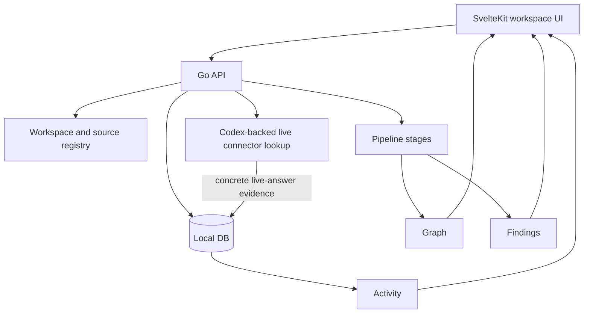
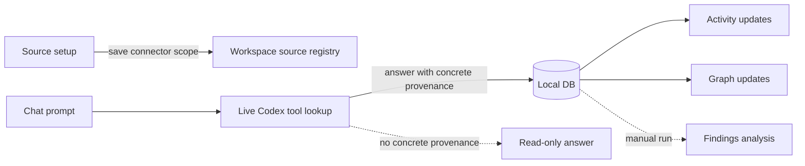

# ContextOS

[English README](README.md) | [贡献指南](CONTRIBUTING.md) | [许可证](LICENSE)

ContextOS 是一个本地优先的工作区智能系统，用来发现工程和业务上下文之间的交付偏差。

它会把实时工具上下文、本地文件、已持久化的证据、图谱结果和不一致发现连接到同一个本地工作流里。当前最重要的产品目标是：

```text
自动发现真实的跨层上下文不一致。
```

## 它能做什么

- 保存 GitHub、Jira/Rovo、Slack、Google Drive、Notion、SharePoint 等来源引用，让聊天流程可以通过 Codex 实时查询。
- 上传并摄取本地文件和文件夹。
- 当聊天回答来自具体来源时，把实时回答中的证据保存到本地数据库。
- 使用本地数据库支持 Activity、图谱、发现、验证和兜底查询。
- 运行确定性的流水线阶段：normalization、classification、extraction、identity、relationship、graph、reasoning、execution、presentation。
- 保留 provenance，让每个发现都能追溯到真实来源材料。

## 技术栈

| 模块 | 技术 |
| --- | --- |
| 后端 API | Go 1.24、net/http、Swagger/OpenAPI |
| 前端 | SvelteKit、Svelte 5、TypeScript、Vite |
| 前端测试 | Jest、SWC、svelte-check |
| 本地数据库 | PostgreSQL、pgvector |
| 队列和运行时基础设施 | NATS、JetStream |
| AI Worker | Python、uv |
| 实时来源访问 | Codex CLI 插件：GitHub、Atlassian Rovo/Jira、Slack、Google Drive、Notion、SharePoint |
| 本地编排 | Bash 脚本、Docker Compose |

## 架构

ContextOS 按照分层流水线组织：

```mermaid
flowchart LR
  Source[source] --> Ingestion[ingestion]
  Ingestion --> Normalization[normalization]
  Normalization --> Classification[classification]
  Classification --> Extraction[extraction]
  Extraction --> Identity[identity]
  Identity --> Relationship[relationship]
  Relationship --> Graph[graph]
  Graph --> Reasoning[reasoning]
  Reasoning --> Execution[execution]
  Execution --> Presentation[presentation]
```



当前产品形态：



外部连接器默认先连接并保存范围，不会自动批量摄取。Filesystem 比较特殊：浏览器选择的文件、文件夹和 API 进程可见的本地路径会被本地摄取。

## 当前工作方式



聊天流程有两个可见阶段：

| 阶段 | 行为 |
| --- | --- |
| Live Codex | 优先通过对应 Codex 插件查询具体外部来源。 |
| Local DB | 使用已保存证据进行兜底、验证、Activity、图谱和发现分析。 |

具体来源示例包括 `BKGDEV-8466`、Jira browse URL、`owner/repo`、Slack channel 或文档 URL。像 `jira` 或 `github` 这样的宽泛范围默认只读。

## 快速开始

本地安装脚本当前面向 Linux：

```bash
./scripts/setup-local.sh
./scripts/start-local.sh
```

打开：

- 前端：http://localhost:5173
- API health：http://localhost:8080/health
- Swagger：http://localhost:8080/swagger/
- 渲染后的 API 文档：`apps/api/docs/api.html`

常用检查：

```bash
go test ./...
go vet ./...
cd apps/frontend && bun run test && bun run check
```

脚本支持 `bun`；在本工作区中，已提交的前端脚本也可以配合 `npm` 使用。

## Docker Compose

```bash
docker compose up --build
```

Compose 会启动 PostgreSQL/pgvector、NATS、Go API、Python worker 和 SvelteKit 前端。

## 重要目录

| 路径 | 用途 |
| --- | --- |
| `apps/api/` | Go API、路由、handler、生成的 OpenAPI 文档。 |
| `apps/frontend/` | SvelteKit 产品界面。 |
| `apps/ai-worker/` | Python worker 服务。 |
| `domain/` | 稳定的领域契约和共享类型。 |
| `internal/` | 流水线阶段、来源连接器、聊天服务、存储和编排。 |
| `migrations/` | PostgreSQL schema migration。 |
| `prompts/findings.md` | 当前 findings prompt。 |
| `storage/` | 本地 raw、parsed、snapshot、embedding 产物。 |
| `docs/` | 架构、readiness gate 和连接器说明。 |
| `.codex/` | 本仓库使用的 Codex agent、instruction 和 skill。 |

## 文档

- [Architecture](docs/ARCHITECTURE.md)：流水线阶段、包边界和数据流。
- [Production Readiness](docs/PRODUCTION_READINESS.md)：当前 readiness gate 和剩余差距。
- [MCP Connectors](docs/mcp-connectors.md)：连接器行为和集成说明。
- [API](apps/api/README.md)：路由、OpenAPI 生成和后端工作流。
- [Frontend](apps/frontend/README.md)：工作区 UI、来源设置和类型生成。

## 开发规则

- 领域契约放在 `domain/`；具体实现放在 `internal/`。
- 保持阶段顺序：source -> ingestion -> normalization -> classification -> extraction -> identity -> relationship -> graph -> reasoning -> execution -> presentation。
- 外部来源默认只 connect/save；除非是 filesystem upload 或明确要求 ingest。
- 实时回答保存的证据必须能追溯到 connector、source URI 和持久化 artifact ID。
- 行为变更需要添加聚焦的测试。

## 贡献

欢迎 issue 和 pull request。本仓库由维护者主导，受保护分支只能由 owner/maintainer 合并。详情见 [CONTRIBUTING.md](CONTRIBUTING.md)。

## 已知差距

- 如果回答里没有具体 provenance，宽泛 prompt 仍可能保持只读。
- 多来源保存依赖回答中是否出现可见 provenance。
- Rovo 403 之类的连接器权限问题仍会限制实时读取。
- 除非启用可选 graph verification，否则图谱质量依赖从已保存回答文本中抽取。

## 许可证

ContextOS 使用 [MIT License](LICENSE)。
