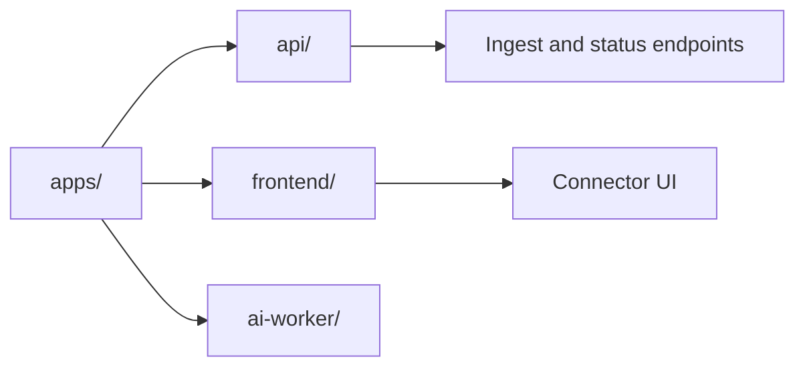

# Apps

This directory contains runnable ContextOS applications.

## Overview

- `api/`: HTTP API service, handlers, middleware, and generated API docs.
- `frontend/`: Svelte frontend for connector operations and ingest workflows.
- `ai-worker/`: Python worker utilities used by local development workflows.

## Directory Map

## Maintenance Checklist

- Keep app-level commands documented in each subfolder README.
- Update this file when a new application folder is introduced.
- Ensure app contracts and route changes are reflected in sibling docs.
