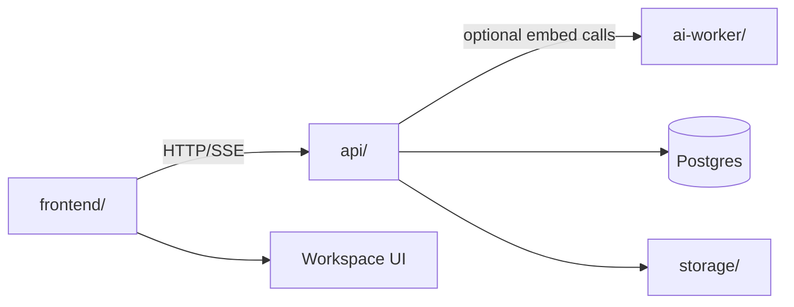

# Apps

Runnable ContextOS applications live here. Each app owns its runtime entrypoints, dependency files, and local tests; shared contracts stay in `domain/`, and shared implementations stay in `internal/`.

## Runtime Map

## Folder Jobs

| Folder | Responsibility | Update when |
| --- | --- | --- |
| [`api/`](api/README.md) | Go HTTP API, route wiring, generated OpenAPI artifacts, and backend runtime composition. | Routes, request/response contracts, persistence wiring, or generated docs change. |
| [`frontend/`](frontend/README.md) | SvelteKit workspace UI for source setup, chat, activity, graph, and findings. | UI behavior, API type generation, route shape, or frontend commands change. |
| [`ai-worker/`](ai-worker/README.md) | Optional Python worker utilities for deterministic local embeddings and future assistive AI tasks. | Worker endpoints, Python dependencies, or Go worker client contracts change. |

## Maintenance Checklist

- Keep app-level commands documented in each subfolder README.
- Update this file when a new application folder is introduced.
- Reflect cross-app contract changes in both the API and frontend READMEs.
