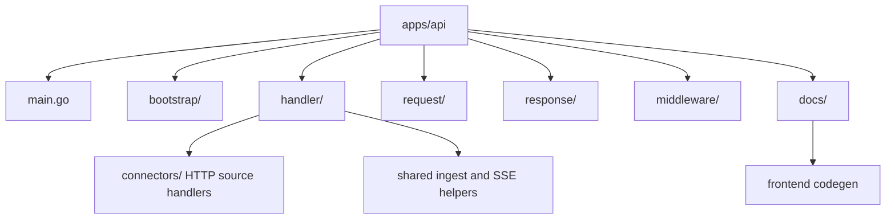

# API App

Go API application surface for ContextOS orchestration endpoints.

## Production responsibility

- Expose local-first pipeline orchestration endpoints.
- Return traceable ingest results today, and preserve entity/finding evidence as pipeline endpoints grow.
- Preserve evidence, confidence, impact, and recommended actions in API responses.
- Keep API contracts aligned with the domain layer.

## Folder layout



```
apps/api/
  main.go          — entry point: loopback addr config, DB open/migrations, ListenAndServe only
  bootstrap/       — API composition: handler dependency construction, route list, CORS registration
  handler/
    connectors/           — HTTP handlers for source connector routes
      github/             — GitHub status, direct/token ingest, and Codex stream ingest
      googledrive/        — Google Drive status and folder ingest
      jira/               — Jira status, direct/token ingest, and Codex/Rovo stream ingest
      filesystem/         — filesystem path ingest and browser upload staging
      notion/             — Notion status, page/database ingest, and Codex stream ingest
      sharepoint/         — SharePoint/OneDrive status, Graph ingest, and Codex stream ingest
      slack/              — Slack status, OAuth, direct/token ingest, and Codex stream ingest
      codex/              — Codex CLI status, login, and plugin reauth streams
    shared/               — shared ingest plumbing + SSE infrastructure (used by all domain packages)
    health/               — GET /health
    README.md             — handler package docs, patterns, and new-connector checklist
  request/
    ingest.go      — inbound ingest request structs
  response/
    error.go       — WriteJSON, WriteError, WriteConnectorError helpers
    ingest.go      — shared ingest response contract and connector aliases
    artifact.go    — local artifact query response projection
    chat.go        — local chat query response projection
  middleware/
    cors.go        — WithCORS middleware
  docs/
    docs.go        — generated by swag init; required to build
    swagger.json   — generated OpenAPI 2.0 spec; source for frontend codegen
    swagger.yaml   — generated YAML spec
    api.html       — generated standalone Redoc HTML
```

`apps/api/docs/` is the only checked-in generated OpenAPI bundle. Do not add duplicate generated documentation paths.

## Convention: adding a new connector endpoint

1. Add the inbound JSON struct to `request/ingest.go`.
2. Reuse `response.Ingest` unless the connector needs a genuinely different response shape.
3. Create a new `handler/connectors/<domain>/` package with a `<domain>.go` file and its own `README.md`; include full swag annotations (`@Summary`, `@Tags`, `@Accept`, `@Produce`, `@Param`, `@Success`, `@Failure`, `@Router`).
4. Register the route in `main.go` — the `@Router` tag must exactly match.
5. Regenerate docs (required before building): `swag init -g apps/api/main.go -o apps/api/docs`. Then refresh frontend TypeScript types: `cd apps/frontend && bun run codegen`. All steps run automatically via `start-local.sh`.
6. Update this README and the frontend connector config/component when the endpoint is user-facing.

## Endpoints

| Method | Path                    | Description                                                                              |
| ------ | ----------------------- | ---------------------------------------------------------------------------------------- |
| GET    | `/health`               | Liveness check — returns `{"status":"ok"}`                                               |
| GET    | `/workspace`            | Lists registered local workspaces                                                        |
| POST   | `/workspace/upsert`     | Registers or updates a local workspace path                                              |
| POST   | `/workspace/source`     | Saves a connected source reference without ingesting external source content             |
| DELETE | `/workspace?path=...`   | Deletes a workspace row, DB-backed local memory, parsed JSON, and graph snapshots without recreating it |
| GET    | `/workspace/status`     | Returns local event/entity/mismatch counts and connector sync state                      |
| GET/PUT | `/workspace/analysis-basket` | Reads or replaces the durable selected-evidence basket for one workspace          |
| GET/PUT | `/workspace/finding-actions` | Reads or replaces the durable finding action checklist for one workspace          |
| GET    | `/artifacts`            | Queries local ingested artifacts by workspace, connector, source URI, date range, and text |
| POST   | `/artifacts/delete`     | Explicitly deletes user-selected workspace-scoped Activity artifacts by ID and prunes graph rows tied to those same events |
| POST   | `/artifacts/live-evidence/cleanup` | Explicitly deletes old noisy live-chat evidence artifacts selected by conservative cleanup rules |
| POST   | `/chat/query`           | Natural-language query over live Codex source context first for plugin-backed sources, with concrete live evidence saved asynchronously |
| POST   | `/chat/query/stream`    | SSE chat query route that streams live Codex progress, an early answer, evidence-save status, and the final answer |
| POST   | `/chat/session/reset`   | Deletes the workspace-scoped stored Codex chat session ID; the next live chat turn starts a fresh Codex conversation |
| GET    | `/github/status`        | Checks `GITHUB_TOKEN` and returns account identity                                       |
| GET    | `/googledrive/status`   | Checks Google Drive OAuth/service-account/folder setup                                   |
| POST   | `/googledrive/ingest`   | Ingest Docs, Sheets, and Slides from a Drive folder                                      |
| POST   | `/github/ingest`        | Ingest a GitHub repo, issue, PR, or commit via MCP                                       |
| POST   | `/github/ingest/stream` | Stream Codex-backed GitHub ingest progress over SSE                                      |
| GET    | `/jira/status`          | Checks Jira environment base URL/token/email readiness                                   |
| POST   | `/jira/ingest`          | Ingest a Jira issue or project via MCP                                                   |
| POST   | `/jira/ingest/stream`   | Stream Codex/Rovo-backed Jira ingest progress over SSE                                   |
| POST   | `/filesystem/ingest`    | Ingest a local file or folder path via MCP                                               |
| POST   | `/filesystem/upload`    | Upload browser-selected files or folders, then ingest                                    |
| GET    | `/slack/status`         | Token availability, source (env/oauth/none), readiness                                   |
| GET    | `/slack/connect`        | Initiates Slack OAuth flow (browser redirect)                                            |
| GET    | `/slack/callback`       | OAuth callback — exchanges code, stores token locally                                    |
| POST   | `/slack/ingest`         | Ingest a Slack channel or message via MCP                                                |
| POST   | `/slack/ingest/stream`  | Stream Codex-backed Slack ingest progress over SSE                                       |
| GET    | `/notion/status`        | Checks `NOTION_TOKEN` readiness                                                          |
| POST   | `/notion/ingest`        | Ingest a Notion page or database via MCP                                                 |
| POST   | `/notion/ingest/stream` | Stream Codex-backed Notion ingest progress over SSE                                      |
| GET    | `/sharepoint/status`    | Checks SharePoint access token or client credentials readiness                           |
| POST   | `/sharepoint/ingest`    | Ingest a SharePoint or OneDrive item via Microsoft Graph                                 |
| POST   | `/sharepoint/ingest/stream` | Stream Codex-backed SharePoint ingest progress over SSE                              |
| GET    | `/codex/status`         | Codex CLI install/login/plugin status                                                    |
| GET    | `/codex/sources`        | Lists Codex-accessible source references for GitHub, Jira, Slack, Notion, Google Drive, and SharePoint/OneDrive |
| POST   | `/codex/login`          | Run `codex login --device-auth` and stream logs as SSE                                   |
| POST   | `/codex/plugin-reauth`  | Re-add plugin with `BROWSER=echo`; OAuth URL printed in SSE log (UI not wired — use CLI) |
| GET    | `/swagger/`             | Interactive Swagger UI (served from generated docs)                                      |

`/artifacts` is DB-backed and does not call live connectors. It requires a workspace scope and accepts optional `connector`, `source_uri`, `q`, `since`, `until`, and `limit` query parameters. `/artifacts/delete` is an explicit POST action for user-selected local Activity rows; it deletes only the provided workspace-scoped event IDs, prunes graph entities and relationships tied to those same event IDs, and never touches upstream sources. `/artifacts/live-evidence/cleanup` is an explicit POST action; it never runs automatically and only deletes old `live_chat_answer` rows that look like duplicate full-answer saves, URL path fragments, or generic extracted terms, plus graph rows tied to those deleted event IDs. `/codex/sources` lists readable source references for plugin-backed connectors so the setup UI can show concrete repos, projects, channels, pages, folders, and sites as optional scope filters. `/workspace/source` writes a `connector_syncs` row with `status="connected"`, `event_count=0`, and no `last_synced_at`; this is the connected-source registry for external plugin-backed sources. A connector-level source can use `source_uri` equal to the connector name, such as `github`, when setup enables the plugin for live chat. `/workspace/analysis-basket` stores selected evidence items by workspace, and `/workspace/finding-actions` stores finding checklist statuses; both are typed handler-owned JSON documents persisted in `workspace_ui_state`. `/chat/query/stream` is the preferred UI route and streams Codex-style progress lines plus heartbeat status while the live lookup runs. Live chat does not impose a fixed API timeout; cancellation follows the client request. Chat requests accept `mode`: `auto` uses Codex first and Local DB fallback, `codex` suppresses Local DB fallback, and `local` skips live lookup. The stream emits an early `answer` event, then saves returned concrete `answer_sections` to the Local DB as one evidence artifact per real source without a second connector lookup before the final `result` reports `evidence_save_status` and `evidence_event_count`. `/chat/query` remains the non-streaming fallback and starts eligible evidence saves asynchronously. Both chat routes use live Codex lookup first when a GitHub, Jira, Slack, Notion, Google Drive, or SharePoint source URI is supplied or resolved from `connector_syncs`. The first live turn for a workspace stores `session_meta.payload.id` from `codex exec --json`; later turns resume that exact ID with `codex exec resume --json`, with per-workspace serialization to avoid races. `/chat/session/reset`, `/workspace/reset`, and workspace delete remove only ContextOS's local session pointer under `storage/codex-chat-sessions/`, not Codex global session files. When a meaningful prompt has no explicit connector or source, chat fans out across connected live scopes and returns `connector: "multiple"` with section-level provenance. Concrete sources such as Jira issue keys, issue URLs, repositories, channels, pages, folders, and sites auto-save; broad connector scopes such as `source_uri: "jira"` or `source_uri: "github"` can answer chat as connected-account scopes but remain read-only unless the live answer returns concrete provenance. If live lookup fails in auto mode, the response says so and falls back to local artifacts where available. Filesystem questions remain local-first because filesystem content is ingested into ContextOS storage. Saved chat evidence appears in Activity after the frontend refreshes workspace data; graph and findings output still require an explicit analysis run.

Local DB artifacts, connector syncs, graph state, findings, evidence, confidence, and audit history remain the source of truth for double-checking and local analysis. Concrete live Codex answers are persisted automatically as local evidence artifacts when connector and source URI provenance are available; broad natural-language connector answers remain derived chat output and are not saved as source evidence.

Relationship assistance is opt-in. By default, ingest uses only deterministic relationship rules.
Set `CONTEXTOS_AI_RELATIONSHIPS=codex` to let persistent ingest call the local Codex CLI for
additional same-document typed relationship proposals. Accepted proposals must use existing
entities, existing relationship kinds, confidence `>= 0.75`, and evidence quoted from the same
document. Results are cached under `storage/relationship-cache/`; failed Codex calls fall back to
deterministic relationships.

Cross-source graph verification is also opt-in. Set `CONTEXTOS_GRAPH_VERIFIER=codex` to run a
Codex CLI verifier over the Local DB snapshot after live chat evidence is saved. The verifier reads
only saved events, entities, and relationships; it persists only validated edges that reference
existing entity IDs and evidence IDs with confidence `>= 0.75`, recording verifier provenance as
`codex_cli`.

Workspace endpoints return explicit API response objects with snake_case JSON fields such as `path`, `created_at`, `event_count`, and `source_uri`; handlers do not expose raw repository structs.

GitHub, Jira, and Slack ingest requests accept `provider`. Use `"token"` or omit it for direct API-token ingestion. Use `"codex"` for Codex CLI plugin ingestion; streaming clients should call the matching `/ingest/stream` endpoint.

Google Drive, Jira, and filesystem direct request fields:

- Google Drive accepts `uri`, `folder_id`, `credential_path`, `service_account_path`, `access_token`, `cursor`, and `metadata`. `uri` may be a `drive.google.com/drive/folders/...` URL or `googledrive://folder/<id>`. The handler falls back to `GOOGLE_DRIVE_FOLDER_ID`, `GOOGLE_DRIVE_OAUTH_CREDENTIALS_PATH`, `GOOGLE_DRIVE_SERVICE_ACCOUNT_PATH`, and `GOOGLE_DRIVE_ACCESS_TOKEN` when request fields are omitted. One response event is emitted per supported file in the folder, and unchanged files replay with the same event ID based on Drive file ID plus `modifiedTime`.

Jira and filesystem direct request fields:

- Jira accepts `uri`, `token`, `email`, `api_base_url`, `expand`, `content`, `cursor`, `provider`, and `metadata`. The token/email/base URL fields map to connector metadata and fall back to `JIRA_TOKEN`, `JIRA_EMAIL`, and `JIRA_BASE_URL`. `provider=codex` routes through `atlassian-rovo@openai-curated`.
- Filesystem path ingest normally needs only `uri`, which may be a file or folder path visible to the API process. A directory `uri` is walked recursively and returns one event per supported child file. Optional advanced fields include inline `content`, `cursor`, `include`, `exclude`, and `metadata`; include/exclude map to explicit path rules before local file reads. Folder guardrails can be set with metadata keys `filesystem_max_files` and `filesystem_max_file_size`; defaults are `1000` files and `10485760` bytes per file.
- Filesystem upload accepts `multipart/form-data` with one or more `files` parts and matching `paths` fields for browser folder relative paths. The API stages uploads under `storage/raw/uploads/<upload-id>/`, then runs the same filesystem connector against the staged file or folder. Upload metadata includes `filesystem_upload_id`, `filesystem_upload_root`, `filesystem_upload_file_count`, and `filesystem_upload_original_name` for single-file uploads.

Filesystem handles spreadsheet extraction and OpenAPI JSON/YAML summary metadata through both path and upload flows.

Filesystem responses keep the existing first-event fields (`event`, `preview`, and `metadata`) and also include aggregate fields (`events`, `previews`, `metadata_items`, and `event_count`) for folder ingestion.

## Running locally

```sh
# Generate docs first (required), then start:
swag init -g apps/api/main.go -o apps/api/docs
go run ./apps/api          # listens on 127.0.0.1:8080
API_ADDR=:9000 go run ./apps/api
```

Or use `start-local.sh`, which runs `swag init` and `bun run codegen` automatically before starting.

The API process installs SIGINT/SIGTERM handling. Shutdown cancels background workers and gives active HTTP requests a short graceful window before closing the server.

Once running:

- **http://localhost:8080/swagger/** — Interactive Swagger UI
- **http://localhost:8080/swagger/doc.json** — Raw OpenAPI spec (Postman/Insomnia)
- **apps/api/docs/api.html** — Standalone Redoc HTML (open directly in browser)
