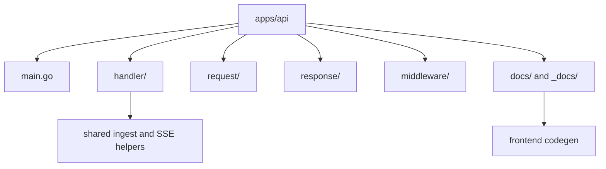

# API App

Go API application surface for ContextOS orchestration endpoints.

## Production responsibility

- Expose local-first pipeline orchestration endpoints.
- Return traceable ingest results today, and preserve entity/finding evidence as pipeline endpoints grow.
- Preserve evidence, confidence, impact, and recommended actions in API responses.
- Keep API contracts aligned with the domain layer.

## Folder layout



```
apps/api/
  main.go          — entry point: addr config, mux, route registration, ListenAndServe only
  handler/
    shared/               — shared ingest plumbing + SSE infrastructure (used by all domain packages)
    health/               — GET /health
    github/               — GitHub status, direct/token ingest, and Codex stream ingest
    googledrive/          — Google Drive status and folder ingest
    jira/                 — Jira status, direct/token ingest, and Codex/Rovo stream ingest
    filesystem/           — filesystem path ingest and browser upload staging
    notion/               — Notion status, page/database ingest, and Codex stream ingest
    sharepoint/           — SharePoint/OneDrive status, Graph ingest, and Codex stream ingest
    presentation/         — role-based graph-backed findings and PMO summaries
    slack/                — Slack status, OAuth, direct/token ingest, and Codex stream ingest
    codex/                — Codex CLI status, login, and plugin reauth streams
    README.md             — handler package docs, patterns, and new-connector checklist
  request/
    ingest.go      — inbound ingest request structs
  response/
    error.go       — WriteJSON, WriteError, WriteConnectorError helpers
    ingest.go      — shared ingest response contract and connector aliases
  middleware/
    cors.go        — WithCORS middleware
  docs/
    docs.go        — generated by swag init; required to build; gitignored
  _docs/
    swagger.json   — generated OpenAPI 2.0 spec; gitignored; source for frontend codegen
    swagger.yaml   — generated YAML spec; gitignored
    api.html       — generated standalone Redoc HTML; gitignored
```

## Convention: adding a new connector endpoint

1. Add the inbound JSON struct to `request/ingest.go`.
2. Reuse `response.Ingest` unless the connector needs a genuinely different response shape.
3. Create a new `handler/<domain>/` package with a `<domain>.go` file and its own `README.md`; include full swag annotations (`@Summary`, `@Tags`, `@Accept`, `@Produce`, `@Param`, `@Success`, `@Failure`, `@Router`).
4. Register the route in `main.go` — the `@Router` tag must exactly match.
5. Regenerate docs (required before building): `swag init -g apps/api/main.go -o apps/api/docs` (for the Go blank import) and `swag init -g apps/api/main.go -o apps/api/_docs` (for the committed swagger spec and Redoc HTML). Then refresh frontend TypeScript types: `cd apps/frontend && bun run codegen`. All steps run automatically via `start-all.sh`.
6. Update this README and the frontend connector config/component when the endpoint is user-facing.

## Endpoints

| Method | Path                    | Description                                                                              |
| ------ | ----------------------- | ---------------------------------------------------------------------------------------- |
| GET    | `/health`               | Liveness check — returns `{"status":"ok"}`                                               |
| GET    | `/github/status`        | Checks `GITHUB_TOKEN` and returns account identity                                       |
| GET    | `/googledrive/status`   | Checks Google Drive OAuth/service-account/folder setup                                   |
| POST   | `/googledrive/ingest`   | Ingest Docs, Sheets, and Slides from a Drive folder                                      |
| POST   | `/github/ingest`        | Ingest a GitHub repo, issue, PR, or commit via MCP                                       |
| POST   | `/github/ingest/stream` | Stream Codex-backed GitHub ingest progress over SSE                                      |
| GET    | `/jira/status`          | Checks Jira environment base URL/token/email readiness                                   |
| POST   | `/jira/ingest`          | Ingest a Jira issue or project via MCP                                                   |
| POST   | `/jira/ingest/stream`   | Stream Codex/Rovo-backed Jira ingest progress over SSE                                   |
| POST   | `/filesystem/ingest`    | Ingest a local file or folder path via MCP                                               |
| POST   | `/filesystem/upload`    | Upload browser-selected files or folders, then ingest                                    |
| GET    | `/slack/status`         | Token availability, source (env/oauth/none), readiness                                   |
| GET    | `/slack/connect`        | Initiates Slack OAuth flow (browser redirect)                                            |
| GET    | `/slack/callback`       | OAuth callback — exchanges code, stores token locally                                    |
| POST   | `/slack/ingest`         | Ingest a Slack channel or message via MCP                                                |
| POST   | `/slack/ingest/stream`  | Stream Codex-backed Slack ingest progress over SSE                                       |
| GET    | `/notion/status`        | Checks `NOTION_TOKEN` readiness                                                          |
| POST   | `/notion/ingest`        | Ingest a Notion page or database via MCP                                                 |
| POST   | `/notion/ingest/stream` | Stream Codex-backed Notion ingest progress over SSE                                      |
| GET    | `/sharepoint/status`    | Checks SharePoint access token or client credentials readiness                           |
| POST   | `/sharepoint/ingest`    | Ingest a SharePoint or OneDrive item via Microsoft Graph                                 |
| POST   | `/sharepoint/ingest/stream` | Stream Codex-backed SharePoint ingest progress over SSE                              |
| GET    | `/presentation/status`  | Supported connectors/roles and hidden execution mode for role summaries                  |
| POST   | `/presentation/findings`| Run graph-backed findings output with role summaries, PMO view model, and assistive execution metadata |
| GET    | `/codex/status`         | Codex CLI install/login/plugin status                                                    |
| POST   | `/codex/login`          | Run `codex login --device-auth` and stream logs as SSE                                   |
| POST   | `/codex/plugin-reauth`  | Re-add plugin with `BROWSER=echo`; OAuth URL printed in SSE log (UI not wired — use CLI) |
| GET    | `/swagger/`             | Interactive Swagger UI (served from generated docs)                                      |

GitHub, Jira, and Slack ingest requests accept `provider`. Use `"token"` or omit it for direct API-token ingestion. Use `"codex"` for Codex CLI plugin ingestion; streaming clients should call the matching `/ingest/stream` endpoint.

Google Drive, Jira, and filesystem direct request fields:

- Google Drive accepts `uri`, `folder_id`, `credential_path`, `service_account_path`, `access_token`, `cursor`, and `metadata`. `uri` may be a `drive.google.com/drive/folders/...` URL or `googledrive://folder/<id>`. The handler falls back to `GOOGLE_DRIVE_FOLDER_ID`, `GOOGLE_DRIVE_OAUTH_CREDENTIALS_PATH`, `GOOGLE_DRIVE_SERVICE_ACCOUNT_PATH`, and `GOOGLE_DRIVE_ACCESS_TOKEN` when request fields are omitted. One response event is emitted per supported file in the folder, and unchanged files replay with the same event ID based on Drive file ID plus `modifiedTime`.

Jira and filesystem direct request fields:

- Jira accepts `uri`, `token`, `email`, `api_base_url`, `expand`, `content`, `cursor`, `provider`, and `metadata`. The token/email/base URL fields map to connector metadata and fall back to `JIRA_TOKEN`, `JIRA_EMAIL`, and `JIRA_BASE_URL`. `provider=codex` routes through `atlassian-rovo@openai-curated`.
- Filesystem path ingest normally needs only `uri`, which may be a file or folder path visible to the API process. A directory `uri` is walked recursively and returns one event per supported child file. Optional advanced fields include inline `content`, `cursor`, `include`, `exclude`, and `metadata`; include/exclude map to explicit path rules before local file reads. Folder guardrails can be set with metadata keys `filesystem_max_files` and `filesystem_max_file_size`; defaults are `1000` files and `10485760` bytes per file.
- Filesystem upload accepts `multipart/form-data` with one or more `files` parts and matching `paths` fields for browser folder relative paths. The API stages uploads under `storage/raw/uploads/<upload-id>/`, then runs the same filesystem connector against the staged file or folder. Upload metadata includes `filesystem_upload_id`, `filesystem_upload_root`, `filesystem_upload_file_count`, and `filesystem_upload_original_name` for single-file uploads.

Filesystem handles spreadsheet extraction and OpenAPI JSON/YAML summary metadata through both path and upload flows.

Filesystem responses keep the existing first-event fields (`event`, `preview`, and `metadata`) and also include aggregate fields (`events`, `previews`, `metadata_items`, and `event_count`) for folder ingestion.

## Running locally

```sh
# Generate docs first (required), then start:
swag init -g apps/api/main.go -o apps/api/docs   # needed for blank import
swag init -g apps/api/main.go -o apps/api/_docs  # updates committed swagger spec
go run ./apps/api          # listens on :8080
API_ADDR=:9000 go run ./apps/api
```

Or use `start-all.sh` which runs both `swag init` commands and `bun run codegen` automatically before starting.

Once running:

- **http://localhost:8080/swagger/** — Interactive Swagger UI
- **http://localhost:8080/swagger/doc.json** — Raw OpenAPI spec (Postman/Insomnia)
- **apps/api/\_docs/api.html** — Standalone Redoc HTML (open directly in browser)
