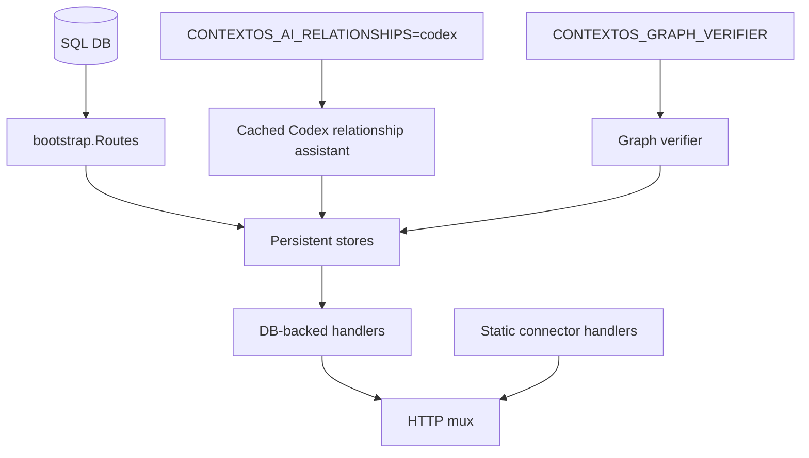

# API Bootstrap

Composes API route registration and DB-backed handler wiring for the local ContextOS service.

## Files

- `bootstrap.go`: builds the `http.ServeMux`, registers public routes, and creates DB-backed workspace, artifact, graph, presentation, chat, and sync services when a SQL connection is available.
- `bootstrap_test.go`: verifies route registration and DB-optional handler behavior.

## Behavior

Static connector, Codex, health, and Swagger routes are always registered. Connector and Codex HTTP handlers are imported from `apps/api/handler/connectors/<name>` while their source implementations remain in `internal/source/<name>`. Workspace, workspace UI state, artifact, graph, and chat routes are registered when `Routes` receives a database handle because those routes need persisted workspace state. The chat route uses the live Codex answerer and the shared persistent ingest service so concrete live source answers can save evidence into the Local DB.

Workspace UI state is wired through `WorkspaceUIStateStore` and exposed from the workspace handler as `/workspace/analysis-basket` and `/workspace/finding-actions`. Keep those routes DB-backed so selected evidence and finding action state are deleted with the workspace instead of living only in browser storage.

Relationship assistance is disabled by default. Set `CONTEXTOS_AI_RELATIONSHIPS=codex` to wire a cached local Codex CLI relationship assistant into persistent ingest. Accepted proposals are still validated by `internal/stages/relationship`, and failed Codex calls fall back to deterministic relationship edges.

Cross-source graph verification is also disabled by default. Set `CONTEXTOS_GRAPH_VERIFIER=codex` to wire a Codex CLI Local DB snapshot verifier after live chat evidence saves. The verifier does not re-read external connectors; it only compares saved events, entities, and existing relationships.

## Maintenance Notes

- Keep route additions in `Routes` covered by bootstrap tests.
- Keep DB-backed service construction here rather than inside individual handlers.
- Update `apps/api/README.md` when public route behavior changes.
- Keep relationship assistance behind an explicit env flag; do not make Codex calls part of default ingest.
