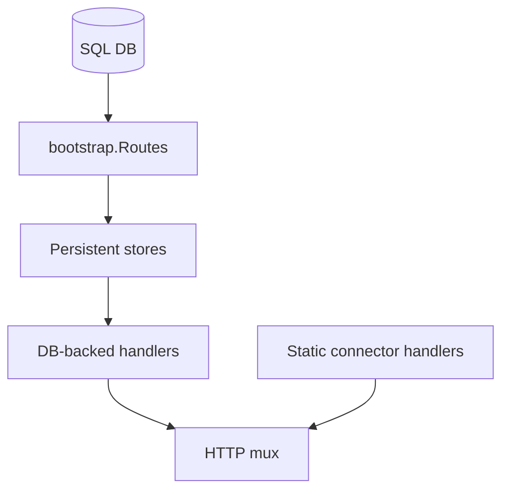

# API Bootstrap

Composes API route registration and DB-backed handler wiring for the local ContextOS service.

## Files

- `bootstrap.go`: builds the `http.ServeMux`, registers public routes, and creates DB-backed workspace, artifact, graph, presentation, chat, and sync services when a SQL connection is available.
- `bootstrap_test.go`: verifies route registration and DB-optional handler behavior.

## Behavior

Static connector, Codex, health, and Swagger routes are always registered. Workspace, artifact, graph, and chat routes are registered when `Routes` receives a database handle because those routes need persisted workspace state. The chat route uses the live Codex answerer and the shared persistent ingest service so concrete live source answers can save evidence into the Local DB.

## Maintenance Notes

- Keep route additions in `Routes` covered by bootstrap tests.
- Keep DB-backed service construction here rather than inside individual handlers.
- Update `apps/api/README.md` when public route behavior changes.
