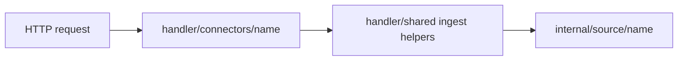

# Connector Handlers

HTTP handler packages for source connector routes.

These packages translate API requests into source-ingest calls and keep HTTP concerns separate from connector implementation logic in `internal/source/<name>/`.

## Layout

| Package | Route prefix | Source package |
| --- | --- | --- |
| [`codex/`](codex/README.md) | `/codex/*` | [`internal/source/codex`](../../../../internal/source/codex/README.md) |
| [`filesystem/`](filesystem/README.md) | `/filesystem/*` | [`internal/source/filesystem`](../../../../internal/source/filesystem/README.md) |
| [`github/`](github/README.md) | `/github/*` | [`internal/source/github`](../../../../internal/source/github/README.md) |
| [`googledrive/`](googledrive/README.md) | `/googledrive/*` | [`internal/source/googledrive`](../../../../internal/source/googledrive/README.md) |
| [`jira/`](jira/README.md) | `/jira/*` | [`internal/source/jira`](../../../../internal/source/jira/README.md) |
| [`notion/`](notion/README.md) | `/notion/*` | [`internal/source/notion`](../../../../internal/source/notion/README.md) |
| [`sharepoint/`](sharepoint/README.md) | `/sharepoint/*` | [`internal/source/sharepoint`](../../../../internal/source/sharepoint/README.md) |
| [`slack/`](slack/README.md) | `/slack/*` | [`internal/source/slack`](../../../../internal/source/slack/README.md) |

## Boundary

- Keep request decoding, method guards, CORS route registration, Swagger annotations, and SSE response setup here.
- Keep connector metadata enrichment, API fetch behavior, replay semantics, and emitted ingestion events in `internal/source/<name>/`.
- Use `handler/shared` helpers between the two layers so handlers do not call pipeline internals directly.
