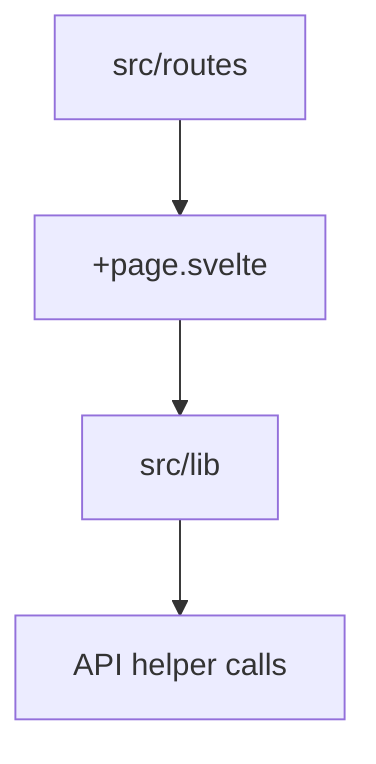

# Frontend Source

This folder contains the Svelte application source for the local ContextOS UI.

## Structure

- `lib/`: shared UI utilities, API helpers, and components.
- `routes/`: page-level route files.
- `app.html`: Svelte app shell.
- `app.d.ts`: global SvelteKit declarations plus `ImportMetaEnv` entries for `VITE_CONTEXTOS_DEFAULT_WORKSPACE` and `VITE_CONTEXTOS_DEBUG_LOGS`.

## Routing Flow

## Maintenance Checklist

- Keep route-level behavior documented under `routes/README.md`.
- Keep shared helper and component behavior documented in `lib/README.md`.
- Update tests when route or API interaction behavior changes.
