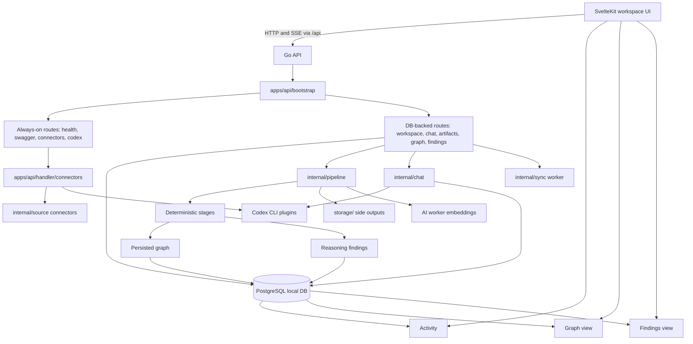
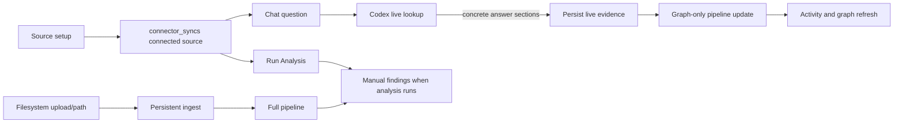
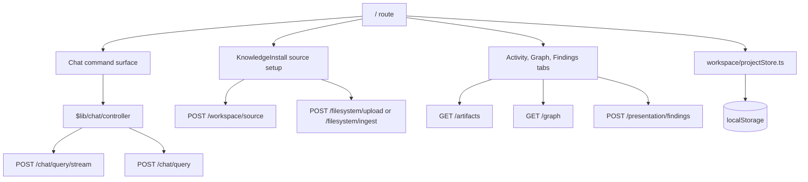
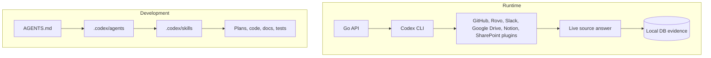
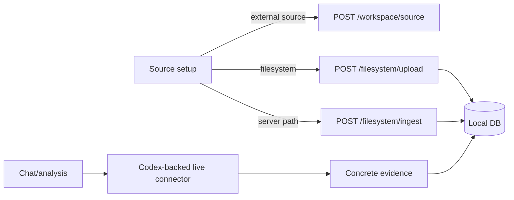
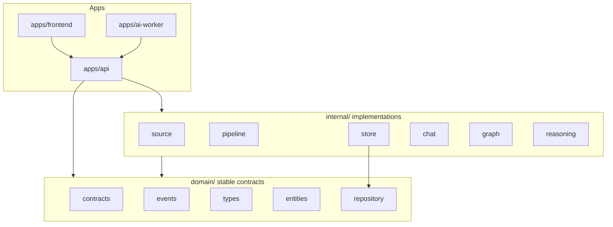

# ContextOS Architecture

ContextOS is a local-first workspace intelligence system for detecting delivery context drift across engineering and business sources. The first success metric remains narrow and concrete:

```text
Detect real cross-layer context misalignment automatically.
```

This document is the cross-layer map. It explains how the frontend, Go API, local DB, storage, AI worker, Codex plugins, source connectors, pipeline stages, graph, findings, and Codex development routing fit together. Package READMEs remain the source of truth for deep implementation details.

## Current Runtime Map



The API starts even when Postgres is unavailable, but DB-backed routes are omitted in that case. Static connector, Codex, health, and Swagger routes still register. When Postgres is available, bootstrap wires repositories, persistent ingest, chat, graph, presentation, audit, and the background sync worker.

## Product Flow

ContextOS has two visible source paths:

- External plugin-backed sources are connected first, then queried live through Codex when a chat prompt or analysis run names a concrete source.
- Filesystem sources are uploaded or read from a server-visible path and ingested into local storage and the Local DB immediately.



Source setup saves connector scope with `POST /workspace/source`; it does not bulk-ingest external systems by default. Concrete live answers from GitHub, Jira/Rovo, Slack, Notion, Google Drive, or SharePoint/OneDrive can save one local evidence artifact per returned source section. That evidence updates Activity and graph state, while Findings remain manual and update through `/presentation/findings`.

## Frontend Architecture

The frontend is a single-window SvelteKit workspace UI. The main route (`/`) coordinates workspace selection, source setup, chat, Activity, graph, and findings. The `/connectors` and `/findings` routes remain available as direct debug or advanced views.



Workspace identity is path-scoped. The browser keeps local workspace and chat state in `localStorage`, while the API mirrors registered workspaces and connected sources in Postgres. The protected demo workspace is local-only and does not require API, worker, or Codex availability.

## API And Persistence

The Go API owns route registration, local DB bootstrap, repository wiring, and source-to-pipeline orchestration.

| Area | Current behavior | Reference |
| --- | --- | --- |
| Bootstrap | Registers always-on routes and adds DB-backed routes only when Postgres is open. | [apps/api/bootstrap](../apps/api/bootstrap/README.md) |
| Workspace | Registers local workspaces, saves connected source references, reports status, supports reset/delete. | [workspace handler](../apps/api/handler/workspace/README.md) |
| Chat | Streams live Codex progress, returns early answers, saves concrete evidence, falls back to local artifacts. | [chat handler](../apps/api/handler/chat/README.md) |
| Artifacts | Queries Local DB evidence and supports explicit noisy live-evidence cleanup. | [artifacts handler](../apps/api/handler/artifacts/README.md) |
| Graph | Reads persisted entities/relationships and supports explicit graph-noise cleanup. | [graph handler](../apps/api/handler/graph/README.md) |
| Findings | Runs presentation analysis from connector input or persisted workspace evidence. | [presentation handler](../apps/api/handler/presentation/README.md) |
| Connectors | Exposes connector status, direct ingest, upload, and Codex-backed stream routes. | [connector handlers](../apps/api/handler/connectors/README.md) |

Postgres is the current product source of truth for workspaces, source events, entities, relationships, mismatches, connector sync state, and audit rows. The `storage/` tree holds upload staging, parsed side outputs, embedding cache files, and graph snapshots.

## Public Route Families

This document names route families instead of duplicating generated OpenAPI details. See [apps/api/README.md](../apps/api/README.md) for request and response fields.

| Route family | Current role |
| --- | --- |
| `/workspace*` | Register, list, reset, delete, and inspect local workspaces; save connected source references. |
| `/chat/query` | Non-streaming local chat fallback for workspace-scoped questions. |
| `/chat/query/stream` | Preferred SSE chat path for live Codex lookup, early answers, and evidence-save status. |
| `/presentation/findings` | Run findings analysis from connector input or persisted workspace evidence; fallback route exists without DB, DB-backed route adds persistence. |
| `/graph` and `/graph/cleanup` | Read persisted graph state and explicitly clean backend-classified noisy graph rows. |
| `/artifacts` and `/artifacts/live-evidence/cleanup` | Query persisted source evidence and explicitly clean old noisy live-evidence rows. |
| `/codex/*` | Check CLI/plugin status, list Codex-visible sources, stream login, and stream plugin reauth. |
| `/<connector>/status` | Report connector readiness where a status route exists. |
| `/<connector>/ingest` | Run direct connector ingest. |
| `/<connector>/ingest/stream` | Run Codex-backed connector ingest over SSE where available. |
| `/filesystem/upload` | Stage browser-selected files or folders and ingest them locally. |

## Codex Roles

Codex appears in two separate places and should not be conflated.



At runtime, Codex CLI plugins provide live, read-oriented access to external systems. The API uses `/codex/status`, `/codex/sources`, `/codex/login`, and `/codex/plugin-reauth` for local CLI and plugin workflows. Chat and stream ingest routes can delegate to Codex when a request uses the Codex provider.

For repository development, `.codex/` mirrors the old GitHub Copilot customization and tells Codex which agent, instruction, and skill guidance to load for tasks. See [Codex Routing](../.codex/README.md).

## Connector Portfolio

Active connectors are GitHub, Jira/Rovo, Slack, Notion, Google Drive, SharePoint/OneDrive, and Filesystem. External connectors are Codex-live by default in the product setup flow, with direct token or credential ingest paths still available where implemented. Filesystem is direct local ingest because browser-selected files and folders must be copied into ContextOS storage.



For connector-specific behavior, see [MCP Connectors](mcp-connectors.md), [apps/api/README.md](../apps/api/README.md), and [internal/source](../internal/source/README.md).

## Pipeline Subsystem

The deterministic pipeline is still the core evidence-processing subsystem. It is no longer the whole product architecture; it is the path that turns source evidence into local facts, graph state, and findings.

```mermaid
flowchart LR
  source[Source]
  ingestion[Ingestion]
  normalization[Normalization]
  classification[Classification]
  extraction[Extraction]
  identity[Identity Resolution]
  relationship[Relationship]
  graph[Context Graph]
  reasoning[Reasoning]
  presentation[Presentation]

  source --> ingestion --> normalization --> classification --> extraction --> identity --> relationship --> graph --> reasoning --> presentation
  reasoning -. assistive prompts .-> execution[Execution]
  execution -. auditable output .-> reasoning
```

| Stage | Responsibility | Reference |
| --- | --- | --- |
| Source | Convert external systems and files into `document.ingested` events. | [internal/source](../internal/source/README.md) |
| Ingestion | Fan source requests through connectors and preserve traceability. | [internal/ingestion](../internal/ingestion/README.md) |
| Normalization | Convert event envelopes into normalized documents and parsed side outputs. | [internal/normalization](../internal/normalization/README.md) |
| Classification | Assign deterministic routing labels and classification signals. | [internal/classification](../internal/classification/README.md) |
| Extraction | Extract candidate entities from text, documents, code, spreadsheets, OpenAPI, and connector facts. | [internal/extraction](../internal/extraction/README.md) |
| Identity | Merge candidate entities into canonical identities; can use worker embeddings as an assistive matcher. | [internal/identity](../internal/identity/README.md) |
| Relationship | Build evidence-backed relationships between canonical entities. | [internal/relationship](../internal/relationship/README.md) |
| Graph | Materialize entities and relationships, expose graph reads, and create snapshots. | [internal/graph](../internal/graph/README.md) |
| Reasoning | Detect mismatch findings with evidence, confidence, impact, severity, and recommendation. | [internal/reasoning](../internal/reasoning/README.md) |
| Execution | Keep generated assistance separate from deterministic facts. | [internal/execution](../internal/execution/README.md) |
| Presentation | Shape findings for PMO, presentation, service, QA, and architecture views. | [internal/presentation](../internal/presentation/README.md) |

`RunEvents` executes the full post-ingest flow through reasoning. `RunEventsGraphOnly` persists live chat evidence and graph state without auto-running findings.

## Domain And Dependency Boundaries

Stable contracts live in `domain/`; implementations live in `internal/`. Internal stages should communicate through domain contracts rather than importing each other directly.



The domain layer must not import `internal/`. `internal/pipeline` is the orchestration boundary for stage execution. API handlers translate HTTP concerns into source requests, repository calls, or service calls; source packages emit events and do not import downstream stages.

## AI Worker And Storage

The optional Python AI worker currently provides deterministic local embeddings through `/embed`. The Go side uses `internal/aiworker` and an embedding cache under `storage/embeddings`. Identity can use this as an assistive semantic matcher, but deterministic evidence remains authoritative.

`storage/` is not the main product source of truth. Use this rule:

```text
Postgres = product truth
storage/raw = upload staging and future raw replay store
storage/parsed = derived debug output
storage/embeddings = cache
storage/snapshots = debug/regression output
```

## Current Implementation Status

- Frontend route `/` is the single-window workspace UI; `/connectors` and `/findings` remain direct routes.
- API bootstrap registers connector, Codex, health, Swagger, and fallback findings routes even without DB; workspace, artifacts, graph, chat, and DB-backed findings require Postgres.
- GitHub, Jira/Rovo, Slack, Notion, Google Drive, SharePoint/OneDrive, and filesystem connector handlers live under `apps/api/handler/connectors/`.
- `/codex/status` reports CLI and plugin readiness; `/codex/sources` lists Codex-visible source candidates for setup.
- `/chat/query/stream` is the preferred chat path. It streams logs/status, returns an early answer, then reports local evidence save status.
- Concrete live answer sections persist as Local DB evidence and run graph-only pipeline updates; broad connector scopes stay read-only when no concrete provenance is visible.
- Filesystem upload/path ingest persists local artifacts immediately and supports text, code/config, OpenAPI JSON/YAML, CSV/XLSX, DOCX, PDF, and PPTX extraction.
- Postgres stores workspaces, ingest events, entities, relationships, mismatches, connector syncs, and audit logs.
- Graph reads are filtered by default; explicit cleanup endpoints remove only backend-classified noisy graph or live-evidence rows.
- Findings are manual analysis outputs and stay evidence-backed with confidence, impact, severity, affected roles, and recommended actions.
- The sync worker marks stale or errored connector sync rows pending; it does not trigger full live re-ingest by itself.

## Production Target

Production-ready ContextOS can be replayed, audited, and trusted locally without hiding uncertain inference behind vague summaries.

| Area | Requirement |
| --- | --- |
| Idempotency | Replaying the same source artifact must not create duplicate canonical facts. |
| Provenance | Documents, entities, relationships, graph output, and mismatches must trace back to source artifacts. |
| Confidence | Classification, extraction, identity, relationship, reasoning, and assistive outputs should expose confidence when inference is non-trivial. |
| Evidence | Findings must include evidence references, not only generated summaries. |
| Impact | Mismatches must explain delivery impact for PMO, presentation, service, QA, and architecture views. |
| Replay | Pipeline stages and persisted evidence should support deterministic replay from stored inputs. |
| Local-first | The default workflow should run from local services, local credentials, and local storage without a hosted SaaS backend. |
| Human trust | Cleanup, high-impact findings, and ambiguous identity behavior should stay explicit and reviewable. |

Use [Production Readiness](PRODUCTION_READINESS.md) to track remaining gaps.
