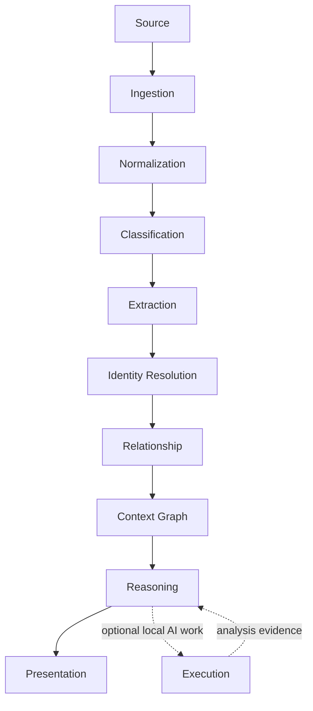
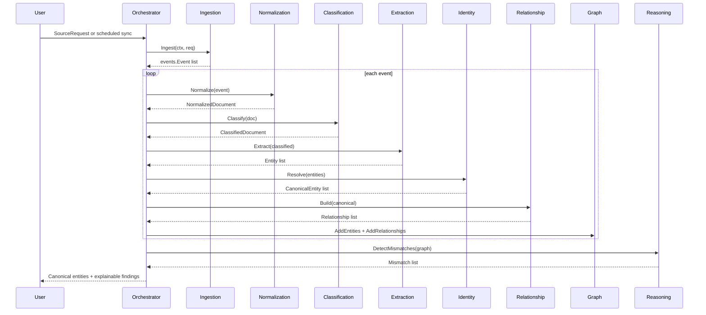
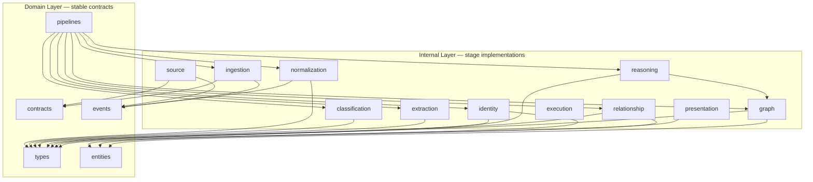
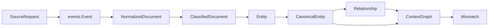

# ContextOS Architecture

ContextOS is a production-oriented, local-first context synchronization platform. Its first production success metric is narrow and concrete: detect real cross-layer context misalignment automatically with traceable evidence, confidence, impact, and recommended action.

This document is the fast path into the codebase. It explains the production domain flow, points to each stage, names the contracts that must stay stable, and separates target behavior from current implementation status.

## Domain Map

## Production Runtime Flow

The current orchestration entry point is `Run`, and the target architecture is production-grade and event-driven. The runtime must preserve stable identifiers, provenance, replay safety, and explainable findings from source ingestion through presentation.

## Stage Responsibilities

| Stage          | Responsibility                                                                        | Code                                                            | Notes                                                                                                             |
| -------------- | ------------------------------------------------------------------------------------- | --------------------------------------------------------------- | ----------------------------------------------------------------------------------------------------------------- |
| Source         | Convert external systems into connector events.                                       | [internal/source](../internal/source/README.md)                 | Production connectors must be idempotent, replay-safe, and provenance-rich.                                       |
| Ingestion      | Fan source requests through registered connectors and preserve source traceability.   | [internal/ingestion](../internal/ingestion/README.md)           | Production ingestion needs stable event IDs, durable raw capture, and retry semantics.                            |
| Normalization  | Convert event envelopes into normalized documents.                                    | [internal/normalization](../internal/normalization/README.md)   | Production normalization must be deterministic and reproducible from raw source data.                             |
| Classification | Assign routing classification, confidence, and evidence.                              | [internal/classification](../internal/classification/README.md) | Production classification must include explainable rule/model evidence.                                           |
| Extraction     | Extract candidate domain entities from text and structured payloads.                  | [internal/extraction](../internal/extraction/README.md)         | Production extraction must preserve offsets, source spans, and extraction confidence.                             |
| Identity       | Merge candidate entities into canonical identities.                                   | [internal/identity](../internal/identity/README.md)             | Core domain. Production identity resolution must handle aliases, multilingual names, conflicts, and human review. |
| Relationship   | Build evidence-backed links between resolved entities.                                | [internal/relationship](../internal/relationship/README.md)     | Production relationships need typed edge vocabulary, confidence, and provenance.                                  |
| Graph          | Materialize canonical entities and relationships as persistent organizational memory. | [internal/graph](../internal/graph/README.md)                   | Production graph needs durable storage, history, replay, and query support.                                       |
| Reasoning      | Detect misalignment and produce explainable findings.                                 | [internal/reasoning](../internal/reasoning/README.md)           | Findings must include confidence, impact, evidence, severity, and recommended action.                             |
| Execution      | Provide local hidden AI orchestration boundary.                                       | [internal/execution](../internal/execution/README.md)           | Execution results are assistive evidence and must be auditable.                                                   |
| Presentation   | Render role-specific outputs.                                                         | [internal/presentation](../internal/presentation/README.md)     | PMO, presentation layer, service layer, QA, and architecture views must preserve evidence and actionability.      |

## Domain Contracts

The stable domain layer is split by contract type.

| Package                                           | Purpose                                                                            |
| ------------------------------------------------- | ---------------------------------------------------------------------------------- |
| [domain/contracts](../domain/contracts/README.md) | Source connector capabilities, request envelope, and MCPSourceConnector interface. |
| [domain/entities](../domain/entities/README.md)   | Canonical entity wrapper with confidence and human-review state.                   |
| [domain/events](../domain/events/README.md)       | Event envelope and pipeline event type constants.                                  |
| [domain/pipelines](../domain/pipelines/README.md) | Current orchestration boundary and production pipeline contract direction.         |
| [domain/types](../domain/types/README.md)         | Documents, classifications, entities, relationships, and mismatches.               |

## Dependency Direction

**Rules:**

- Internal packages import from domain only — domain never imports internal.
- No internal stage imports another internal stage directly.
- `internal/pipeline` is the only orchestrator; it wires all stages together.

**What each internal package imports from domain:**

| Internal package | Imports                              |
| ---------------- | ------------------------------------ |
| source           | contracts, events                    |
| ingestion        | contracts, events                    |
| normalization    | events, types                        |
| classification   | types                                |
| extraction       | contracts, events, types             |
| identity         | entities, types                      |
| relationship     | entities, types                      |
| graph            | entities, types                      |
| reasoning        | contracts, entities, types           |
| presentation     | types                                |
| pipeline         | contracts, pipelines, and all stages |

## Data Shape Through The Pipeline

## Production Target

Production readiness means the system can be replayed, audited, and trusted locally without hiding uncertain inference behind vague summaries.

| Area         | Production Requirement                                                                                                        |
| ------------ | ----------------------------------------------------------------------------------------------------------------------------- |
| Idempotency  | Replaying the same source artifact must not create duplicate canonical facts.                                                 |
| Provenance   | Every document, entity, relationship, and mismatch must trace back to source artifacts.                                       |
| Confidence   | Classification, extraction, identity, relationship, and reasoning outputs must expose confidence.                             |
| Evidence     | Findings must include evidence references, not only generated summaries.                                                      |
| Impact       | Mismatches must explain likely delivery impact for all knowledge participants (presentation, service, PMO, QA, architecture). |
| Replay       | Pipeline stages must support deterministic replay from raw or normalized artifacts.                                           |
| Local-first  | The default path must work without SaaS-only dependencies.                                                                    |
| Human review | Ambiguous identity merges and high-impact findings must support manual review state.                                          |

## Current Implementation Status

- Source connectors emit `document.ingested` events with connector metadata.
- Normalization trims title and body and records a fresh UTC normalization timestamp.
- Classification uses deterministic keyword ordering; blocker and decision terms win before risk or presentation/service/API routing terms.
- Extraction finds alphanumeric tokens and infers entity type from suffixes, token content, and document classification.
- Identity resolution canonicalizes by lowercasing and removing non-alphanumeric separators.
- Relationship building links adjacent canonical entities that came from the same source document.
- Reasoning flags entities whose names include `missing`, `mismatch`, or `outdated`.

Use [PRODUCTION_READINESS.md](PRODUCTION_READINESS.md) to track the open issue backlog against these production requirements.

## Implementation Rules

- Keep the flow traceable from source request to mismatch finding.
- Preserve provenance on every stage output, especially source IDs and metadata.
- Prefer deterministic and explainable behavior for core pipeline logic.
- Treat AI execution output as assistive evidence, not a blind source of truth.
- When reasoning output changes, include confidence, impact, and evidence support in the contract or metadata.
