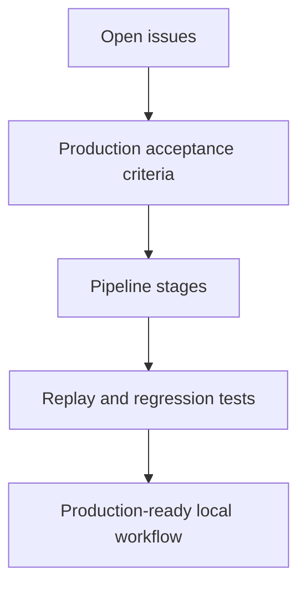

# Production Readiness

This document turns the open issue backlog into production acceptance criteria. The repository can keep small, incremental implementation steps, but the target is production-grade local-first delivery intelligence rather than a demo pipeline.

## Production Definition

ContextOS is production-ready when it can ingest source artifacts repeatedly, build a durable context graph, resolve identities with explainable confidence, and report cross-layer context misalignment with evidence and recommended action.

## Cross-Cutting Gates

Every stage-specific issue should satisfy these gates before it is considered production-complete.

| Gate          | Requirement                                                                           |
| ------------- | ------------------------------------------------------------------------------------- |
| Idempotency   | Re-running the same input produces stable IDs and no duplicate facts.                 |
| Replay safety | Raw and normalized inputs can reproduce downstream outputs.                           |
| Provenance    | Outputs reference the source artifact, source location, and stage that produced them. |
| Confidence    | Non-trivial inference includes confidence and a reason for that score.                |
| Evidence      | Findings and merges include evidence links or source spans.                           |
| Tests         | Unit tests cover deterministic behavior; pipeline tests cover stage interactions.     |
| Observability | Errors include stage, source, and trace identifiers.                                  |
| Local-first   | Production behavior does not require hosted SaaS infrastructure by default.           |

## Issue Map

| Issue                                                  | Production Acceptance                                                                                                                                                                              |
| ------------------------------------------------------ | -------------------------------------------------------------------------------------------------------------------------------------------------------------------------------------------------- |
| #3 Main Group: Foundation and Contracts                | Contracts are stable, versionable, and documented with ownership boundaries.                                                                                                                       |
| #4 Issue 1: Scaffold ContextOS repository structure    | Repository structure maps cleanly to source, pipeline, graph, reasoning, execution, and presentation domains.                                                                                      |
| #5 Issue 2: Define domain event contracts              | Event contracts include stable IDs, source provenance, timestamps, metadata, replay semantics, and migration guidance.                                                                             |
| #6 Issue 3: Build MCP source connector interface       | Connector interface supports capabilities, idempotent ingestion, source cursors, cancellation, and structured errors.                                                                              |
| #24 Main Group: MCP Source Connectors                  | All connectors follow the domain contract, expose stable artifact IDs, and support replay without duplication.                                                                                     |
| #7 Issue 4: Build GitHub MCP connector                 | GitHub connector ingests repositories, issues, PRs, and relevant metadata with stable external IDs.                                                                                                |
| #8 Issue 5: Build Slack MCP connector                  | Slack connector ingests messages, threads, channels, timestamps, and participants with replay-safe cursors.                                                                                        |
| #9 Issue 6: Build Jira MCP connector                   | Jira/Rovo connector ingests issues, comments, status, fields, links, and history with stable keys. Codex/Rovo is the default user-facing path; direct API auth remains available for local checks. |
| #10 Issue 7: Build OpenAPI MCP connector               | Closed and folded into #12 filesystem ingestion; OpenAPI JSON/YAML specs keep endpoint, schema, enum, version, and contract provenance metadata without a standalone source package or API route.  |
| #11 Issue 8: Build Excel MCP connector                 | Closed and folded into #12 filesystem ingestion; spreadsheet files keep workbook, sheet, row, column, cell, value, and formula provenance without a standalone source package or API route.        |
| #12 Issue 9: Build filesystem MCP connector            | Filesystem connector ingests files and recursive folders with content hashes, paths, modified times, skip counts, and replay-safe per-file events. Extracts text from .docx, .pdf, .pptx, .xlsx, .csv, and OpenAPI JSON/YAML specs. |
| #30 Build Google Drive MCP connector                   | Google Drive connector ingests Docs, Sheets, and Slides with stable Drive file IDs and OAuth 2.0 credential isolation.                                                                             |
| #31 Build SharePoint / OneDrive MCP connector          | SharePoint connector ingests files via Microsoft Graph with MSAL auth, delta sync, and replay-safe item IDs.                                                                                       |
| #32 Build Confluence MCP connector                     | Deferred future scope. No Confluence source package is scaffolded now; current Atlassian context goes through Jira/Rovo.                                                                           |
| #33 Build Notion MCP connector                         | Notion connector ingests pages and database entries with stable page IDs, integration token auth, and recursive block extraction.                                                                  |
| #25 Main Group: Core Intelligence Pipeline             | Normalization, classification, extraction, and identity resolution are deterministic, explainable, and tested together.                                                                            |
| #13 Issue 10: Build normalization pipeline             | Normalization preserves source metadata, content hashes, canonical text, and reproducible document IDs.                                                                                            |
| #14 Issue 11: Build classification engine              | Classification returns category, confidence, evidence, and rule/model provenance.                                                                                                                  |
| #15 Issue 12: Build extraction engine                  | Extraction returns typed entities with source spans, confidence, and metadata for structured and unstructured inputs.                                                                              |
| #16 Issue 13: Build identity resolution engine         | Identity resolution supports aliases, naming conventions, multilingual names, confidence, conflicts, and human-review state.                                                                       |
| #26 Main Group: Context Graph and Reasoning            | Graph and reasoning produce auditable findings with impact, evidence, confidence, and recommendation quality checks.                                                                               |
| #17 Issue 14: Build relationship graph                 | Relationships use typed edge vocabulary, source evidence, confidence, and deterministic IDs.                                                                                                       |
| #18 Issue 15: Build persistent context graph storage   | Graph storage supports snapshots, replay, history, querying, and local-first persistence.                                                                                                          |
| #19 Issue 16: Build mismatch detection                 | Mismatch detection reports evidence, confidence, impact, severity, affected roles, and recommended action.                                                                                         |
| #27 Main Group: Outputs and Execution                  | Execution and outputs preserve auditability and do not hide uncertain inference.                                                                                                                   |
| #20 Issue 17: Build PMO summary output                 | PMO summaries separate facts, risk, impact, confidence, and recommended decisions.                                                                                                                 |
| #21 Issue 18: Build hidden Codex execution integration | Codex execution is local-first, cancellable, traceable, and treated as assistive evidence.                                                                                                         |
| #22 Issue 19: Build presentation layer                 | Presentation keeps role-specific views consistent with underlying evidence and graph state.                                                                                                        |
| #28 Main Group: Production Validation                  | Validation proves the first production feature: cross-layer misalignment detection with evidence and low false-positive risk.                                                                      |
| #23 Issue 20: Validate first killer feature            | Validation uses real or realistic cross-layer artifacts, expected findings, false-positive tracking, and regression tests.                                                                         |

## Stage Readiness Matrix

| Stage          | Current Status                                                                                                                        | Production Gap                                                                                             |
| -------------- | ------------------------------------------------------------------------------------------------------------------------------------- | ---------------------------------------------------------------------------------------------------------- |
| Source         | GitHub, Slack, Jira, and filesystem adapters emit provenance-rich ingestion events; filesystem covers recursive folders, spreadsheets, and OpenAPI specs. | Broader replay validation, durable raw snapshots, and additional cloud/source adapters.                    |
| Ingestion      | Sequential fan-out through connectors.                                                                                                | Durable raw capture, structured errors, retry policy, source deduplication, and trace IDs.                 |
| Normalization  | Trims subject/body and copies metadata.                                                                                               | Content hashes, canonical document IDs, source spans, schema versioning, and reproducible transforms.      |
| Classification | Keyword rules with static confidence.                                                                                                 | Evidence-backed confidence, rule traces, evaluation set, and ambiguity handling.                           |
| Extraction     | Regex token extraction.                                                                                                               | Structured extractors, source offsets, confidence, field/value modeling, and multilingual support.         |
| Identity       | Separator-stripped exact key merge.                                                                                                   | Alias dictionary, semantic candidates, conflict scoring, human review, and benchmark tracking.             |
| Relationship   | Adjacent co-occurrence links.                                                                                                         | Typed relationships, edge confidence, source evidence, graph constraints, and relationship tests.          |
| Graph          | In-memory maps.                                                                                                                       | Persistent local storage, snapshots, history, query APIs, and replay validation.                           |
| Reasoning      | Keyword mismatch detection.                                                                                                           | Cross-layer context drift rules, impact scoring, confidence, evidence bundles, and recommendation quality. |
| Execution      | Local stub executor.                                                                                                                  | Real local executor integration, auditable prompts/results, cancellation, and failure semantics.           |
| Presentation   | Plain text summaries.                                                                                                                 | Role-specific outputs with evidence, impact, confidence, status, and next actions.                         |

## Production Work Order

1. Stabilize contracts and event identity: #3, #5, #6.
2. Make source ingestion replay-safe before expanding reasoning: #24, #7, #8, #9, #12. OpenAPI (#10) and Excel (#11) are folded into filesystem (#12).
3. Implement cloud and knowledge-base connectors: #30, #31, #32, #33.
4. Upgrade core intelligence outputs to include evidence and confidence: #25, #13, #14, #15, #16.
5. Persist graph and produce explainable findings: #26, #17, #18, #19.
6. Add execution and presentation outputs without losing provenance: #27, #20, #21, #22.
7. Validate the first production feature using real cross-layer misalignment cases: #28, #23.

## Documentation Rule

When an issue changes a contract or behavior, update the relevant stage README in the same pull request. Production documentation must always state both:

- the target behavior the stage is responsible for;
- the current implementation status and remaining production gap.
