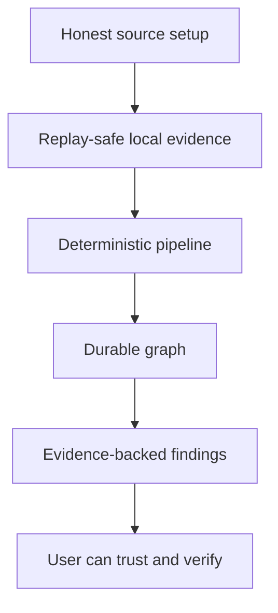

# Production Readiness

This document keeps the production bar visible without duplicating package READMEs or the root product plan.

ContextOS is production-ready when a local workflow can connect or ingest real source evidence repeatedly, preserve provenance in the Local DB, build a useful graph, and report cross-layer context misalignment with evidence, confidence, impact, and recommended action.

## Cross-Cutting Gates

Every production-facing layer should satisfy these gates.

| Gate | Requirement |
| --- | --- |
| Idempotency | Re-running the same input produces stable IDs and no duplicate facts. |
| Replay safety | Stored source evidence can reproduce downstream outputs. |
| Provenance | Outputs reference connector, source URI, source artifact, and producing stage or route. |
| Confidence | Non-trivial inference includes confidence and a reason for that score. |
| Evidence | Findings, merges, and recommendations include evidence links or source spans. |
| Observability | Errors include route or stage, source, workspace, and trace/request identifiers when available. |
| Local-first | Default behavior runs from local services, local credentials, and local persistence. |
| Explicit cleanup | Cleanup and deletion flows are user-triggered and describe what they remove. |
| Tests | Deterministic behavior has unit tests; cross-stage behavior has pipeline or handler coverage. |

## Runtime Readiness

| Layer | Current status | Remaining gap |
| --- | --- | --- |
| Frontend workspace UI | Main route supports workspace selection, source setup, chat streaming, Activity, graph, findings, demo workspace, and explicit cleanup actions. | Browser smoke tests, production build gate, clearer recovery states for unavailable API/Codex/DB, and more realistic end-to-end UX validation. |
| API/bootstrap | Static connector/Codex/health/Swagger routes always register; DB-backed workspace, chat, artifacts, graph, and findings routes wire when Postgres is available. | More explicit degraded-mode docs in UI/API responses and route-level readiness checks for optional services. |
| Local DB persistence | Postgres stores workspaces, ingest events, entities, relationships, mismatches, connector syncs, and audit logs with idempotent upserts. | Backup/restore flow, migration rollback policy, raw replay contract, and wider replay fixtures. |
| Storage | Upload staging, parsed side outputs, embedding cache, and graph snapshots are documented as side effects rather than product truth. | Retention/rotation policy and stronger raw artifact durability if storage becomes replay source of truth. |
| Codex live lookup | `/codex/status`, `/codex/sources`, login, reauth, live chat, and Codex-backed ingest streams exist for plugin workflows. | Real-account matrix coverage, clearer timeout/retry behavior, and stronger source-section validation for persistence. |
| Connectors | GitHub, Jira/Rovo, Slack, Notion, Google Drive, SharePoint/OneDrive, and Filesystem handlers exist; filesystem has broad local extraction support. | Broader credential validation, rate-limit/backoff consistency, partial-failure contracts, and replay tests across every connector. |
| Chat evidence | Streaming chat can save concrete live answer sections into Local DB evidence and update graph without auto-running findings. | Better multi-source provenance extraction, fewer skipped broad prompts, and stronger guarantees that saved answer sections map to real artifacts. |
| Graph and Activity | Activity reads persisted artifacts; graph reads persisted entities/relationships and supports explicit noise cleanup. | More useful graph semantics, durable graph replay from persisted evidence, and regression fixtures for cleanup safety. |
| Findings and presentation | Findings include evidence, confidence, impact, severity, affected roles, and recommended actions; UI aggregates per-source results. | More realistic drift rules, false-positive tracking, recommendation quality checks, and browser/API smoke tests. |
| AI worker | Optional worker provides deterministic local embeddings and cache-backed Go integration for assistive matching. | Production worker supervision, timeout/error reporting, model/version provenance, and opt-in behavior documentation in UI. |
| Sync worker | Background worker marks stale or errored connector sync rows pending without triggering full live ingest. | User-visible sync state explanations and safe future re-ingest scheduling policy. |

## Stage Readiness

| Stage | Current status | Remaining gap |
| --- | --- | --- |
| Source | Connectors emit source evidence with connector metadata, source IDs, object IDs, cursors, and direct/Codex provider support where implemented. | Complete replay/idempotency tests for every connector and consistent retryable error metadata. |
| Ingestion | Persistent ingest stores events, entities, relationships, mismatches, sync state, and audit rows; live evidence can run graph-only persistence. | Durable raw capture policy, structured partial failures, and deduplication guarantees across every route. |
| Normalization | Normalized documents preserve content and metadata and can write parsed side outputs. | Schema versions, stronger content hashes, source spans, and reproducible replay commands. |
| Classification | Deterministic keyword/routing rules exist. | Evidence-backed rule traces, confidence calibration, ambiguity handling, and evaluation fixtures. |
| Extraction | Regex and structured extractors cover code, documents, spreadsheets, OpenAPI, GitHub, Jira, and Codex label metadata. | Source offsets, richer field/value models, confidence scoring, and multilingual coverage. |
| Identity | Deterministic name normalization exists and can use worker embeddings as an assistive matcher. | Alias dictionaries, semantic candidate review, conflict workflows, and precision/recall targets. |
| Relationship | Relationship generation and graph persistence exist. | Typed edge vocabulary quality, source-span evidence, confidence scoring, and graph constraints. |
| Graph | Graph package, persisted reads, snapshots, filtered UI views, and explicit cleanup exist. | Richer query semantics and deterministic replay from persisted evidence instead of only latest materialized state. |
| Reasoning | Deterministic findings include evidence, confidence, impact, severity, affected roles, and recommended actions. | Realistic cross-layer drift rules, false-positive tracking, and regression gates for findings quality. |
| Execution | Template executor and AI-assist boundary keep generated output separate from deterministic facts. | Persisted prompt/output provenance, timeout handling, and clearer production local executor path. |
| Presentation | API and frontend present chat, Activity, graph, findings, PMO, and role-oriented outputs. | Production build/smoke gates, accessibility review, and clearer empty/error states. |

## Current Priority Order

1. Keep setup honest: external sources save connected references; filesystem ingests local content directly.
2. Make every persisted evidence path replay-safe, idempotent, and source-provenanced.
3. Improve identity and relationship quality before expanding reasoning complexity.
4. Add realistic cross-layer misalignment fixtures with false-positive tracking.
5. Harden local operations: setup validation, logs, backups, migrations, smoke tests, and cleanup safety.

## Documentation Rule

When behavior changes, update the nearest README in the same change. Production documentation should state:

- what the layer or stage is responsible for;
- what currently works;
- what remains risky or unfinished;
- what source of truth owns deeper implementation details.
