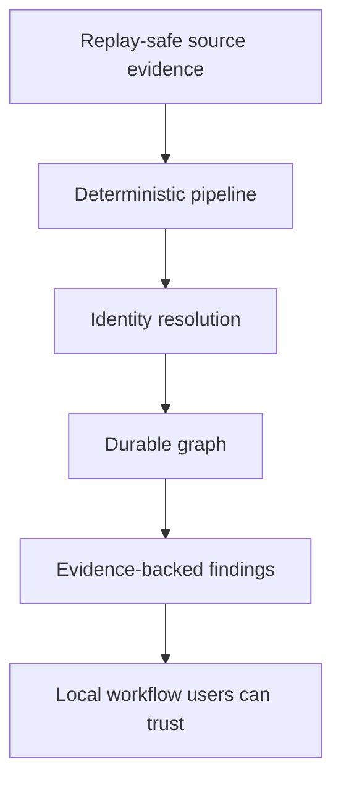

# Production Readiness

This document keeps the production bar visible without duplicating the old issue backlog or root product plan.

ContextOS is production-ready when it can ingest source artifacts repeatedly, build a durable context graph, resolve identities with explainable confidence, and report cross-layer context misalignment with evidence and recommended action.

## Cross-Cutting Gates

Every production-facing stage should satisfy these gates.

| Gate | Requirement |
| --- | --- |
| Idempotency | Re-running the same input produces stable IDs and no duplicate facts. |
| Replay safety | Raw and normalized inputs can reproduce downstream outputs. |
| Provenance | Outputs reference the source artifact, source location, and stage that produced them. |
| Confidence | Non-trivial inference includes confidence and a reason for that score. |
| Evidence | Findings and merges include evidence links or source spans. |
| Tests | Unit tests cover deterministic behavior; pipeline tests cover stage interactions. |
| Observability | Errors include stage, source, and trace identifiers. |
| Local-first | Production behavior does not require hosted SaaS infrastructure by default. |

## Stage Readiness

| Stage | Current Status | Remaining Gap |
| --- | --- | --- |
| Source | GitHub, Slack, Jira/Rovo, Google Drive, Notion, SharePoint, Codex status, and filesystem handlers exist. Filesystem has the broadest local extraction support. | Broader real-account validation, replay tests, retry/backoff behavior, and rate-limit handling. |
| Ingestion | Connectors emit source events and the persisted ingest service stores events, entities, mismatches, sync state, and audit rows. | Consistent durable raw capture, structured partial-failure behavior, and source deduplication across every route. |
| Normalization | Normalized documents preserve content and metadata enough for tests and local analysis. | Stronger content hashes, schema versioning, source spans, and reproducible replay commands. |
| Classification | Deterministic keyword rules exist. | Evidence-backed confidence, rule traces, ambiguity handling, and evaluation fixtures. |
| Extraction | Regex and structured extractors cover useful code, document, spreadsheet, OpenAPI, GitHub, and Jira facts. | Source offsets, richer field/value models, confidence scoring, and multilingual coverage. |
| Identity | Deterministic name normalization and benchmark scaffolding exist. | Alias dictionaries, semantic candidate review, conflict workflows, and precision/recall targets. |
| Relationship | Basic relationship generation and graph tests exist. | Typed edge vocabulary, source-span evidence, confidence scoring, and graph constraints. |
| Graph | Graph packages, query routes, and snapshots exist. | Durable graph replay from persisted evidence and richer query semantics. |
| Reasoning | Findings include evidence, confidence, impact, severity, affected roles, and recommended action. | More realistic cross-layer drift rules, false-positive tracking, and recommendation quality checks. |
| Execution | Execution boundary exists and generated assistance is kept separate from deterministic facts. | Production local executor path with persisted prompts, output provenance, errors, and timeouts. |
| Presentation | API and frontend surfaces show chat, Activity, graph, and findings. | Browser smoke tests, production build gate, and clearer recovery states. |

## Current Priority Order

1. Keep setup honest: external connectors save sources; filesystem ingests local files.
2. Make every persisted evidence path replay-safe and idempotent.
3. Improve identity resolution quality before expanding reasoning complexity.
4. Add realistic misalignment fixtures and false-positive tracking.
5. Harden local operations: setup validation, logs, backups, migrations, and smoke tests.

## Documentation Rule

When behavior changes, update the nearest README in the same change. Production documentation should state:

- what the stage is responsible for;
- what currently works;
- what remains risky or unfinished.
