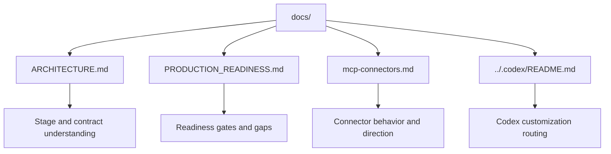

# ContextOS Docs

Documentation for architecture, readiness gates, connector behavior, and the local-first operating model.

## Start Here

- [Architecture](ARCHITECTURE.md) - production domain map, pipeline flow, data contracts, and links to every stage guide.
- [Production Readiness](PRODUCTION_READINESS.md) - production gates, stage readiness, and remaining gaps.
- [MCP Connectors](mcp-connectors.md) - connector notes and integration direction.
- [Codex Routing](../.codex/README.md) - Codex instructions, agents, skills, and validation commands.

## Document Flow

## Recent Updates

- [Codex Routing](../.codex/README.md) documents the `.github` to `.codex` mirror, root `AGENTS.md`, and validation commands for migrated skills.
- [MCP Connectors](mcp-connectors.md) now documents the Google Drive connector (Phase 1): OAuth/service-account auth, folder scan, Docs/Sheets/Slides export, stable replay event IDs, and the `/googledrive/status` and `/googledrive/ingest` API endpoints.

## Maintenance Checklist

- Update this index when new top-level documentation is added.
- Keep document names and links aligned after renames.
- Reflect major architecture or readiness changes in the linked docs.
