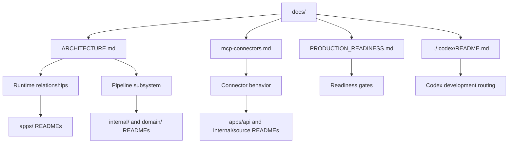

# ContextOS Docs

Top-level documentation for the current ContextOS runtime, connector model, production bar, and Codex-facing development workflow.

The docs in this folder are intentionally cross-layer. Deep implementation details stay in the nearest package README so the product architecture stays readable without becoming a duplicate API reference.

## Start Here

| Document | Use it for |
| --- | --- |
| [Architecture](ARCHITECTURE.md) | Current runtime map across frontend, API, Codex plugins, local DB, storage, AI worker, pipeline stages, graph, and findings. |
| [Production Readiness](PRODUCTION_READINESS.md) | Production gates, current readiness by runtime layer and pipeline stage, and the priority order for hardening. |
| [MCP Connectors](mcp-connectors.md) | Active connector portfolio, Codex-live versus direct ingest behavior, and route-family overview. |
| [Codex Routing](../.codex/README.md) | Repo-level Codex agents, instructions, skills, and validation commands. |

## Nearby Runtime Docs

| Area | Source of truth |
| --- | --- |
| Runnable apps | [apps/README.md](../apps/README.md) |
| Go API routes and generated OpenAPI workflow | [apps/api/README.md](../apps/api/README.md) |
| SvelteKit product UI | [apps/frontend/README.md](../apps/frontend/README.md) |
| Optional local AI worker | [apps/ai-worker/README.md](../apps/ai-worker/README.md) |
| Stable contracts | [domain/README.md](../domain/README.md) |
| Internal stages and services | [internal/README.md](../internal/README.md) |
| Local persistence and runtime artifacts | [storage/README.md](../storage/README.md) |

## Document Flow

## Maintenance

- Update [Architecture](ARCHITECTURE.md) when a runtime layer, data flow, route family, persistence boundary, Codex role, or pipeline relationship changes.
- Update [MCP Connectors](mcp-connectors.md) when the active connector portfolio, Codex plugin defaults, source setup behavior, or connector route families change.
- Update [Production Readiness](PRODUCTION_READINESS.md) when the production bar, readiness status, risks, or priority order changes.
- Keep endpoint fields, generated OpenAPI details, component props, and package internals in their nearest package README.
- When a docs change describes code that also changed, update the nearest README for that code in the same change.
