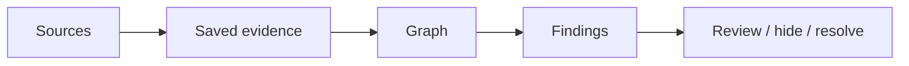
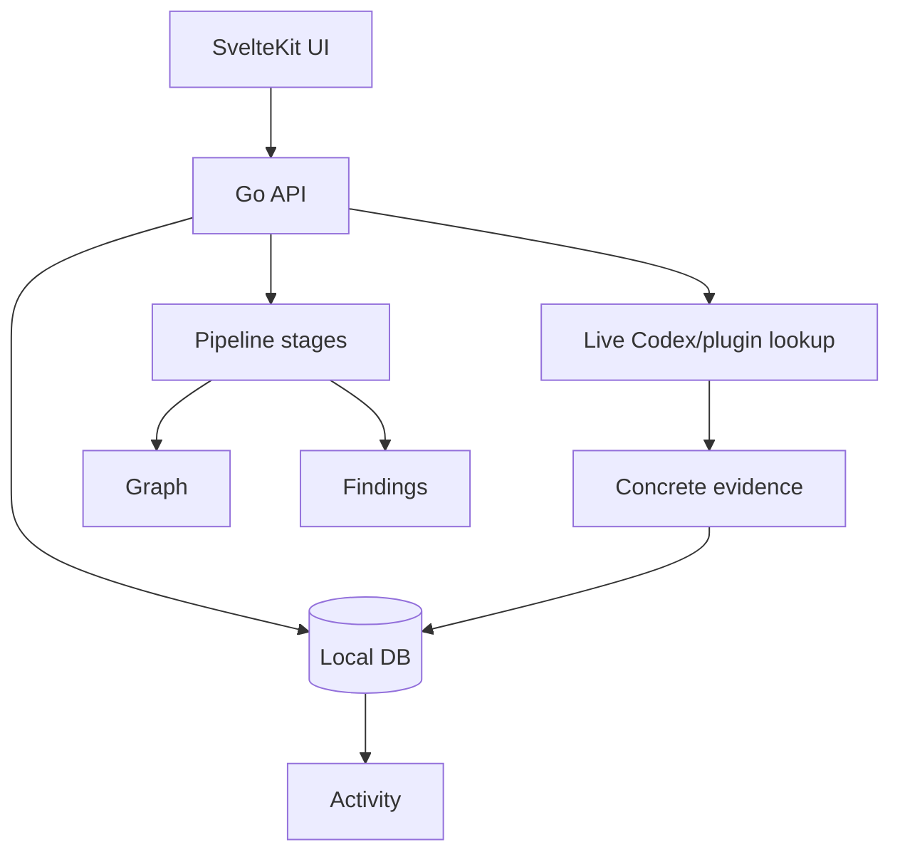
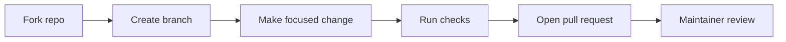

# ContextOS Wiki

Fast guide for users and contributors.

## 1. What ContextOS Is

ContextOS is a local-first workspace intelligence tool. It helps you compare engineering and business context from tools like GitHub, Jira, Slack, Google Drive, Notion, SharePoint, and local files.

The main goal:

```text
Detect real cross-layer context misalignment automatically.
```

In plain words: ContextOS looks for places where different sources disagree, drift, or miss important delivery context.

## 2. Mental Model



- **Sources** are connected tools or local files.
- **Evidence** is saved local source content.
- **Graph** is entities and relationships extracted from evidence.
- **Findings** are possible mismatches found during analysis.
- **Actions** are your review state, such as open, done, ignored, or false positive.

## 3. What Each Screen Means

| Area | Meaning |
| --- | --- |
| Sources | Connect GitHub, Jira, Slack, Google Drive, Notion, SharePoint, or filesystem evidence. |
| Report Agent | Ask questions across selected sources. |
| Activity | Saved evidence events from chat, ingest, or analysis. |
| Graph | Local entities and relationships extracted from saved evidence. |
| Findings | Analysis results that may show mismatch, drift, or delivery risk. |
| Preview | Shows what will be included before running analysis. |

## 4. Quick Start

Use this flow for local development:

```bash
./scripts/setup-local.sh
./scripts/start-infra.sh
./scripts/start-local.sh
```

Open:

- App: http://localhost:5173
- API health: http://localhost:8080/health
- Swagger: http://localhost:8080/swagger/

`start-infra.sh` starts PostgreSQL/pgvector and NATS. `start-local.sh` starts the API, worker, and frontend.

## 5. Full Docker Start

Use this if you want the whole stack in Docker:

```bash
docker compose up --build
```

This starts:

- PostgreSQL with pgvector
- NATS
- Go API
- Python worker
- SvelteKit frontend

## 6. Tech Stack

| Layer | Stack |
| --- | --- |
| Frontend | SvelteKit, Svelte 5, TypeScript, Vite |
| Backend | Go 1.24, net/http |
| Database | PostgreSQL, pgvector |
| Messaging | NATS with JetStream |
| Worker | Python, uv |
| API docs | Swagger/OpenAPI |
| Tests | Go test, go vet, Jest, svelte-check |
| Source access | Codex CLI plugins and direct connectors |

## 7. Data Flow



The app is local-first. Saved evidence and analysis state live in the local database and local storage folders.

## 8. Finding Review

Findings are not always perfect. Use review states instead of deleting evidence immediately.

| Status | Use it when |
| --- | --- |
| Open | The finding still needs review. |
| Checking | You are investigating it. |
| Done | The finding is handled. |
| Ignored | The finding is not useful right now. |
| False positive | The finding is wrong. |

Ignored and false-positive findings are hidden from the default Findings view, but you can show them again with the status filter and reopen them.

## 9. Activity vs Graph vs Findings

| View | Stored from | Main use |
| --- | --- | --- |
| Activity | Saved source evidence | Inspect what ContextOS knows. |
| Graph | Extracted entities and links | See local context structure. |
| Findings | Manual analysis output | Review possible mismatch or risk. |

If Activity is empty, the app has no saved evidence for that workspace. If Graph is empty, run analysis or ingest concrete evidence. If Findings are empty, run analysis after connecting concrete sources.

## 10. Common Troubleshooting

| Problem | Check |
| --- | --- |
| App opens but Activity is empty | Make sure PostgreSQL is running and you are using the same workspace. |
| Graph is empty after restart | Start infra first: `./scripts/start-infra.sh`. Check that the same Docker volume is still present. |
| Findings look wrong | Mark them `false_positive` or `ignored`; they will hide from the default view. |
| Live Codex lookup fails | Run `codex login` and check plugin authentication. |
| GitHub private repos do not load | Set `GITHUB_TOKEN` before starting the API. |
| Jira/Rovo returns 403 | Check Atlassian/Rovo app permissions and account access. |

Useful status command:

```bash
./scripts/status-local.sh
```

## 11. Important Paths

| Path | Purpose |
| --- | --- |
| `apps/frontend/` | SvelteKit UI. |
| `apps/api/` | Go API and handlers. |
| `apps/ai-worker/` | Python worker. |
| `domain/` | Stable contracts and domain types. |
| `internal/` | Pipeline stages, connectors, stores, and runtime logic. |
| `migrations/` | PostgreSQL schema. |
| `storage/` | Local artifacts and snapshots. |
| `docs/` | Public docs and architecture notes. |

## 12. How To Contribute



Pull requests are welcome. Only the owner/maintainer can merge protected branches.

Run checks before opening a PR:

```bash
go test ./...
go vet ./...
cd apps/frontend && bun run test && bun run check
```

## 13. Deeper Docs

- [Architecture](ARCHITECTURE.md)
- [MCP Connectors](mcp-connectors.md)
- [Production Readiness](PRODUCTION_READINESS.md)
- [API README](../apps/api/README.md)
- [Frontend README](../apps/frontend/README.md)
- [Contributing](../CONTRIBUTING.md)
