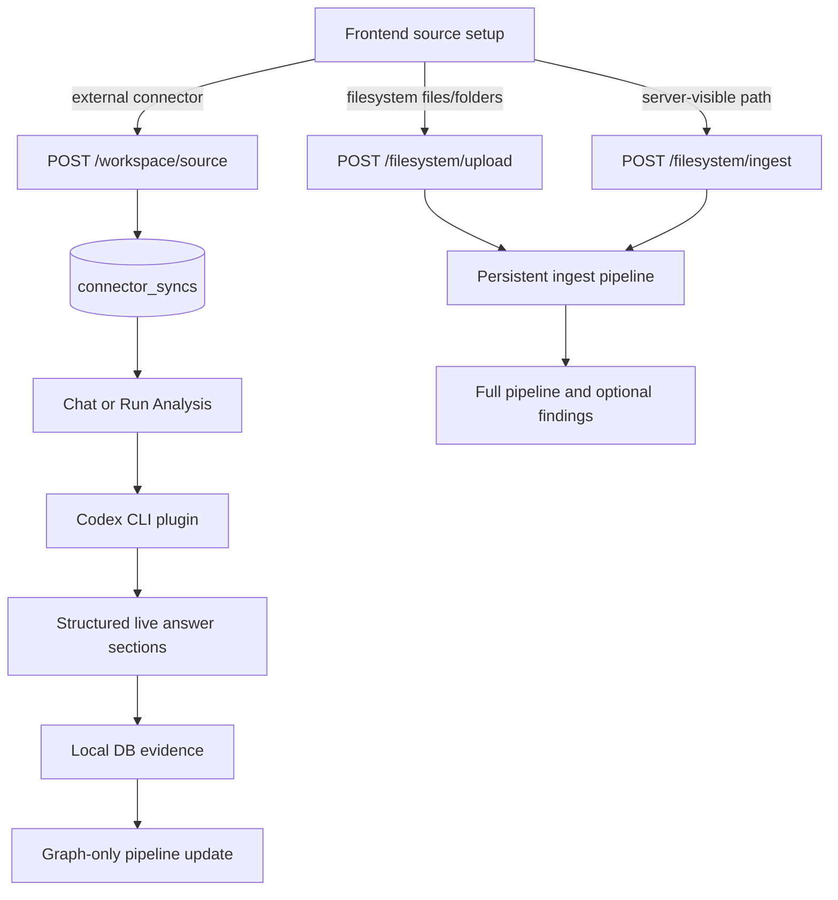
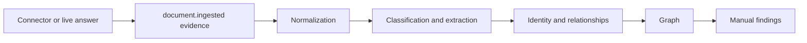

# MCP Connector Architecture

ContextOS connectors turn external tools and local files into traceable source evidence. The product setup flow is Codex-live by default for external systems, while filesystem content is ingested directly into local storage and the Local DB.

This document summarizes connector behavior. Endpoint fields and package internals live in [apps/api/README.md](../apps/api/README.md), [apps/api/handler/connectors](../apps/api/handler/connectors/README.md), and [internal/source](../internal/source/README.md).

## Connector Model

External source setup saves a connected source reference. It does not bulk-ingest every external artifact during setup. Concrete live answers can be persisted later when chat or analysis returns source-specific evidence. Filesystem is different: selected files and folders are copied or read locally and ingested immediately.

## Active Connector Portfolio

| Connector | Primary source | Default product path | Direct ingest path | Reference |
| --- | --- | --- | --- | --- |
| GitHub | Repositories, issues, pull requests, commits | Codex plugin live lookup | Token/env API reads and `/github/ingest` | [GitHub source](../internal/source/github/README.md) |
| Jira/Rovo | Jira issues, projects, status, comments, links | Atlassian Rovo Codex plugin | Jira REST token/env reads and `/jira/ingest` | [Jira source](../internal/source/jira/README.md) |
| Slack | Channels, messages, threads | Slack Codex plugin | OAuth/env token reads and `/slack/ingest` | [Slack source](../internal/source/slack/README.md) |
| Notion | Pages and databases | Notion Codex plugin | Notion token/env reads and `/notion/ingest` | [Notion source](../internal/source/notion/README.md) |
| Google Drive | Docs, Sheets, Slides, folders | Google Drive Codex plugin for live setup/chat | OAuth/service-account/access-token folder ingest | [Google Drive source](../internal/source/googledrive/README.md) |
| SharePoint / OneDrive | Microsoft Graph drive items and files | SharePoint Codex plugin | Graph token or client-credentials ingest | [SharePoint source](../internal/source/sharepoint/README.md) |
| Filesystem | Local files and folders | Direct local upload/path ingest | `/filesystem/upload` and `/filesystem/ingest` | [Filesystem source](../internal/source/filesystem/README.md) |

There is no separate Confluence source package right now. Current Atlassian context routes through Jira/Rovo unless dedicated Confluence scope is reopened.

## Codex-Live Versus Direct Ingest

| Path | What happens | When to use |
| --- | --- | --- |
| `POST /workspace/source` | Saves connector and source URI as a connected source in `connector_syncs`; no external content is ingested. | External source setup for GitHub, Jira/Rovo, Slack, Notion, Google Drive, or SharePoint/OneDrive. |
| `POST /chat/query/stream` | Uses live Codex lookup for concrete plugin-backed sources, streams progress, and can save returned source sections as local evidence. | Normal source questions in the product UI. |
| Connector `/ingest/stream` | Delegates a connector ingest request to the matching Codex CLI plugin and streams logs/status/result over SSE. | Debug or explicit Codex-backed ingest flows. |
| Connector `/ingest` | Runs a direct connector implementation when credentials or local paths are available. | Filesystem ingest and direct token/credential workflows. |
| `POST /filesystem/upload` | Stages browser-selected files/folders under `storage/raw/uploads/` and ingests them through the filesystem connector. | User-selected local files outside the repo. |

Concrete source provenance matters. Broad source scopes like `github` or `jira` can remain read-only because there is no single artifact to persist. Concrete sources such as a Jira key, GitHub repo, Slack channel, Drive file/folder, Notion page, or SharePoint item can become Local DB evidence.

## Route Families

The current public connector-related route families are:

| Route family | Purpose |
| --- | --- |
| `/<connector>/status` | Reports local env/token/credential readiness where applicable. |
| `/<connector>/ingest` | Runs direct ingest for a connector request. |
| `/<connector>/ingest/stream` | Streams Codex-backed ingest for plugin-capable connectors. |
| `/filesystem/upload` | Accepts browser multipart file/folder uploads and ingests the staged local files. |
| `/slack/connect` and `/slack/callback` | Slack OAuth helper routes. |
| `/codex/status` | Reports Codex CLI login state and installed plugins. |
| `/codex/sources` | Lists Codex-visible source candidates for setup. |
| `/codex/login` | Streams device-auth login output. |
| `/codex/plugin-reauth` | Streams plugin re-add output for terminal-driven OAuth reauth. |

See [apps/api/README.md](../apps/api/README.md) for the full route table and generated OpenAPI workflow.

## Output And Persistence

All connector paths ultimately produce or save evidence shaped like source events with connector metadata, source URI, object type, object ID, cursor/checkpoint data, and content or summary text. The downstream pipeline then normalizes, classifies, extracts, resolves identities, builds relationships, updates graph state, and optionally emits findings.

Live chat evidence uses the graph-only persistence path so Activity and Graph can update without auto-running Findings. Direct ingest and explicit analysis can run the full pipeline.

## Filesystem Formats

Filesystem remains the broadest local ingest path.

| Format | Supported input |
| --- | --- |
| Folder | Recursive local folder traversal with deterministic child-file events. |
| Text and Markdown | `.txt`, `.md` |
| Code and config | `.go`, `.ts`, `.json`, `.yaml`, `.yml`, `.toml`, `.sql` |
| OpenAPI | JSON/YAML specs detected inside filesystem files. |
| Spreadsheet | `.csv`, `.xlsx` |
| Office documents | `.docx`, `.pptx` |
| PDF | Best-effort `.pdf` text extraction. |

Unsupported, oversized, unreadable, and skipped folder children are reported through metadata rather than silently becoming facts.

## Maintenance Rules

- Add new connector docs here only after the source package and API route family exist.
- Keep endpoint field details in [apps/api/README.md](../apps/api/README.md) and connector package READMEs.
- Keep external setup behavior honest: connected sources are saved first; content is persisted only from concrete live answers, direct ingest, upload, or analysis.
- Preserve local-first credentials and provenance. Do not document a SaaS-only dependency as the default path.
