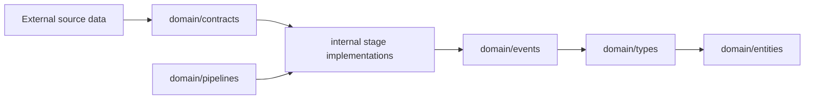

# Domain Layer

The `domain` tree contains stable contracts and primitives. These packages should stay small, serializable, and implementation-independent so internal stages can change without breaking the rest of the pipeline.

## Packages

| Package                          | Responsibility                                                                 |
| -------------------------------- | ------------------------------------------------------------------------------ |
| [contracts](contracts/README.md) | Source connector capability and ingestion request contracts.                   |
| [entities](entities/README.md)   | Canonical entity wrapper used after identity resolution.                       |
| [events](events/README.md)       | Event envelope and pipeline event type constants.                              |
| [pipelines](pipelines/README.md) | Current orchestration contract and production pipeline direction.              |
| [types](types/README.md)         | Normalized documents, classification, entities, relationships, and mismatches. |

## Contract Boundary

The domain layer should not import internal packages. `domain/pipelines` only defines the compact `Result` contract for tests and local use; orchestration lives in `internal/pipeline`.

## Fast Lookup

- Source connector interface: [contracts](contracts/README.md)
- Event envelope: [events](events/README.md)
- Normalized document shape: [types](types/README.md)
- Entity and relationship shape: [types](types/README.md)
- Canonical identity wrapper: [entities](entities/README.md)
- Pipeline result: [pipelines](pipelines/README.md)

## Maintenance Checklist

- Keep domain packages implementation-independent and serializable.
- Update package READMEs when contracts or type meanings change.
- Do not move stage orchestration logic into the domain layer.
