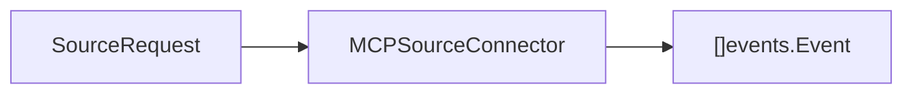

# Domain Contracts

Package `domain/contracts` defines the source connector boundary. Anything that can provide external context to ContextOS should implement this package, then be registered with the ingestion pipeline.

## Responsibility

- Describe source connector capabilities.
- Carry source input through `SourceRequest`.
- Define the `MCPSourceConnector` interface used by ingestion.

## Key Types

```go
type Capability string

const (
    CapabilityRepository  Capability = "repository"
    CapabilityMessages    Capability = "messages"
    CapabilityIssues      Capability = "issues"
    CapabilityAPISpec     Capability = "api_spec"
    CapabilitySpreadsheet Capability = "spreadsheet"
    CapabilityFiles       Capability = "files"
    CapabilityDocs        Capability = "docs"
)
```

Capabilities are descriptive routing hints. They should reflect what a connector can ingest, not the current request content.

```go
type SourceRequest struct {
    URI      string            `json:"uri"`
    Content  string            `json:"content"`
    Cursor   string            `json:"cursor"`
    Metadata map[string]string `json:"metadata"`
}
```

`SourceRequest` is the universal source input envelope. It lets the ingestion pipeline talk to every source connector with the same contract, whether the backing source is GitHub, Slack, Jira, Excel, or the local filesystem.

| Property | Meaning | Example |
| --- | --- | --- |
| `URI` | Stable pointer to the external resource or collection to read. Use it when the connector can locate the content itself. | `github://sx-tane/context-os/issues/42`, `slack://team/channel/C123` |
| `Content` | Inline text that is already available and should be turned into an ingestion event. Use it for local tests, pasted payloads, or adapters that already fetched the body. | Issue body, Slack message text, file contents |
| `Cursor` | Replay checkpoint supplied by the source system or connector. It is similar to a snapshot marker, but it is not the whole snapshot/content. It says "continue from here" or "this request was read at this source position". | Last Slack timestamp, GitHub page cursor, Jira `updated >= ...` watermark, file version/hash marker |
| `Metadata` | Extra source-specific context that should travel with the event without changing the shared contract. | `source_id`, `trace_id`, `object_type`, `object_id` |

A cursor is best understood as a bookmark/checkpoint for replay and incremental sync. If a connector stops after reading page 3 of a GitHub result, the next request can pass the page cursor so ingestion resumes from page 4 instead of starting over. If a source has no checkpoint concept yet, leave `Cursor` empty and rely on stable `URI`/metadata for provenance.

## Metadata Keys

| Key | Purpose |
| --- | ------- |
| `connector` | Connector name that produced a `document.ingested` event. |
| `mcp` | Marks events produced through the MCP source connector contract. |
| `source_uri` | Replayable source resource URI copied from `SourceRequest.URI`. |
| `source_cursor` | Source checkpoint or pagination cursor copied from `SourceRequest.Cursor`. |
| `object_type` | Source artifact kind used in actionable connector errors. |
| `object_id` | Source artifact identifier used in actionable connector errors. |

Connectors may also set event metadata keys from `domain/events`, including `source_id`, `event_id`, and `trace_id`, when an upstream system provides stable identities.

```go
type MCPSourceConnector interface {
    Name() string
    Capabilities() []Capability
    Ingest(context.Context, SourceRequest) ([]events.Event, error)
}
```

`MCPSourceConnector` converts source input into `document.ingested` domain events. Implementations should be idempotent when the same `SourceRequest` is replayed.

Connector failures should use `ConnectorError` so callers can inspect connector name, URI, object type, object ID, error kind, and retryability with `IsRetryable`.

## Inputs And Outputs



## Implementation Notes

- Connector implementations live under [internal/source](../../internal/source/README.md).
- `Ingest` should respect context cancellation before doing work.
- Metadata should preserve provenance such as connector name, URI, cursor, external ID, and source timestamps where available.
- For replay safety, prefer stable source identifiers over generated identifiers whenever the external system provides them.
- Use structured connector errors for cancellation, invalid requests, temporary failures, and permanent failures.
