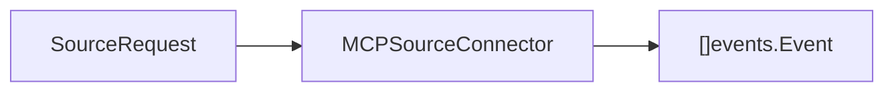

# Domain Contracts

Package `domain/contracts` defines the source connector boundary. Anything that can provide external context to ContextOS should implement this package, then be registered with the ingestion pipeline.

## Responsibility

- Describe source connector capabilities.
- Carry source input through `SourceRequest`.
- Define the `MCPSourceConnector` interface used by ingestion.

## Key Types

```go
type Capability string

const (
    CapabilityRepository  Capability = "repository"
    CapabilityMessages    Capability = "messages"
    CapabilityIssues      Capability = "issues"
    CapabilityAPISpec     Capability = "api_spec"
    CapabilitySpreadsheet Capability = "spreadsheet"
    CapabilityFiles       Capability = "files"
)
```

Capabilities are descriptive routing hints. They should reflect what a connector can ingest, not the current request content.

```go
type SourceRequest struct {
    URI      string            `json:"uri"`
    Content  string            `json:"content"`
    Cursor   string            `json:"cursor"`
    Metadata map[string]string `json:"metadata"`
}
```

`SourceRequest` is the universal source input envelope. `URI` identifies an external resource when available. `Content` carries inline payloads. `Cursor` carries source checkpoints or pagination cursors for replay. `Metadata` carries source-specific context without changing the contract.

## Metadata Keys

| Key | Purpose |
| --- | ------- |
| `connector` | Connector name that produced a `document.ingested` event. |
| `mcp` | Marks events produced through the MCP source connector contract. |
| `source_uri` | Replayable source resource URI copied from `SourceRequest.URI`. |
| `source_cursor` | Source checkpoint or pagination cursor copied from `SourceRequest.Cursor`. |
| `object_type` | Source artifact kind used in actionable connector errors. |
| `object_id` | Source artifact identifier used in actionable connector errors. |

Connectors may also set event metadata keys from `domain/events`, including `source_id`, `event_id`, and `trace_id`, when an upstream system provides stable identities.

```go
type MCPSourceConnector interface {
    Name() string
    Capabilities() []Capability
    Ingest(context.Context, SourceRequest) ([]events.Event, error)
}
```

`MCPSourceConnector` converts source input into `document.ingested` domain events. Implementations should be idempotent when the same `SourceRequest` is replayed.

Connector failures should use `ConnectorError` so callers can inspect connector name, URI, object type, object ID, error kind, and retryability with `IsRetryable`.

## Inputs And Outputs



## Implementation Notes

- Connector implementations live under [internal/source](../../internal/source/README.md).
- `Ingest` should respect context cancellation before doing work.
- Metadata should preserve provenance such as connector name, URI, cursor, external ID, and source timestamps where available.
- For replay safety, prefer stable source identifiers over generated identifiers whenever the external system provides them.
- Use structured connector errors for cancellation, invalid requests, temporary failures, and permanent failures.
