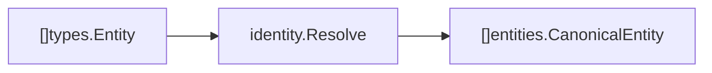

# Domain Entities

Package `domain/entities` contains the canonical entity wrapper produced by identity resolution.

## Responsibility

Represent the result of resolving raw extracted entities into canonical identities. This package intentionally wraps `domain/types.Entity` instead of redefining the entity itself.

## Key Type

```go
type MergeCandidate struct {
    Name       string   `json:"name"`
    Layer      string   `json:"layer"`
    Confidence float64  `json:"confidence"`
    Evidence   []string `json:"evidence"`
}

type CanonicalEntity struct {
    Entity         types.Entity     `json:"entity"`
    Confidence     float64          `json:"confidence"`
    NeedsHuman     bool             `json:"needs_human"`
    MatchLayer     string           `json:"match_layer"`
    Evidence       []string         `json:"evidence"`
    ConflictReason string           `json:"conflict_reason"`
    Candidates     []MergeCandidate `json:"candidates"`
}
```

Match layers are labeled with the `MatchLayerExact`, `MatchLayerConvention`, and `MatchLayerSemantic` constants.

## Field Meaning

| Field            | Meaning                                                                               |
| ---------------- | ------------------------------------------------------------------------------------- |
| `Entity`         | Canonical entity payload, including aliases and metadata.                             |
| `Confidence`     | Resolution confidence from 0 to 1. Exact canonical-key grouping uses `1`.             |
| `NeedsHuman`     | Manual-review flag set when a merge is ambiguous or high-impact.                      |
| `MatchLayer`     | Strongest layer that contributed: `exact`, `convention`, or `semantic`.              |
| `Evidence`       | References explaining how aliases were merged.                                        |
| `ConflictReason` | Populated when `NeedsHuman` is set, explaining the conflict.                          |
| `Candidates`     | Unmerged alias candidates (e.g. semantic suggestions) awaiting confirmation.          |

## Produced By

[internal/identity](../../internal/identity/README.md) produces canonical entities from extracted `types.Entity` values.



## Implementation Notes

- Keep confidence explainable. Semantic and multilingual matching surface alias suggestions as `Candidates` with evidence rather than silently collapsing distinct entities.
- `NeedsHuman` plus `ConflictReason` is the hook for conflict review when convention or semantic matching is ambiguous or high-impact.
- Canonical entities are stored in [internal/graph](../../internal/graph/README.md).
