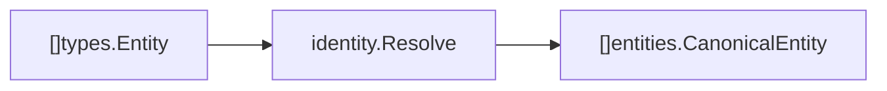

# Domain Entities

Package `domain/entities` contains the canonical entity wrapper produced by identity resolution.

## Responsibility

Represent the result of resolving raw extracted entities into canonical identities. This package intentionally wraps `domain/types.Entity` instead of redefining the entity itself.

## Key Type

```go
type MergeCandidate struct {
    Alias      string  `json:"alias"`
    Layer      string  `json:"layer"`
    Confidence float64 `json:"confidence"`
    Evidence   string  `json:"evidence"`
    Accepted   bool    `json:"accepted"`
}

type CanonicalEntity struct {
    Entity         types.Entity     `json:"entity"`
    Confidence     float64          `json:"confidence"`
    NeedsHuman     bool             `json:"needs_human"`
    MatchLayer     string           `json:"match_layer"`
    ConflictReason string           `json:"conflict_reason"`
    Evidence       []string         `json:"evidence"`
    Candidates     []MergeCandidate `json:"candidates"`
}
```

## Field Meaning

| Field | Meaning |
| --- | --- |
| `Entity` | Canonical entity payload, including aliases and metadata. |
| `Confidence` | Resolution confidence from 0 to 1. Current exact canonical-key grouping uses `1`. |
| `NeedsHuman` | Manual-review flag for ambiguous merges. Current exact matching sets this to `false`. |
| `MatchLayer` | Highest-precedence resolution layer that contributed to the entity, such as `exact`, `convention`, or `semantic`. |
| `ConflictReason` | Human-readable explanation when `NeedsHuman` is true. |
| `Evidence` | Provenance notes explaining why aliases were merged or left for review. |
| `Candidates` | Proposed alias links considered during resolution, including layer, confidence, evidence, and accepted state. |

## Match Layers

| Constant | Meaning |
| --- | --- |
| `MatchLayerExact` | Alias matched after canonical-key normalization. |
| `MatchLayerConvention` | Alias matched through naming convention transforms such as snake, camel, kebab, or Pascal case. |
| `MatchLayerSemantic` | Alias matched through embedding similarity above threshold. |
| `MatchLayerRelationship` | Reserved layer for relationship-backed identity evidence. |
| `MatchLayerHistorical` | Reserved layer for prior merge memory. |

## Produced By

[internal/stages/identity](../../internal/stages/identity/README.md) produces canonical entities from extracted `types.Entity` values.



## Implementation Notes

- Keep confidence explainable. Future semantic or multilingual matching should include evidence in metadata or a richer contract before lowering certainty.
- `NeedsHuman` is the hook for conflict review once identity resolution moves beyond deterministic key matching.
- `MergeCandidate` values should preserve rejected and accepted proposals so benchmark and review workflows can inspect false merges.
- Canonical entities are stored in [internal/stages/graph](../../internal/stages/graph/README.md).
