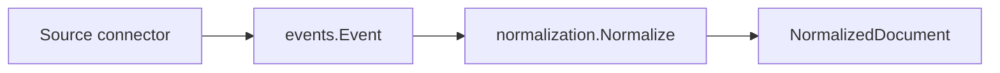

# Domain Events

Package `domain/events` defines the event envelope passed from source ingestion into downstream document processing.

## Responsibility

- Name pipeline event types.
- Carry source, subject, content, metadata, and occurrence time.
- Provide a small constructor that fills IDs and metadata defaults.

## Event Types

| Constant | Value | Stage Meaning |
| --- | --- | --- |
| `DocumentIngested` | `document.ingested` | Raw source data entered the system. |
| `DocumentNormalized` | `document.normalized` | Document was standardized. Reserved for future emitted events. |
| `EntityExtracted` | `entity.extracted` | Entity was identified. Reserved for future emitted events. |
| `IdentityResolved` | `identity.resolved` | Canonical identity was resolved. Reserved for future emitted events. |
| `RelationshipCreated` | `relationship.created` | Relationship edge was created. Reserved for future emitted events. |
| `MismatchDetected` | `mismatch.detected` | Reasoning found a delivery mismatch. Reserved for future emitted events. |
| `CodexAnalysisComplete` | `codex.analysis.completed` | Execution analysis completed. Reserved for future emitted events. |

## Key Type

```go
type Event struct {
    ID         string            `json:"id"`
    Type       Type              `json:"type"`
    Source     string            `json:"source"`
    Subject    string            `json:"subject"`
    Content    string            `json:"content"`
    Metadata   map[string]string `json:"metadata"`
    OccurredAt time.Time         `json:"occurred_at"`
}
```

## Constructor

```go
func New(eventType Type, source, subject, content string, metadata map[string]string) Event
```

`New` fills a nil metadata map, records UTC time, and builds an ID using event type, subject, and nanosecond timestamp.

## Data Flow



## Implementation Notes

- Current event IDs are time-derived. Production ingestion should prefer stable source IDs for idempotency.
- `Source` should be the connector or upstream system name.
- `Subject` should be a human-readable resource identifier such as URI, issue key, channel thread, or file path.
- Metadata should carry provenance rather than derived analysis that belongs in later stages.
