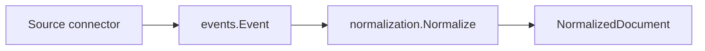

# Domain Events

Package `domain/events` defines the source-agnostic event envelope passed between ContextOS pipeline stages.

## Responsibility

- Name the stable pipeline event vocabulary.
- Carry source, subject, content, metadata, occurrence time, trace identity, source identity, and schema version.
- Provide a small constructor that fills replay-safe IDs and metadata defaults.

## Event Types

| Constant                | Value                      | Stage Meaning                                                            |
| ----------------------- | -------------------------- | ------------------------------------------------------------------------ |
| `DocumentIngested`      | `document.ingested`        | Raw source data entered the system.                                      |
| `DocumentNormalized`    | `document.normalized`      | Document was standardized. Reserved for future emitted events.           |
| `EntityExtracted`       | `entity.extracted`         | Entity was identified. Reserved for future emitted events.               |
| `IdentityResolved`      | `identity.resolved`        | Canonical identity was resolved. Reserved for future emitted events.     |
| `RelationshipCreated`   | `relationship.created`     | Relationship edge was created. Reserved for future emitted events.       |
| `MismatchDetected`      | `mismatch.detected`        | Reasoning found a delivery mismatch. Reserved for future emitted events. |
| `CodexAnalysisComplete` | `codex.analysis.completed` | Execution analysis completed. Reserved for future emitted events.        |

## Key Type

```go
type Event struct {
    ID            string            `json:"id"             example:"evt_a1b2c3d4e5f6"`
    TraceID       string            `json:"trace_id"       example:"trace_a1b2c3d4e5f6"`
    Type          Type              `json:"type"           example:"document.ingested"`
    SchemaVersion string            `json:"schema_version" example:"v1"`
    Source        string            `json:"source"         example:"github"`
    SourceID      string            `json:"source_id"      example:"https://github.com/sx-tane/context-os/issues/1"`
    Subject       string            `json:"subject"        example:"Fix: update connector README"`
    Content       string            `json:"content"        example:"Issue body: Please update the connector README with setup steps."`
    Metadata      map[string]string `json:"metadata"`
    OccurredAt    time.Time         `json:"occurred_at"    example:"2026-05-29T10:00:00Z"`
}
```

`Event` is the common envelope each pipeline stage reads or emits. It should preserve enough identity and provenance for replay, debugging, and downstream evidence bundles.

The struct tags include Swagger/OpenAPI `example` values for fields surfaced through API docs. Keep these examples realistic and non-secret so generated docs remain useful without implying a live external artifact.

| Property        | Meaning                                                                                                                                                                      | Example                                                            |
| --------------- | ---------------------------------------------------------------------------------------------------------------------------------------------------------------------------- | ------------------------------------------------------------------ |
| `ID`            | Stable logical event identity. Prefer a durable upstream event ID through metadata; otherwise `New` derives one deterministically from type, source, source ID, and subject. | `event:...`, GitHub webhook delivery ID                            |
| `TraceID`       | Correlation ID for all events that belong to the same ingestion or pipeline run. Defaults to `ID` when no trace is provided.                                                 | `trace-local-run-2026-05-23`, same value across related events     |
| `Type`          | Pipeline vocabulary value that tells the next stage what happened.                                                                                                           | `document.ingested`, `mismatch.detected`                           |
| `SchemaVersion` | Version of the event envelope contract. It is currently `v1`; breaking field changes should use a new version.                                                               | `v1`                                                               |
| `Source`        | Connector or stage that produced the event. This is the producer name, not necessarily the external artifact ID.                                                             | `github`, `normalization`, `reasoning`                             |
| `SourceID`      | Stable upstream artifact identity used for replay and provenance. If metadata does not provide it, `New` falls back to `Subject`, then `Source`.                             | `github:issue:42`, `slack:C123:1716400000.000100`                  |
| `Subject`       | Human-readable event subject for display, debugging, and routing context. It should point to what the event is about.                                                        | `repo://context-os/issues/42`, `Refund API mismatch`               |
| `Content`       | Event body passed to the next stage. For source events this is the captured text; for later stages it can be the stage output summary or payload.                            | Issue body, normalized document text, mismatch summary             |
| `Metadata`      | Extra provenance and correlation values that should travel with the event without changing the event contract. Keep it factual and source/stage-specific.                    | `event_id`, `source_id`, `trace_id`, `source_uri`, `source_cursor` |
| `OccurredAt`    | UTC time when this event envelope was created locally. It is for ordering/audit and is not part of stable replay identity.                                                   | `2026-05-23T01:06:23Z`                                             |

## Metadata Keys

| Key         | Purpose                                                                                           |
| ----------- | ------------------------------------------------------------------------------------------------- |
| `event_id`  | Optional durable upstream event identity. When present, it becomes `Event.ID`.                    |
| `source_id` | Optional stable upstream artifact identity. When present, it becomes `Event.SourceID`.            |
| `trace_id`  | Optional correlation identity shared by related events. When present, it becomes `Event.TraceID`. |

## Constructor

```go
func New(eventType Type, source, subject, content string, metadata map[string]string) Event
```

`New` copies metadata, fills a non-nil metadata map, records UTC time, sets `SchemaVersion` to `v1`, and derives replay-safe identity:

- `metadata["event_id"]` overrides the event ID when a connector has a stable upstream event identifier.
- `metadata["source_id"]` becomes `SourceID`; otherwise the constructor falls back to `subject`, then `source`.
- `metadata["trace_id"]` becomes `TraceID`; otherwise the constructor falls back to the event ID.
- If no explicit event ID is supplied, the ID is a deterministic hash of event type, source, source ID, and subject.

## Data Flow



## Replay Semantics

Replaying the same source artifact with the same event type, source, source ID, and subject produces the same event ID. Downstream stages can therefore reuse `Event.ID` as a stable document provenance key while `OccurredAt` remains the time the envelope was created for ordering and audit purposes.

## Migration Impact

The `Event` envelope is schema version `v1`. Contract changes that rename fields, change ID derivation, or alter required provenance should introduce a new schema version and document downstream migration impact before landing. Existing callers can keep using `New`; new source connectors should provide `event_id`, `source_id`, and `trace_id` metadata whenever the upstream system exposes stable values.

## Implementation Notes

- `Source` should be the connector or stage name.
- `SourceID` should be the stable upstream artifact identifier, such as URI, issue key, channel thread, file path, or content-derived ID.
- `Subject` should remain human-readable for display and debugging.
- Metadata should carry provenance rather than derived analysis that belongs in later stages.
