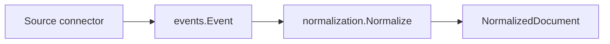

# Domain Events

Package `domain/events` defines the source-agnostic event envelope passed between ContextOS pipeline stages.

## Responsibility

- Name the stable pipeline event vocabulary.
- Carry source, subject, content, metadata, occurrence time, trace identity, source identity, and schema version.
- Provide a small constructor that fills replay-safe IDs and metadata defaults.

## Event Types

| Constant | Value | Stage Meaning |
| --- | --- | --- |
| `DocumentIngested` | `document.ingested` | Raw source data entered the system. |
| `DocumentNormalized` | `document.normalized` | Document was standardized. Reserved for future emitted events. |
| `EntityExtracted` | `entity.extracted` | Entity was identified. Reserved for future emitted events. |
| `IdentityResolved` | `identity.resolved` | Canonical identity was resolved. Reserved for future emitted events. |
| `RelationshipCreated` | `relationship.created` | Relationship edge was created. Reserved for future emitted events. |
| `MismatchDetected` | `mismatch.detected` | Reasoning found a delivery mismatch. Reserved for future emitted events. |
| `CodexAnalysisComplete` | `codex.analysis.completed` | Execution analysis completed. Reserved for future emitted events. |

## Key Type

```go
type Event struct {
    ID            string            `json:"id"`
    TraceID       string            `json:"trace_id"`
    Type          Type              `json:"type"`
    SchemaVersion string            `json:"schema_version"`
    Source        string            `json:"source"`
    SourceID      string            `json:"source_id"`
    Subject       string            `json:"subject"`
    Content       string            `json:"content"`
    Metadata      map[string]string `json:"metadata"`
    OccurredAt    time.Time         `json:"occurred_at"`
}
```

## Constructor

```go
func New(eventType Type, source, subject, content string, metadata map[string]string) Event
```

`New` copies metadata, fills a non-nil metadata map, records UTC time, sets `SchemaVersion` to `v1`, and derives replay-safe identity:

- `metadata["event_id"]` overrides the event ID when a connector has a stable upstream event identifier.
- `metadata["source_id"]` becomes `SourceID`; otherwise the constructor falls back to `subject`, then `source`.
- `metadata["trace_id"]` becomes `TraceID`; otherwise the constructor falls back to the event ID.
- If no explicit event ID is supplied, the ID is a deterministic hash of event type, source, source ID, and subject.

## Data Flow



## Replay Semantics

Replaying the same source artifact with the same event type, source, source ID, and subject produces the same event ID. Downstream stages can therefore reuse `Event.ID` as a stable document provenance key while `OccurredAt` remains the time the envelope was created for ordering and audit purposes.

## Migration Impact

The `Event` envelope is schema version `v1`. Contract changes that rename fields, change ID derivation, or alter required provenance should introduce a new schema version and document downstream migration impact before landing. Existing callers can keep using `New`; new source connectors should provide `event_id`, `source_id`, and `trace_id` metadata whenever the upstream system exposes stable values.

## Implementation Notes

- `Source` should be the connector or stage name.
- `SourceID` should be the stable upstream artifact identifier, such as URI, issue key, channel thread, file path, or content-derived ID.
- `Subject` should remain human-readable for display and debugging.
- Metadata should carry provenance rather than derived analysis that belongs in later stages.
