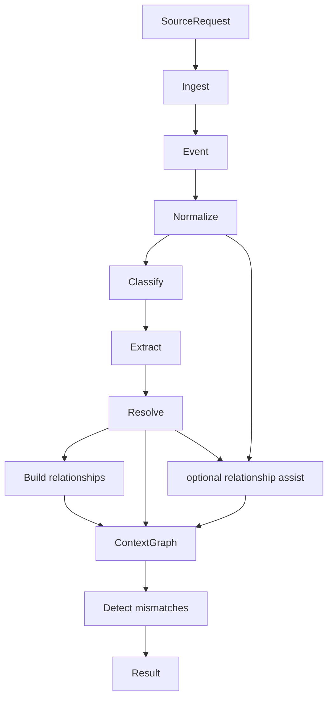

# Domain Pipelines

Package `domain/pipelines` exposes the current orchestration boundary.

## Responsibility

Define the domain-level result contract for the current local-first processing path from a source request to canonical entities and detected mismatches, while documenting the production direction for durable orchestration.

## Key Types

```go
type Result struct {
  EventCount    int                        `json:"event_count"`
  Events        []events.Event             `json:"events"`
  Entities      []entities.CanonicalEntity `json:"entities"`
  Relationships []types.Relationship       `json:"relationships"`
  Mismatches    []types.Mismatch           `json:"mismatches"`
}
```

`Result` is the current high-level output. `Events`, `Entities`, and `Relationships` expose the context accumulated during the run. `Mismatches` contains evidence-backed reasoning findings derived from the in-memory graph.

```go
func Run(ctx context.Context, sourcePipeline ingestion.Pipeline, req contracts.SourceRequest) (Result, error)
```

## Flow



## Behavior

1. Ingest the request through the provided ingestion pipeline.
2. For each emitted event, normalize it into a document.
3. Classify the document with deterministic routing rules.
4. Extract candidate entities from the document body.
5. Resolve candidates into canonical entities.
6. Build deterministic relationships between canonical entities from the same source document.
7. Add entities and relationships to the in-memory context graph.
8. Run reasoning against the graph and return canonical entities plus mismatches.

Internal orchestration can opt into relationship assistance through `pipeline.Stores`, but the
domain result contract remains the same: AI can only add validated relationships and cannot create
entities or remove deterministic edges.

## Implementation Notes

- `Run` currently imports internal stage implementations directly. Production orchestration should support stage contracts, durable state, replay, and trace IDs.
- The function stops immediately on ingestion errors.
- Downstream stages are currently synchronous and in-memory.
- Scenario-backed tests for this contract live in [tests/pipeline_test.go](../../tests/pipeline_test.go) and load fixtures from [tests/harness](../../tests/harness/README.md).

## Production Direction

- Keep the same source-to-finding shape, but make each stage output durable and replayable.
- Carry a trace identifier from `SourceRequest` through events, documents, entities, relationships, graph snapshots, and mismatches.
- Return or persist stage diagnostics so production failures can be inspected without re-running opaque work.
- Keep orchestration local-first by default, even when optional AI execution is enabled.
