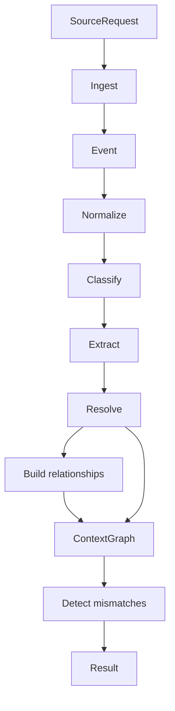

# Domain Pipelines

Package `domain/pipelines` exposes the current orchestration boundary.

## Responsibility

Run the current local-first processing path from a source request to a context graph and detected mismatches, while documenting the production direction for durable orchestration.

## Key Types

```go
type Result struct {
    Graph      *graph.ContextGraph `json:"graph"`
    Mismatches []types.Mismatch    `json:"mismatches"`
}
```

`Result` is the current high-level output. The graph is the accumulated memory for the request. Mismatches are reasoning findings derived from that graph.

```go
func Run(ctx context.Context, sourcePipeline ingestion.Pipeline, req contracts.SourceRequest) (Result, error)
```

## Flow



## Behavior

1. Ingest the request through the provided ingestion pipeline.
2. For each emitted event, normalize it into a document.
3. Classify the document with deterministic routing rules.
4. Extract candidate entities from the document body.
5. Resolve candidates into canonical entities.
6. Build relationships between adjacent canonical entities from the same source document.
7. Add entities and relationships to the in-memory context graph.
8. Run reasoning against the graph and return mismatches.

## Implementation Notes

- `Run` currently imports internal stage implementations directly. Production orchestration should support stage contracts, durable state, replay, and trace IDs.
- The function stops immediately on ingestion errors.
- Downstream stages are currently synchronous and in-memory.
- Tests for this contract live in [tests/pipeline_test.go](../../tests/pipeline_test.go).

## Production Direction

- Keep the same source-to-finding shape, but make each stage output durable and replayable.
- Carry a trace identifier from `SourceRequest` through events, documents, entities, relationships, graph snapshots, and mismatches.
- Return or persist stage diagnostics so production failures can be inspected without re-running opaque work.
- Keep orchestration local-first by default, even when optional AI execution is enabled.
