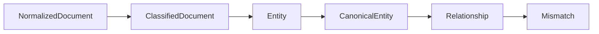

# Domain Types

Package `domain/types` contains the serializable data structures shared across pipeline stages.

## Normalized Documents

```go
type SourceSpan struct {
    Field string `json:"field"`
    Start int    `json:"start"`
    End   int    `json:"end"`
    Path  string `json:"path"`
}

type NormalizedDocument struct {
    ID            string            `json:"id"`
    Source        string            `json:"source"`
    SourceType    string            `json:"source_type"`
    Title         string            `json:"title"`
    Body          string            `json:"body"`
    Metadata      map[string]string `json:"metadata"`
    ContentHash   string            `json:"content_hash"`
    SchemaVersion string            `json:"schema_version"`
    RuleVersion   string            `json:"rule_version"`
    Spans         []SourceSpan      `json:"spans"`
    NormalizedAt  time.Time         `json:"normalized_at"`
}
```

Normalized documents are the common processing unit after ingestion. They preserve source identity, deterministic content hash, event schema version, normalization rule version, and source spans so downstream stages can trace text back to the original artifact.

## Classification

```go
type Classification string

const (
    BusinessLogic   Classification = "business_logic"
    APIDiscussion   Classification = "api_discussion"
    PMORisk         Classification = "pmo_risk"
    ConsumerConcern Classification = "consumer_concern"
    ProducerConcern Classification = "producer_concern"
    Blocker         Classification = "blocker"
    Decision        Classification = "decision"
    Unknown         Classification = "unknown"
)
```

```go
type ScoredLabel struct {
    Classification Classification `json:"classification"`
    Confidence     float64        `json:"confidence"`
    Rule           string         `json:"rule"`
    Evidence       []string       `json:"evidence"`
}

type ClassifiedDocument struct {
    Document       NormalizedDocument `json:"document"`
    Classification Classification     `json:"classification"`
    Confidence     float64            `json:"confidence"`
    Labels         []ScoredLabel      `json:"labels"`
    MatchedRules   []string           `json:"matched_rules"`
    Evidence       []string           `json:"evidence"`
}
```

Classification routes a document toward domain-specific extraction and reasoning behavior. The current classifier is deterministic; `Labels`, `MatchedRules`, and `Evidence` preserve every rule signal that fired while `Classification` and `Confidence` expose the primary result.

## Entities

```go
type EntityType string

const (
    APIField    EntityType = "api_field"
    DBColumn    EntityType = "db_column"
    Enum        EntityType = "enum"
    Requirement EntityType = "requirement"
    Service     EntityType = "service"
    Dependency  EntityType = "dependency"
)
```

```go
type Entity struct {
    ID               string            `json:"id"`
    Type             EntityType        `json:"type"`
    Name             string            `json:"name"`
    RawMention       string            `json:"raw_mention"`
    SourceID         string            `json:"source_id"`
    Confidence       float64           `json:"confidence"`
    ExtractionMethod string            `json:"extraction_method"`
    Spans            []SourceSpan      `json:"spans"`
    Aliases          []string          `json:"aliases"`
    Metadata         map[string]string `json:"metadata"`
}
```

Entities are candidate or canonical domain concepts depending on stage. `SourceID`, `RawMention`, `ExtractionMethod`, `Confidence`, and `Spans` keep extraction evidence traceable back to the normalized document or source event.

## Relationships

```go
type RelationshipKind string

const (
    CoOccursInDocument       RelationshipKind = "co_occurs_in_document"
    RequirementAffectsAPI    RelationshipKind = "requirement_affects_api"
    RequirementAffectsService RelationshipKind = "requirement_affects_service"
    APIBackedByDB            RelationshipKind = "api_backed_by_db"
    EnumConstrainsField      RelationshipKind = "enum_constrains_field"
    ServiceDependsOn         RelationshipKind = "service_depends_on"
)

type Relationship struct {
    ID         string           `json:"id"`
    FromID     string           `json:"from_id"`
    ToID       string           `json:"to_id"`
    Kind       RelationshipKind `json:"kind"`
    Confidence float64          `json:"confidence"`
    Evidence   []string         `json:"evidence"`
    Metadata   map[string]string `json:"metadata"`
}
```

Relationships connect domain entities through a stable `RelationshipKind` vocabulary. They include confidence and evidence so graph and reasoning output can explain why an edge exists.

## Mismatches

```go
type Mismatch struct {
    ID          string   `json:"id"`
    Type        string   `json:"type"`
    Summary     string   `json:"summary"`
    EntityIDs   []string `json:"entity_ids"`
    Severity    string   `json:"severity"`
    Confidence  float64  `json:"confidence"`
    Impact      string   `json:"impact"`
    Evidence    []string `json:"evidence"`
    Recommended string   `json:"recommended"`
}
```

Mismatches are reasoning findings. Current findings include the detection type, confidence score, impact level, evidence references, severity, and recommended action so downstream presentation and regression harnesses can audit why a finding exists.

Production mismatch direction:

```go
type Mismatch struct {
    ID          string
    Summary     string
    EntityIDs   []string
    Severity    string
    Confidence  float64
    Impact      string
    Evidence    []string
    AffectedRoles []string
    Recommended string
}
```

Future expansions should add role-specific impact and recommendation status without removing the existing evidence and confidence fields.

## Pipeline Shape



## Maintenance Checklist

- Keep new shared types stable and JSON-friendly.
- Preserve `Evidence` and `Confidence` fields for reasoning outputs.
- Document breaking contract changes before updating downstream stages.
