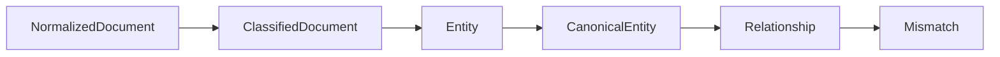

# Domain Types

Package `domain/types` contains the serializable data structures shared across pipeline stages.

## Normalized Documents

```go
type NormalizedDocument struct {
    ID           string            `json:"id"`
    Source       string            `json:"source"`
    SourceType   string            `json:"source_type"`
    Title        string            `json:"title"`
    Body         string            `json:"body"`
    Metadata     map[string]string `json:"metadata"`
    NormalizedAt time.Time         `json:"normalized_at"`
}
```

Normalized documents are the common processing unit after ingestion. They should preserve source identity and enough metadata to trace back to the original artifact.

## Classification

```go
type Classification string

const (
    BusinessLogic   Classification = "business_logic"
    APIDiscussion   Classification = "api_discussion"
    PMORisk         Classification = "pmo_risk"
    ConsumerConcern Classification = "consumer_concern"
    ProducerConcern Classification = "producer_concern"
    Blocker         Classification = "blocker"
    Decision        Classification = "decision"
    Unknown         Classification = "unknown"
)
```

```go
type ClassifiedDocument struct {
    Document       NormalizedDocument `json:"document"`
    Classification Classification     `json:"classification"`
    Confidence     float64            `json:"confidence"`
}
```

Classification routes a document toward domain-specific extraction and reasoning behavior. The current classifier is deterministic and confidence values are rule scores.

## Entities

```go
type EntityType string

const (
    APIField    EntityType = "api_field"
    DBColumn    EntityType = "db_column"
    Enum        EntityType = "enum"
    Requirement EntityType = "requirement"
    Service     EntityType = "service"
    Dependency  EntityType = "dependency"
)
```

```go
type Entity struct {
    ID       string            `json:"id"`
    Type     EntityType        `json:"type"`
    Name     string            `json:"name"`
    SourceID string            `json:"source_id"`
    Aliases  []string          `json:"aliases"`
    Metadata map[string]string `json:"metadata"`
}
```

Entities are candidate or canonical domain concepts depending on stage. `SourceID` links back to the normalized document or source event.

## Relationships

```go
type Relationship struct {
    ID       string            `json:"id"`
    FromID   string            `json:"from_id"`
    ToID     string            `json:"to_id"`
    Kind     string            `json:"kind"`
    Metadata map[string]string `json:"metadata"`
}
```

Relationships connect domain entities. The current implementation creates `co_occurs_in_document` relationships.

## Mismatches

```go
type Mismatch struct {
    ID          string   `json:"id"`
    Type        string   `json:"type"`
    Summary     string   `json:"summary"`
    EntityIDs   []string `json:"entity_ids"`
    Severity    string   `json:"severity"`
    Confidence  float64  `json:"confidence"`
    Impact      string   `json:"impact"`
    Evidence    []string `json:"evidence"`
    Recommended string   `json:"recommended"`
}
```

Mismatches are reasoning findings. Current findings include the detection type, confidence score, impact level, evidence references, severity, and recommended action so downstream presentation and regression harnesses can audit why a finding exists.

Production mismatch direction:

```go
type Mismatch struct {
    ID          string
    Summary     string
    EntityIDs   []string
    Severity    string
    Confidence  float64
    Impact      string
    Evidence    []string
    AffectedRoles []string
    Recommended string
}
```

Future expansions should add role-specific impact and recommendation status without removing the existing evidence and confidence fields.

## Pipeline Shape


