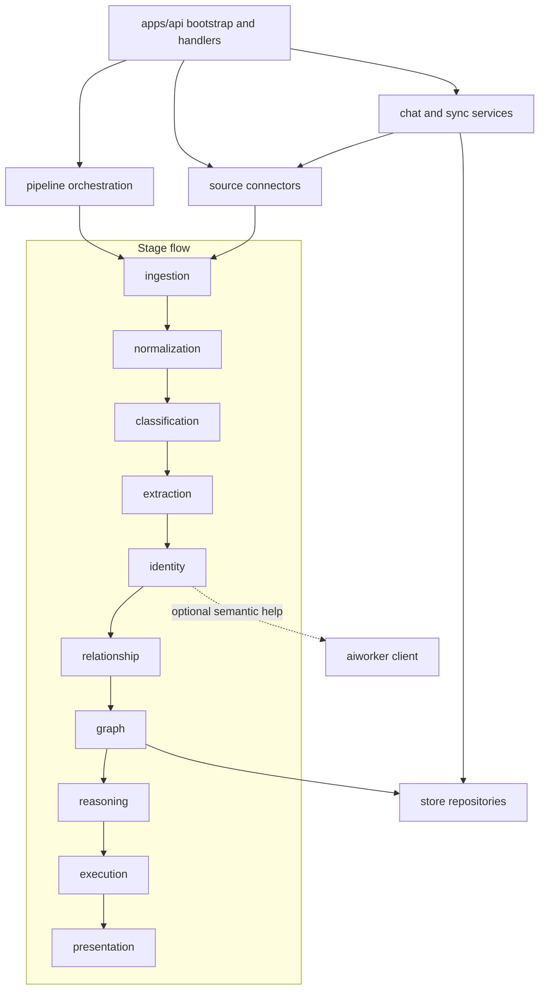

# Internal Layer

The `internal` tree contains ContextOS implementations behind the stable contracts in [`domain/`](../domain/README.md). It is grouped by responsibility: source connectors collect context, stage packages transform it, runtime services expose it to product workflows, and support packages provide persistence or worker access.

This README is the fast map. Package-level READMEs remain the detailed source of truth for behavior, contracts, setup, and tests.

## Package Groups

| Group | Packages | Responsibility |
| --- | --- | --- |
| Source connectors | [`source/`](source/README.md) | Connector interface helpers and source-specific adapters for GitHub, Jira/Rovo, Slack, Notion, Google Drive, SharePoint/OneDrive, filesystem, and Codex-backed live source access. |
| Pipeline stages | [`stages/`](stages/README.md), including [`stages/ingestion/`](stages/ingestion/README.md), [`stages/normalization/`](stages/normalization/README.md), [`stages/classification/`](stages/classification/README.md), [`stages/extraction/`](stages/extraction/README.md), [`stages/identity/`](stages/identity/README.md), [`stages/relationship/`](stages/relationship/README.md), [`stages/graph/`](stages/graph/README.md), [`stages/reasoning/`](stages/reasoning/README.md), [`stages/execution/`](stages/execution/README.md), and [`stages/presentation/`](stages/presentation/README.md) | Independent stage implementations that consume and emit domain contracts while preserving traceability. |
| Orchestration | [`pipeline/`](pipeline/README.md) | Wires stage order for local runs, tests, and replayable pipeline execution. |
| Runtime services | [`runtime/`](runtime/README.md), including [`runtime/chat/`](runtime/chat/README.md) and [`runtime/sync/`](runtime/sync/README.md) | Product-facing service logic for live chat answers, evidence persistence, and connector sync lifecycle tracking. |
| Persistence | [`persistence/`](persistence/README.md), including [`persistence/store/`](persistence/store/README.md) | Local DB backed repositories and storage helpers used by API handlers, runtime services, and stages. |
| Assistive worker client | [`worker/`](worker/README.md), including [`worker/aiworker/`](worker/aiworker/README.md) | Go client and cache for optional Python worker services such as embeddings and semantic matching. |

## Internal Map

## Package Jobs

| Package | Responsibility | Update when |
| --- | --- | --- |
| [`source/`](source/README.md) | Connector interfaces and source-specific ingest implementations. | Connector behavior, metadata mapping, live Codex behavior, or replay rules change. |
| [`stages/ingestion/`](stages/ingestion/README.md) | Converts source events into pipeline inputs. | Event acceptance, validation, or ingest traceability changes. |
| [`stages/normalization/`](stages/normalization/README.md) | Normalizes raw event content into deterministic document records and side outputs. | Document IDs, content hashing, parsed output, or normalization fields change. |
| [`stages/classification/`](stages/classification/README.md) | Assigns document categories with evidence and confidence. | Classification rules, labels, or confidence behavior change. |
| [`stages/extraction/`](stages/extraction/README.md) | Extracts entities and facts from normalized documents and structured source metadata. | Entity/fact extraction, source-specific parsers, or evidence spans change. |
| [`stages/identity/`](stages/identity/README.md) | Resolves aliases and semantic matches into canonical identities. | Merge rules, match thresholds, multilingual handling, or benchmark fixtures change. |
| [`stages/relationship/`](stages/relationship/README.md) | Builds typed relationships between resolved entities. | Edge vocabulary, evidence propagation, or relationship confidence changes. |
| [`stages/graph/`](stages/graph/README.md) | Stores and snapshots graph nodes and relationships for querying. | Graph persistence, snapshot output, cleanup behavior, or graph API models change. |
| [`stages/reasoning/`](stages/reasoning/README.md) | Produces mismatch findings with evidence, impact, recommendation, and confidence. | Finding rules, severity, evidence, or recommendation behavior changes. |
| [`stages/execution/`](stages/execution/README.md) | Applies output and execution rules after reasoning. | Execution validation or action-output contracts change. |
| [`stages/presentation/`](stages/presentation/README.md) | Formats findings and summaries for API and UI consumption. | Public finding, summary, graph, or role-specific output shape changes. |
| [`pipeline/`](pipeline/README.md) | Orchestrates stage order for local and test runs. | Stage sequencing, failure handling, or cross-stage contracts change. |
| [`runtime/chat/`](runtime/chat/README.md) | Answers workspace chat queries using live Codex context and Local DB evidence. | Chat intent routing, evidence saving, stream behavior, or fallback semantics change. |
| [`runtime/sync/`](runtime/sync/README.md) | Tracks connector sync status and cancellation-aware sync work. | Background sync orchestration, status marking, or cancellation behavior changes. |
| [`persistence/store/`](persistence/store/README.md) | Implements persistence repositories for local DB backed product state. | Store interfaces, repository behavior, or storage adapters change. |
| [`worker/aiworker/`](worker/aiworker/README.md) | Calls and caches optional Python worker services. | Worker API, cache behavior, embeddings, or semantic matcher integration changes. |

## Fast Lookup

- Connector contracts and ingest behavior: [`source/`](source/README.md)
- Source-specific connector details: `source/<connector>/README.md`
- Pipeline order and replay behavior: [`pipeline/`](pipeline/README.md)
- Parsed output and normalized document writes: [`stages/normalization/`](stages/normalization/README.md)
- Classification labels: [`stages/classification/`](stages/classification/README.md)
- Entity extraction and facts: [`stages/extraction/`](stages/extraction/README.md)
- Alias and identity matching: [`stages/identity/`](stages/identity/README.md)
- Relationship edges: [`stages/relationship/`](stages/relationship/README.md)
- Graph snapshots and cleanup: [`stages/graph/`](stages/graph/README.md)
- Misalignment findings: [`stages/reasoning/`](stages/reasoning/README.md)
- API/UI finding summaries: [`stages/presentation/`](stages/presentation/README.md)
- Local DB repositories: [`persistence/store/`](persistence/store/README.md)
- Live chat and evidence saving: [`runtime/chat/`](runtime/chat/README.md)
- Background sync status: [`runtime/sync/`](runtime/sync/README.md)
- Worker-backed embeddings or semantic help: [`worker/aiworker/`](worker/aiworker/README.md)

## Where To Put New Code

| Need | Put it in |
| --- | --- |
| Stable contracts, serializable types, event names, or cross-package interfaces. | [`domain/`](../domain/README.md) |
| Source API clients, source parsers, connector metadata mapping, or replay-safe source ingest. | `internal/source/<connector>/` |
| HTTP route handlers, request parsing, response shaping, or API wiring. | `apps/api/handler/...` and `apps/api/bootstrap/...` |
| A deterministic stage transform that belongs to one pipeline step. | The matching `internal/stages/<stage>/` package. |
| Cross-stage sequencing, replay setup, or pipeline failure handling. | [`pipeline/`](pipeline/README.md) |
| Local DB repository implementations or storage adapters. | [`persistence/store/`](persistence/store/README.md) |
| Chat intent routing, live-answer persistence, or evidence save behavior. | [`runtime/chat/`](runtime/chat/README.md) |
| Connector sync status marking or cancellation-aware background sync helpers. | [`runtime/sync/`](runtime/sync/README.md) |
| Optional AI worker calls, response caching, embeddings, or semantic match clients. | [`worker/aiworker/`](worker/aiworker/README.md) |

## Dependency Rules

- Keep stable contracts in [`domain/`](../domain/README.md); internal packages may depend on domain, but domain must not depend on internal packages.
- Keep source packages focused on collecting source context and emitting events. They should not import downstream stage packages.
- Keep stage packages independent. Prefer domain contracts and narrow interfaces over importing sibling stage implementations.
- Let [`pipeline/`](pipeline/README.md) wire stage order, retries, replay setup, and cross-stage error handling.
- Let API bootstrap and handlers wire runtime services, stores, connector handlers, and pipeline entrypoints.
- Keep [`persistence/store/`](persistence/store/README.md) behind repository-style boundaries so callers do not need storage-specific details.
- Keep public stage APIs synchronous; callers decide concurrency and cancellation boundaries.

## Maintenance Checklist

- Update this README when a package group, dependency rule, or code-placement convention changes.
- Update the nearest package README when behavior, contracts, setup, workflows, or tests change.
- Add tests for new behavior paths, especially replay, duplicate handling, provenance, and persistence writes.
- Avoid cross-importing between unrelated `internal/` stages.
