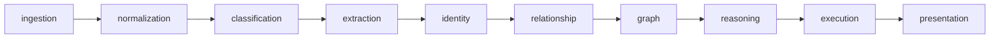

# Internal Pipeline Stages

This folder contains ContextOS stage implementations and runtime orchestration internals.

## Stage Responsibilities

- Implement stage logic behind stable domain contracts.
- Preserve traceability and provenance across stage outputs.
- Keep stages decoupled to protect pipeline boundaries.

## Stage Flow

## Package Jobs

| Package | Responsibility | Update when |
| --- | --- | --- |
| [`source/`](source/README.md) | Connector interfaces and source-specific ingest implementations. | Connector behavior, metadata mapping, live Codex behavior, or replay rules change. |
| [`ingestion/`](ingestion/README.md) | Converts source events into pipeline inputs. | Event acceptance, validation, or ingest traceability changes. |
| [`normalization/`](normalization/README.md) | Normalizes raw event content into deterministic document records and side outputs. | Document IDs, content hashing, parsed output, or normalization fields change. |
| [`classification/`](classification/README.md) | Assigns document categories with evidence and confidence. | Classification rules, labels, or confidence behavior change. |
| [`extraction/`](extraction/README.md) | Extracts entities and facts from normalized documents and structured source metadata. | Entity/fact extraction, source-specific parsers, or evidence spans change. |
| [`identity/`](identity/README.md) | Resolves aliases and semantic matches into canonical identities. | Merge rules, match thresholds, multilingual handling, or benchmark fixtures change. |
| [`relationship/`](relationship/README.md) | Builds typed relationships between resolved entities. | Edge vocabulary, evidence propagation, or relationship confidence changes. |
| [`graph/`](graph/README.md) | Stores and snapshots graph nodes and relationships for querying. | Graph persistence, snapshot output, or graph API models change. |
| [`reasoning/`](reasoning/README.md) | Produces mismatch findings with evidence, impact, recommendation, and confidence. | Finding rules, severity, evidence, or recommendation behavior changes. |
| [`execution/`](execution/README.md) | Applies output/execution rules after reasoning. | Execution validation or action-output contracts change. |
| [`presentation/`](presentation/README.md) | Formats findings and PMO-facing summaries for API/UI consumption. | Public finding, summary, graph, or role-specific output shape changes. |
| [`pipeline/`](pipeline/README.md) | Orchestrates stage order for local and test runs. | Stage sequencing, failure handling, or cross-stage contracts change. |
| [`chat/`](chat/README.md) | Answers workspace chat queries using live Codex context and Local DB evidence. | Chat intent routing, evidence saving, or fallback semantics change. |
| [`aiworker/`](aiworker/README.md) | Go client and cache for optional Python worker services. | Worker API, caching, or semantic matcher integration changes. |
| [`store/`](store/README.md) | Shared persistence helpers for local DB access. | Store interfaces or storage adapters change. |
| [`sync/`](sync/README.md) | Connector sync worker scaffolding. | Background sync orchestration or cancellation behavior changes. |

## Maintenance Checklist

- Update stage READMEs when behavior or contracts change.
- Add tests for new stage paths, including replay/duplicate handling.
- Avoid cross-importing between unrelated `internal/` stages.
