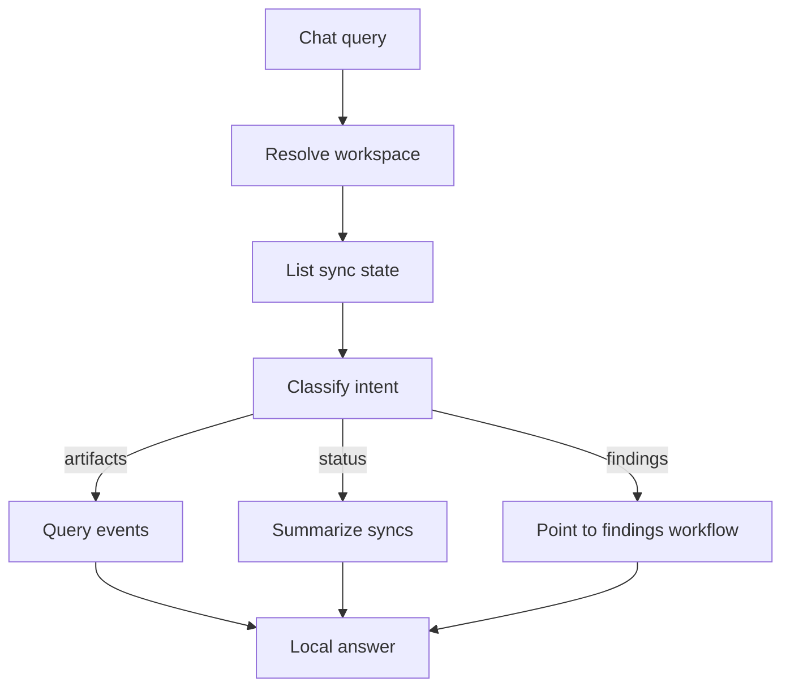

# Internal Chat

Deterministic local chat service for answering workspace-scoped questions from persisted ContextOS repositories.

## Files

| File | Purpose |
| --- | --- |
| `chat.go` | Classifies local chat intent, resolves workspace scope, queries artifacts and sync state, and builds answer summaries. |
| `chat_test.go` | Verifies intent routing, workspace resolution, time range inference, and answer construction. |

## Behavior

The service supports artifact, status, findings, and unsupported intents. It does not call external models or live connectors; answers are built from repository data already stored for the workspace.

GitHub source questions infer the configured repository source from sync state when the user names only a repo slug such as `tourii-backend`. This keeps answers scoped to the requested repo instead of falling back to every GitHub artifact in the workspace. Latest-commit questions still require local commit artifacts; when only repository, issue, or pull request artifacts exist, the service says that commit data is not available locally instead of presenting a repository artifact as a commit.

## Maintenance Notes

- Keep chat answers deterministic and local-first.
- Preserve workspace scoping before querying artifacts or sync state.
- Update `apps/api/handler/chat/README.md` when service result fields change.
