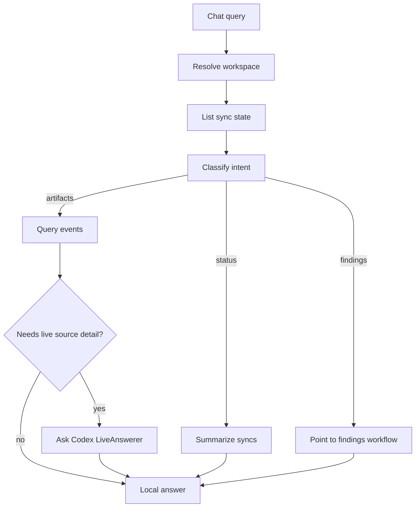

# Internal Chat

Chat service for answering workspace-scoped questions from persisted ContextOS repositories and optional Codex-backed live source context.

## Files

| File | Purpose |
| --- | --- |
| `chat.go` | Classifies local chat intent, resolves workspace scope, queries artifacts and sync state, and builds answer summaries. |
| `chat_test.go` | Verifies intent routing, workspace resolution, time range inference, and answer construction. |

## Behavior

The service supports artifact, status, findings, and unsupported intents. It always resolves workspace scope and queries persisted artifacts first. When a configured source is backed by a Codex plugin and the local artifacts are not enough for source-specific detail, the service can call a `LiveAnswerer` to ask the connected Codex account.

GitHub source questions infer the configured repository source from sync state when the user names only a repo slug such as `tourii-backend`. This keeps answers scoped to the requested repo instead of falling back to every GitHub artifact in the workspace. Latest-commit questions use local commit artifacts when present; otherwise, configured GitHub sources are eligible for live Codex lookup.

## Maintenance Notes

- Keep chat answers deterministic and local-first.
- Preserve workspace scoping before querying artifacts or sync state.
- Update `apps/api/handler/chat/README.md` when service result fields change.
