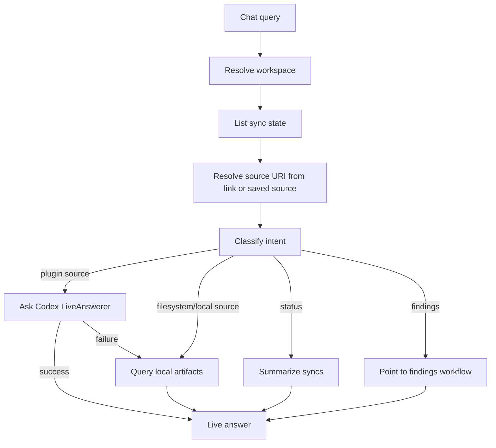

# Internal Chat

Chat service for answering workspace-scoped questions from persisted ContextOS repositories and optional Codex-backed live source context.

## Files

| File | Purpose |
| --- | --- |
| `chat.go` | Classifies local chat intent, resolves workspace scope, queries artifacts and sync state, and builds answer summaries. |
| `chat_test.go` | Verifies intent routing, workspace resolution, time range inference, and answer construction. |

## Behavior

The service supports artifact, status, findings, and unsupported intents. It always resolves workspace scope and lists connector sync state before answering. For plugin-backed connectors (`github`, `jira`, `slack`, `notion`, `googledrive`, `sharepoint`), source questions use a `LiveAnswerer` first when the message includes a source link or can be matched to a saved `connector_syncs` source. A connector-level connected source can use the connector name as `source_uri`, such as `github`; if live lookup fails, local fallback stays connector-wide instead of filtering to that literal URI. Filesystem questions remain local-first because filesystem content is ingested into ContextOS storage.

If live Codex lookup fails, the answer names the live failure and then falls back to local artifacts when available. Callers can provide `Query.Progress` to receive Codex-style transcript lines while the live lookup runs, including the plugin/source being checked, CLI startup, heartbeat status from the API layer, and completion/failure notes. Local artifacts, graph output, findings, evidence, and confidence remain the auditable source of truth for double-checking and analysis.

GitHub source questions infer the configured repository source from sync state when the user names only a repo slug such as `tourii-backend`. This keeps answers scoped to the requested repo instead of falling back to every GitHub artifact in the workspace. Pasted Jira, GitHub, Slack, Notion, Google Drive, and SharePoint links can route to the matching live plugin even when the exact source was not saved during setup. For GitHub, the live Codex prompt allows read-only `gh` commands as fallback context when the GitHub plugin cannot answer and the CLI is already authenticated.

## Maintenance Notes

- Keep filesystem answers deterministic and local-first.
- Keep live Codex answers labeled through `Result.Provider`.
- Preserve workspace scoping before querying artifacts or sync state.
- Update `apps/api/handler/chat/README.md` when service result fields change.
