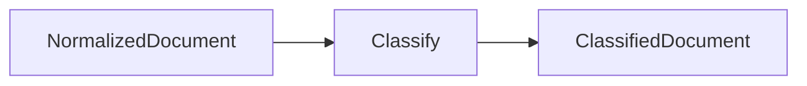
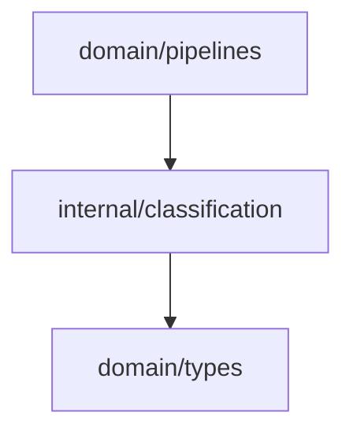

# Classification Domain

The classification domain assigns a document category and confidence score. This category routes extraction and reasoning behavior.

## Responsibility

- Inspect normalized document text.
- Assign a primary `types.Classification` with an explainable confidence score.
- Emit every matching label, the matched rule names, and keyword evidence.

## Input And Output



## Key API

```go
func Classify(doc types.NormalizedDocument) types.ClassifiedDocument
```

## Rule Order

The classifier lowercases `Title + " " + Body` and evaluates every rule. The highest-priority
rule that fires becomes the primary `Classification`; all firing rules are returned in `Labels`
(ordered by confidence), `MatchedRules`, and the primary rule's keywords in `Evidence`.

| Match                                            | Classification    | Confidence |
| ------------------------------------------------ | ----------------- | ---------- |
| `blocker`, `blocked`                             | `Blocker`         | `0.9`      |
| `decision`, `decided`                            | `Decision`        | `0.85`     |
| `risk`, `delay`                                  | `PMORisk`         | `0.8`      |
| `frontend`, `fe`, `screen`, `presentation layer` | `ConsumerConcern` | `0.75`     |
| `backend`, `be`, `database`, `service layer`     | `ProducerConcern` | `0.75`     |
| `api`, `endpoint`                                | `APIDiscussion`   | `0.75`     |
| `requirement`, `business logic`                  | `BusinessLogic`   | `0.75`     |
| no match                                         | `Unknown`         | `0.4`      |

## Dependencies



## Example Usage

```go
classified := classification.Classify(doc)
```

## Implementation Notes

- Rule order matters. A document containing both `blocker` and `api` has primary `Blocker` while still surfacing `APIDiscussion` in `Labels`.
- Keep confidence values explainable. Matched rule names and keyword evidence travel with each label.
- Avoid broadening keywords without tests; short tokens like `fe` and `be` can match ordinary words.

## Production Requirements

- Return classification evidence such as matched rules, source spans, or model rationale references.
- Track confidence calibration against an evaluation set.
- Support multi-label or ambiguous classification when one document carries multiple delivery signals.
- Keep deterministic fallbacks available even when AI-assisted classification is enabled.

## Status

Evidence (`Evidence`), matched-rule tracking (`MatchedRules`), and multi-label output (`Labels`) are implemented and covered by tests in `classification_test.go`. The primary `Classification`/`Confidence` remain backward compatible.
