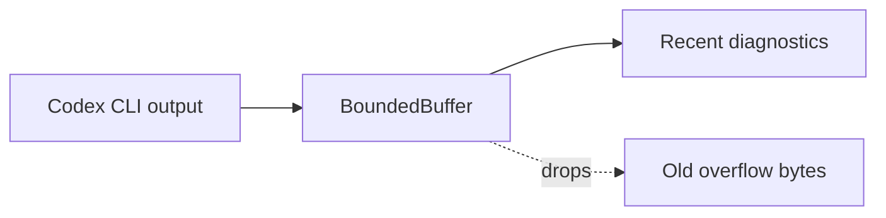

# codexio

Small IO helpers shared by Codex CLI integrations.

## Behavior

`BoundedBuffer` keeps only the most recent Codex stdout/stderr bytes. Codex-backed source ingest, live chat, relationship assistance, graph verification, and Codex status/source discovery use it to avoid retaining unbounded CLI logs in memory while still preserving useful diagnostics.

## Maintenance Notes

- Keep the default limit high enough for diagnostics and session metadata.
- Do not use this helper for source content; Codex source output should continue to be written to explicit output files.
