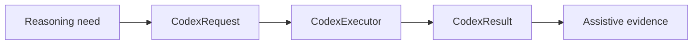
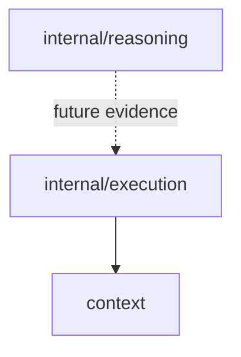

# Execution Domain

The execution domain defines the boundary for local hidden AI orchestration.

## Responsibility

- Provide a stable executor interface for local AI analysis.
- Carry prompts and context into an execution backend.
- Return summaries and metadata that downstream reasoning can treat as evidence.

## Key Types

```go
type CodexRequest struct {
    Prompt  string            `json:"prompt"`
    Context map[string]string `json:"context"`
}

type CodexResult struct {
    Summary  string            `json:"summary"`
    Metadata map[string]string `json:"metadata"`
}

type CodexExecutor interface {
    Analyze(context.Context, CodexRequest) (CodexResult, error)
}
```

## Local Stub

```go
type LocalStubExecutor struct{}

func (LocalStubExecutor) Analyze(ctx context.Context, req CodexRequest) (CodexResult, error)
```

The stub checks context cancellation and returns a deterministic local summary with metadata:

- `mode`: `local-stub`
- `prompt`: original request prompt

## Execution Boundary



## Dependencies



## Implementation Notes

- Execution is intentionally isolated from the current pipeline today.
- Treat executor output as assistive evidence. Do not let it become the only source of truth for mismatch detection.
- Real executors should preserve input context, command metadata, runtime errors, and output provenance.
- Keep local-first behavior: the default path should work without SaaS dependencies.

## Production Requirements

- Run local analysis with cancellation, timeouts, structured errors, and trace metadata.
- Persist prompts, input context references, output summaries, and tool metadata for audit.
- Never overwrite deterministic evidence with generated text.
- Keep executor implementations replaceable behind `CodexExecutor`.
