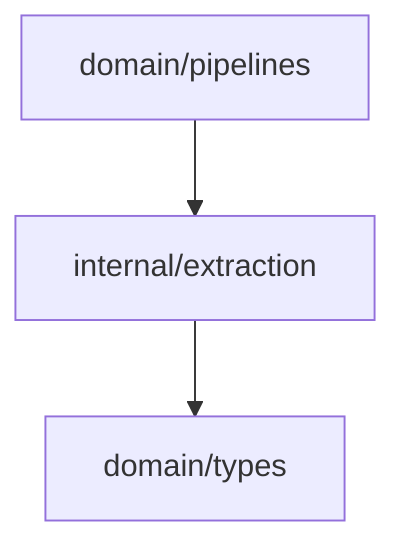

# Extraction Domain

The extraction domain turns classified document text into candidate entities.

## Responsibility

- Find candidate names in document body text.
- Deduplicate candidates within one document.
- Infer a coarse entity type.
- Preserve the source document ID and classification metadata.

## Input And Output

```mermaid
flowchart LR
  classified[ClassifiedDocument]
  extract[Extract]
  entities[[]Entity]

  classified --> extract --> entities
```

## Key API

```go
func Extract(doc types.ClassifiedDocument) []types.Entity
```

Internal helper:

```go
func inferType(name string, classification types.Classification) types.EntityType
```

## Candidate Pattern

Extraction uses this regular expression:

```text
[A-Za-z][A-Za-z0-9_]*(?:Status|State|ID|Id|Type|Flag|Field|Column)?
```

Candidates shorter than three characters are ignored. Deduplication is case-insensitive within one document.

## Type Inference

| Condition | Entity Type |
| --- | --- |
| name contains `field`, `status`, or `state` | `APIField` |
| name contains `column` or `database` | `DBColumn` |
| name contains `type` or `flag` | `Enum` |
| document classification is `BusinessLogic` | `Requirement` |
| document classification is `APIDiscussion` | `Service` |
| fallback | `Dependency` |

## Entity Shape

Each extracted entity receives:

- `ID`: document ID plus lowercase entity key.
- `Type`: inferred entity type.
- `Name`: original candidate text.
- `SourceID`: normalized document ID.
- `Metadata`: `classification` value.

## Dependencies



## Example Usage

```go
extracted := extraction.Extract(classified)
```

## Implementation Notes

- The current extractor is intentionally deterministic and light. It is a candidate generator, not final truth.
- Keep `SourceID` intact because identity, relationship, and reasoning depend on provenance.
- Add tests before changing token behavior; extraction changes quickly affect graph shape and mismatch detection.

## Production Requirements

- Emit source spans or structured field paths for every extracted entity.
- Include extraction confidence and extraction method metadata.
- Support structured inputs such as OpenAPI schemas, Jira fields, Excel cells, and filesystem documents.
- Preserve raw mention text separately from normalized entity names.
